# Architecture Document: Copy Trading Platform

**Version:** 1.0
**Date:** 2026-02-20
**Companion Documents:** [PRD.md](PRD.md) | [Implementation.md](Implementation.md)

---

## Table of Contents

1. [Architecture Overview](#1-architecture-overview)
2. [Component Architecture](#2-component-architecture)
3. [Event-Driven Communication](#3-event-driven-communication)
4. [Database Architecture](#4-database-architecture)
5. [Trade Lifecycle and Storage](#5-trade-lifecycle-and-storage)
6. [Multi-Tenant and Auth Architecture](#6-multi-tenant-and-auth-architecture)
7. [Dashboard Architecture](#7-dashboard-architecture)
8. [Infrastructure Architecture](#8-infrastructure-architecture)
9. [Security Architecture](#9-security-architecture)
10. [Observability Architecture](#10-observability-architecture)
11. [Agentic Extension Architecture](#11-agentic-extension-architecture)

---

## 1. Architecture Overview

### 1.1 Design Principles

| Principle | Rationale |
|-----------|-----------|
| **Event-driven first** | Kafka decouples all services; no service calls another directly. Enables replay, audit, and zero-downtime deploys. |
| **Single responsibility per service** | Each Docker container does one thing. Failures are isolated. Scaling is granular. |
| **Every trade is persisted** | All trades (executed, rejected, errored) are stored in PostgreSQL with full lifecycle events. Nothing is lost. |
| **Dashboard as a first-class citizen** | The monitoring dashboard is not an afterthought. It has its own service, its own WebSocket feeds, and direct DB read access. |
| **Broker-agnostic execution** | The `BrokerAdapter` protocol abstracts all broker calls. Alpaca today, Interactive Brokers tomorrow. |
| **Multi-tenant by default** | Every table carries `user_id`. Every query is scoped. No user can see another user's data. Row-level isolation. |
| **ML-ready from day one** | Kafka topics, plugin interfaces, and database schemas are designed for future agent/ML integration. |

### 1.2 System Context Diagram

```mermaid
flowchart TB
    subgraph external [External Systems]
        DiscordAPI[Discord API]
        TwitterAPI[Twitter/X API]
        RedditAPI[Reddit API]
        AlpacaAPI[Alpaca Broker API]
        IBAPI[Interactive Brokers API]
        SMTP[Email SMTP]
        Webhooks[Webhook Endpoints]
    end

    subgraph platform [Copy Trading Platform]
        subgraph ingestion [Ingestion Layer]
            SourceOrchestrator[Source Orchestrator]
            DiscordIngestor[Discord Ingestor Workers]
            TwitterIngestor[Twitter Ingestor Workers]
            RedditIngestor[Reddit Ingestor Workers]
        end

        subgraph processing [Processing Layer]
            TradeParser[Trade Parser]
            TradeGateway[Trade Gateway]
        end

        subgraph execution [Execution Layer]
            TradeExecutor[Trade Executor]
            PositionMonitor[Position Monitor]
        end

        subgraph presentation [Presentation Layer]
            AuthService[Auth Service]
            APIGateway[API Gateway]
            Dashboard[Dashboard UI]
            NotificationSvc[Notification Service]
        end

        subgraph data [Data Layer]
            Kafka[(Apache Kafka)]
            PostgreSQL[(PostgreSQL)]
            Redis[(Redis)]
        end
    end

    subgraph users [Users]
        Operator[Human Operator]
    end

    SourceOrchestrator --> DiscordIngestor
    SourceOrchestrator --> TwitterIngestor
    SourceOrchestrator --> RedditIngestor
    DiscordAPI --> DiscordIngestor
    TwitterAPI --> TwitterIngestor
    RedditAPI --> RedditIngestor
    DiscordIngestor --> Kafka
    TwitterIngestor --> Kafka
    RedditIngestor --> Kafka
    Kafka --> TradeParser
    TradeParser --> Kafka
    Kafka --> TradeGateway
    TradeGateway --> Kafka
    Kafka --> TradeExecutor
    TradeExecutor <--> AlpacaAPI
    TradeExecutor <--> IBAPI
    TradeExecutor --> Kafka
    Kafka --> PositionMonitor
    PositionMonitor <--> AlpacaAPI
    PositionMonitor <--> IBAPI
    PositionMonitor --> Kafka
    Kafka --> NotificationSvc
    NotificationSvc --> DiscordAPI
    NotificationSvc --> SMTP
    NotificationSvc --> Webhooks

    AuthService <--> PostgreSQL
    APIGateway <--> PostgreSQL
    APIGateway <--> Redis
    Dashboard <--> APIGateway

    TradeParser --> PostgreSQL
    TradeGateway --> PostgreSQL
    TradeExecutor --> PostgreSQL
    PositionMonitor --> PostgreSQL

    Operator <--> Dashboard
    Operator <--> TradeGateway
```

### 1.3 Layered Architecture

The platform follows a four-layer architecture with strict dependency rules:

```
+------------------------------------------------------------------------------+
|                          PRESENTATION LAYER                                  |
|  Dashboard UI (React)  |  API Gateway (FastAPI)  |  Auth Service  |  Notifs  |
+------------------------------------------------------------------------------+
            |                      |                       |
+------------------------------------------------------------------------------+
|                           INGESTION LAYER                                    |
|  Source Orchestrator  |  Discord Workers  |  Twitter Workers  |  Reddit      |
+------------------------------------------------------------------------------+
            |                      |                       |
+------------------------------------------------------------------------------+
|                          PROCESSING LAYER                                    |
|  Trade Parser  |  Trade Gateway  |  Position Monitor                         |
+------------------------------------------------------------------------------+
            |                      |                       |
+------------------------------------------------------------------------------+
|                          EXECUTION LAYER                                     |
|  Trade Executor  |  BrokerAdapter (Alpaca / IB / Tradier)                    |
+------------------------------------------------------------------------------+
            |                      |                       |
+------------------------------------------------------------------------------+
|                            DATA LAYER                                        |
|  Apache Kafka  |  PostgreSQL  |  Redis  |  Schema Registry                   |
+------------------------------------------------------------------------------+
```

**Dependency rules:**
- Presentation layer reads from Data layer and communicates with Processing/Execution layers only through Kafka or REST API.
- Processing and Execution layers communicate exclusively through Kafka topics.
- All layers write to PostgreSQL for persistence.
- No service imports code from another service. Shared code lives in `shared/`.

---

## 2. Component Architecture

### 2.1 Service Map

```mermaid
flowchart LR
    subgraph svc0a [auth-service]
        S0aReg[Registration Handler]
        S0aLogin[Login Handler]
        S0aJWT[JWT Issuer/Validator]
        S0aDB[DB Read/Write]
        S0aReg --> S0aDB
        S0aLogin --> S0aJWT
        S0aLogin --> S0aDB
    end

    subgraph svc0b [source-orchestrator]
        S0bWatch[DB Watcher]
        S0bSpawn[Worker Spawner]
        S0bHealth[Health Checker]
        S0bWatch --> S0bSpawn
        S0bSpawn --> S0bHealth
    end

    subgraph svc1 [discord-ingestor worker]
        S1Conn[Discord Client]
        S1Prod[Kafka Producer]
        S1Conn --> S1Prod
    end

    subgraph svc2 [trade-parser]
        S2Cons[Kafka Consumer]
        S2Parse[Parser Engine]
        S2Prod[Kafka Producer]
        S2DB[DB Writer]
        S2Cons --> S2Parse --> S2Prod
        S2Parse --> S2DB
    end

    subgraph svc3 [trade-gateway]
        S3Cons[Kafka Consumer]
        S3Approval[Approval Engine]
        S3Discord[Discord Commands]
        S3Prod[Kafka Producer]
        S3DB[DB Read/Write]
        S3Cons --> S3Approval
        S3Discord --> S3Approval
        S3Approval --> S3Prod
        S3Approval --> S3DB
    end

    subgraph svc4 [trade-executor]
        S4Cons[Kafka Consumer]
        S4Buffer[Buffer Pricing]
        S4Validate[Validator]
        S4Broker[BrokerAdapter]
        S4Prod[Kafka Producer]
        S4DB[DB Read/Write]
        S4Cons --> S4Validate --> S4Buffer --> S4Broker
        S4Broker --> S4Prod
        S4Broker --> S4DB
    end

    subgraph svc5 [position-monitor]
        S5Cons[Kafka Consumer]
        S5Loop[Monitor Loop]
        S5Broker[BrokerAdapter]
        S5Prod[Kafka Producer]
        S5DB[DB Read/Write]
        S5Cons --> S5Loop
        S5Loop --> S5Broker
        S5Loop --> S5Prod
        S5Loop --> S5DB
    end

    subgraph svc6 [notification-service]
        S6Cons[Kafka Consumer]
        S6Router[Channel Router]
        S6Discord[Discord Webhook]
        S6Email[Email Sender]
        S6Webhook[HTTP Webhook]
        S6Cons --> S6Router
        S6Router --> S6Discord
        S6Router --> S6Email
        S6Router --> S6Webhook
    end

    subgraph svc7 [api-gateway]
        S7REST[FastAPI REST]
        S7WS[WebSocket Server]
        S7DB[DB Read/Write]
        S7Cache[Redis Cache]
        S7REST --> S7DB
        S7REST --> S7Cache
        S7WS --> S7DB
    end

    subgraph svc8 [dashboard-ui]
        S8App[React Application]
        S8Charts[Chart Components]
        S8WS[WebSocket Client]
        S8App --> S8Charts
        S8App --> S8WS
    end

    S1Prod -.-> S2Cons
    S2Prod -.-> S3Cons
    S3Prod -.-> S4Cons
    S4Prod -.-> S5Cons
    S4Prod -.-> S6Cons
    S5Prod -.-> S4Cons
    S5Prod -.-> S6Cons
    S8App --> S7REST
    S8WS --> S7WS
```

### 2.2 Service Responsibilities Matrix

| Service | Reads Kafka | Writes Kafka | Reads DB | Writes DB | Reads Redis | Writes Redis | Broker API |
|---------|------------|-------------|---------|----------|------------|-------------|-----------|
| auth-service | - | - | `users` | `users` | JWT blocklist | JWT blocklist | - |
| source-orchestrator | - | - | `data_sources`, `channels` | `data_sources` | worker registry | worker registry | - |
| discord-ingestor | - | `raw-messages` | - | - | - | - | - |
| trade-parser | `raw-messages` | `parsed-trades` | `account_source_mappings` | `trade_events` | - | - | - |
| trade-gateway | `parsed-trades` | `approved-trades`, `notifications` | `trades`, `trading_accounts` | `trades`, `trade_events` | - | rate limits | - |
| trade-executor | `approved-trades`, `exit-signals` | `execution-results`, `notifications` | `trades`, `positions`, `trading_accounts`, `configurations` | `trades`, `positions`, `trade_events` | dedup check | dedup set | place/cancel orders |
| position-monitor | `execution-results` | `exit-signals`, `notifications` | `positions`, `trading_accounts` | `positions`, `daily_metrics` | quote cache | quote cache | get quotes |
| notification-service | `notifications`, `execution-results` | - | - | `notification_log` | - | - | - |
| api-gateway | - | `notifications` | all tables | `configurations`, `trading_accounts`, `data_sources`, `channels`, `account_source_mappings` | cache reads | cache writes | - |
| dashboard-ui | - | - | - (via API) | - (via API) | - | - | - |

### 2.3 Internal Component Design: Trade Executor

The Trade Executor is the most complex service. Its internal architecture:

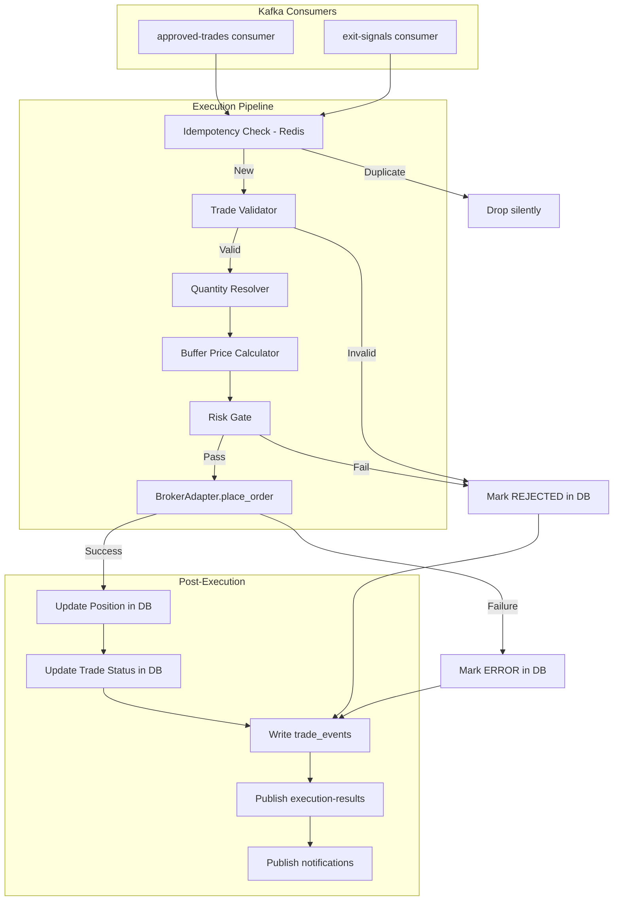

### 2.4 Internal Component Design: Position Monitor

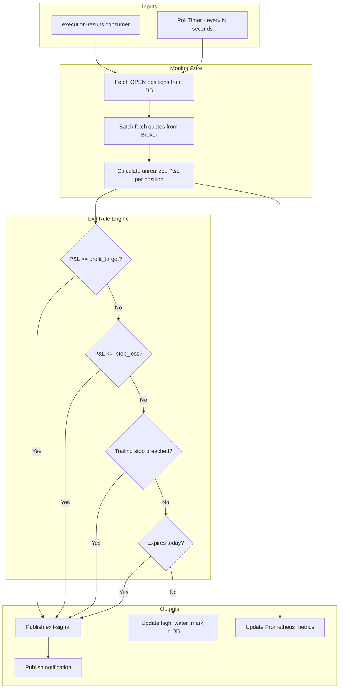

---

## 3. Event-Driven Communication

### 3.1 Kafka Topology

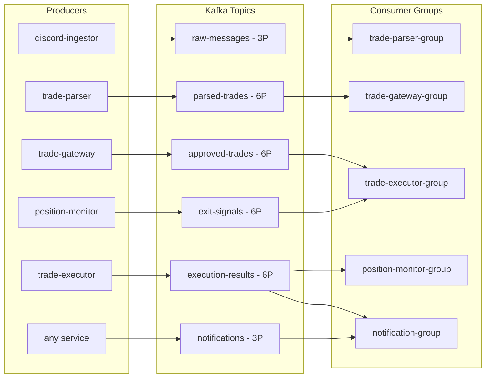

**Partition key strategy (P = partitions):**

All Kafka messages carry `user_id` in the message header for tenant routing.

| Topic | Partitions | Key | Header | Ordering Guarantee |
|-------|-----------|-----|--------|-------------------|
| `raw-messages` | 3 | `source_id` | `user_id` | Per-source ordering |
| `parsed-trades` | 6 | `ticker` | `user_id`, `channel_id` | Same ticker processed in order |
| `approved-trades` | 6 | `ticker` | `user_id`, `trading_account_id` | Same ticker executed in order |
| `execution-results` | 6 | `trade_id` | `user_id`, `trading_account_id` | Per-trade ordering |
| `exit-signals` | 6 | `position_id` | `user_id`, `trading_account_id` | Per-position ordering |
| `notifications` | 3 | `notification_type` | `user_id` | Per-type ordering |

### 3.2 Message Flow Timing

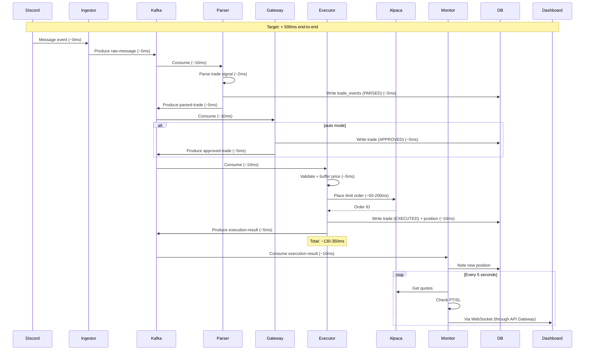

### 3.3 Schema Evolution Strategy

All Kafka messages use **Apache Avro** with **Confluent Schema Registry**.

| Policy | Value | Rationale |
|--------|-------|-----------|
| Compatibility mode | BACKWARD | New consumers can read old messages |
| Schema ID strategy | TopicNameStrategy | One schema per topic |
| Default field values | Required on all new fields | Enables backward compatibility |

Schema evolution rules:
- Adding a new field with a default is always safe.
- Removing a field requires deprecation period (1 release).
- Renaming a field requires a new schema version.
- Changing a field type is never allowed.

---

## 4. Database Architecture

### 4.1 Database Topology

```mermaid
flowchart TB
    subgraph pg [PostgreSQL 16]
        subgraph schemas [Schemas]
            Public[public schema]
        end

        subgraph tenantTables [Tenant Tables]
            Users[users]
            TradingAccounts[trading_accounts]
            DataSources[data_sources]
            Channels[channels]
            AccSrcMap[account_source_mappings]
        end

        subgraph tradingTables [Trading Tables]
            Trades[trades]
            Positions[positions]
            TradeEvents[trade_events]
            DailyMetrics[daily_metrics]
            AnalystPerf[analyst_performance]
            Configs[configurations]
            NotifLog[notification_log]
        end
    end

    subgraph services [Service Ownership]
        AUTH[auth-service] -->|owns| Users
        API[api-gateway] -->|owns| TradingAccounts
        API -->|owns| DataSources
        API -->|owns| Channels
        API -->|owns| AccSrcMap
        GW[trade-gateway] -->|owns| Trades
        EX[trade-executor] -->|owns| Positions
        PA[trade-parser] -->|writes| TradeEvents
        GW -->|writes| TradeEvents
        EX -->|writes| TradeEvents
        MO[position-monitor] -->|writes| DailyMetrics
        MO -->|writes| AnalystPerf
        API -->|reads| Trades
        API -->|reads| Positions
        API -->|reads| TradeEvents
        API -->|reads| DailyMetrics
        API -->|reads| AnalystPerf
        API -->|owns| Configs
        NS[notification-service] -->|owns| NotifLog
    end
```

**Tenant isolation rule:** Every query against trading tables includes `WHERE user_id = $current_user_id`. This is enforced at the ORM layer via a base query mixin.

### 4.2 Complete Schema

#### `users` -- Tenant table

```sql
CREATE TABLE users (
    id              UUID PRIMARY KEY DEFAULT gen_random_uuid(),
    email           VARCHAR(255) NOT NULL UNIQUE,
    password_hash   VARCHAR(255) NOT NULL,
    name            VARCHAR(100),
    timezone        VARCHAR(50) NOT NULL DEFAULT 'UTC',
    notification_prefs JSONB NOT NULL DEFAULT '{"email_enabled": true}',
    is_active       BOOLEAN NOT NULL DEFAULT TRUE,
    created_at      TIMESTAMPTZ NOT NULL DEFAULT NOW(),
    last_login      TIMESTAMPTZ
);

CREATE UNIQUE INDEX idx_users_email ON users (email);
```

#### `trading_accounts` -- Broker connections per user

```sql
CREATE TABLE trading_accounts (
    id                  UUID PRIMARY KEY DEFAULT gen_random_uuid(),
    user_id             UUID NOT NULL REFERENCES users(id) ON DELETE CASCADE,
    broker_type         VARCHAR(30) NOT NULL CHECK (broker_type IN ('ALPACA','INTERACTIVE_BROKERS','TRADIER')),
    display_name        VARCHAR(100) NOT NULL,
    credentials_encrypted BYTEA NOT NULL,
    paper_mode          BOOLEAN NOT NULL DEFAULT TRUE,
    enabled             BOOLEAN NOT NULL DEFAULT TRUE,
    risk_config         JSONB NOT NULL DEFAULT '{"max_position_size": 10, "max_daily_loss": 1000, "max_total_contracts": 100, "max_notional_value": 50000}',
    last_health_check   TIMESTAMPTZ,
    health_status       VARCHAR(20) NOT NULL DEFAULT 'UNKNOWN' CHECK (health_status IN ('HEALTHY','UNHEALTHY','UNKNOWN')),
    created_at          TIMESTAMPTZ NOT NULL DEFAULT NOW(),
    updated_at          TIMESTAMPTZ NOT NULL DEFAULT NOW()
);

CREATE INDEX idx_ta_user ON trading_accounts (user_id);
CREATE INDEX idx_ta_user_broker ON trading_accounts (user_id, broker_type);
```

#### `data_sources` -- Signal source connections per user

```sql
CREATE TABLE data_sources (
    id                  UUID PRIMARY KEY DEFAULT gen_random_uuid(),
    user_id             UUID NOT NULL REFERENCES users(id) ON DELETE CASCADE,
    source_type         VARCHAR(20) NOT NULL CHECK (source_type IN ('DISCORD','TWITTER','REDDIT')),
    display_name        VARCHAR(100) NOT NULL,
    credentials_encrypted BYTEA NOT NULL,
    enabled             BOOLEAN NOT NULL DEFAULT TRUE,
    connection_status   VARCHAR(20) NOT NULL DEFAULT 'DISCONNECTED'
                        CHECK (connection_status IN ('CONNECTED','DISCONNECTED','ERROR','CONNECTING')),
    last_connected_at   TIMESTAMPTZ,
    created_at          TIMESTAMPTZ NOT NULL DEFAULT NOW(),
    updated_at          TIMESTAMPTZ NOT NULL DEFAULT NOW()
);

CREATE INDEX idx_ds_user ON data_sources (user_id);
CREATE INDEX idx_ds_user_type ON data_sources (user_id, source_type);
```

#### `channels` -- Individual feeds within a data source

```sql
CREATE TABLE channels (
    id                  UUID PRIMARY KEY DEFAULT gen_random_uuid(),
    data_source_id      UUID NOT NULL REFERENCES data_sources(id) ON DELETE CASCADE,
    channel_identifier  VARCHAR(200) NOT NULL,
    display_name        VARCHAR(100) NOT NULL,
    enabled             BOOLEAN NOT NULL DEFAULT TRUE,
    created_at          TIMESTAMPTZ NOT NULL DEFAULT NOW(),

    CONSTRAINT uq_channel_per_source UNIQUE (data_source_id, channel_identifier)
);

CREATE INDEX idx_ch_source ON channels (data_source_id);
```

#### `account_source_mappings` -- Links channels to trading accounts

```sql
CREATE TABLE account_source_mappings (
    id                  UUID PRIMARY KEY DEFAULT gen_random_uuid(),
    trading_account_id  UUID NOT NULL REFERENCES trading_accounts(id) ON DELETE CASCADE,
    channel_id          UUID NOT NULL REFERENCES channels(id) ON DELETE CASCADE,
    config_overrides    JSONB DEFAULT '{}',
    enabled             BOOLEAN NOT NULL DEFAULT TRUE,
    created_at          TIMESTAMPTZ NOT NULL DEFAULT NOW(),

    CONSTRAINT uq_account_channel UNIQUE (trading_account_id, channel_id)
);

CREATE INDEX idx_asm_account ON account_source_mappings (trading_account_id);
CREATE INDEX idx_asm_channel ON account_source_mappings (channel_id);
```

#### `trades` -- Every trade ever parsed (executed, rejected, errored, pending)

```sql
CREATE TABLE trades (
    id              SERIAL PRIMARY KEY,
    trade_id        UUID NOT NULL UNIQUE,
    user_id         UUID NOT NULL REFERENCES users(id),
    trading_account_id UUID NOT NULL REFERENCES trading_accounts(id),
    channel_id      UUID REFERENCES channels(id),
    ticker          VARCHAR(10) NOT NULL,
    strike          DECIMAL(10,2) NOT NULL,
    option_type     VARCHAR(4) NOT NULL CHECK (option_type IN ('CALL','PUT')),
    expiration      DATE,
    action          VARCHAR(4) NOT NULL CHECK (action IN ('BUY','SELL')),
    quantity        VARCHAR(20) NOT NULL,
    resolved_quantity INTEGER,
    price           DECIMAL(10,2) NOT NULL,
    buffered_price  DECIMAL(10,2),
    fill_price      DECIMAL(10,2),
    source          VARCHAR(20) NOT NULL DEFAULT 'discord',
    source_message_id VARCHAR(100),
    source_author   VARCHAR(100),
    raw_message     TEXT,
    status          VARCHAR(20) NOT NULL DEFAULT 'PENDING'
                    CHECK (status IN ('PENDING','APPROVED','PROCESSING','EXECUTED','REJECTED','ERROR','CLOSED')),
    rejection_reason TEXT,
    error_message   TEXT,
    broker_order_id VARCHAR(100),
    profit_target   DECIMAL(5,4) NOT NULL DEFAULT 0.30,
    stop_loss       DECIMAL(5,4) NOT NULL DEFAULT 0.20,
    buffer_pct_used DECIMAL(5,4),
    approved_by     VARCHAR(100),
    approved_at     TIMESTAMPTZ,
    created_at      TIMESTAMPTZ NOT NULL DEFAULT NOW(),
    processed_at    TIMESTAMPTZ,
    closed_at       TIMESTAMPTZ,
    close_reason    VARCHAR(20) CHECK (close_reason IN (
                        'TAKE_PROFIT','STOP_LOSS','TRAILING_STOP','MANUAL','EXPIRATION','TIMEOUT'
                    )),
    realized_pnl    DECIMAL(12,2),

    execution_latency_ms INTEGER,
    slippage_pct    DECIMAL(5,4)
);

CREATE INDEX idx_trades_user ON trades (user_id);
CREATE INDEX idx_trades_account ON trades (trading_account_id);
CREATE INDEX idx_trades_status ON trades (user_id, status);
CREATE INDEX idx_trades_ticker ON trades (ticker, strike, option_type, expiration);
CREATE INDEX idx_trades_created ON trades (user_id, created_at);
CREATE INDEX idx_trades_source ON trades (source, created_at);
CREATE INDEX idx_trades_status_created ON trades (user_id, status, created_at);
```

#### `positions` -- Current and historical positions

```sql
CREATE TABLE positions (
    id              SERIAL PRIMARY KEY,
    user_id         UUID NOT NULL REFERENCES users(id),
    trading_account_id UUID NOT NULL REFERENCES trading_accounts(id),
    ticker          VARCHAR(10) NOT NULL,
    strike          DECIMAL(10,2) NOT NULL,
    option_type     VARCHAR(4) NOT NULL,
    expiration      DATE NOT NULL,
    quantity        INTEGER NOT NULL,
    avg_entry_price DECIMAL(10,2) NOT NULL,
    total_cost      DECIMAL(12,2) NOT NULL,
    profit_target   DECIMAL(5,4) NOT NULL DEFAULT 0.30,
    stop_loss       DECIMAL(5,4) NOT NULL DEFAULT 0.20,
    high_water_mark DECIMAL(10,2),
    broker_symbol   VARCHAR(50) NOT NULL,
    status          VARCHAR(10) NOT NULL DEFAULT 'OPEN' CHECK (status IN ('OPEN','CLOSED')),
    opened_at       TIMESTAMPTZ NOT NULL DEFAULT NOW(),
    closed_at       TIMESTAMPTZ,
    close_reason    VARCHAR(20),
    close_price     DECIMAL(10,2),
    realized_pnl    DECIMAL(12,2),
    last_updated    TIMESTAMPTZ NOT NULL DEFAULT NOW(),

    CONSTRAINT uq_open_position UNIQUE (user_id, ticker, strike, option_type, expiration)
        WHERE status = 'OPEN'
);

CREATE INDEX idx_positions_user ON positions (user_id);
CREATE INDEX idx_positions_account ON positions (trading_account_id);
CREATE INDEX idx_positions_status ON positions (user_id, status);
CREATE INDEX idx_positions_ticker ON positions (ticker);
CREATE INDEX idx_positions_closed ON positions (user_id, closed_at) WHERE status = 'CLOSED';
```

#### `trade_events` -- Immutable audit log

```sql
CREATE TABLE trade_events (
    id              BIGSERIAL PRIMARY KEY,
    user_id         UUID NOT NULL REFERENCES users(id),
    trade_id        UUID NOT NULL REFERENCES trades(trade_id),
    event_type      VARCHAR(30) NOT NULL,
    event_data      JSONB NOT NULL DEFAULT '{}',
    source_service  VARCHAR(30) NOT NULL,
    created_at      TIMESTAMPTZ NOT NULL DEFAULT NOW()
);

CREATE INDEX idx_trade_events_user ON trade_events (user_id);
CREATE INDEX idx_trade_events_trade_id ON trade_events (trade_id);
CREATE INDEX idx_trade_events_type ON trade_events (event_type, created_at);
```

#### `daily_metrics` -- Pre-aggregated daily dashboard metrics

```sql
CREATE TABLE daily_metrics (
    id              SERIAL PRIMARY KEY,
    user_id         UUID NOT NULL REFERENCES users(id),
    trading_account_id UUID NOT NULL REFERENCES trading_accounts(id),
    date            DATE NOT NULL,
    total_trades    INTEGER NOT NULL DEFAULT 0,
    executed_trades INTEGER NOT NULL DEFAULT 0,
    rejected_trades INTEGER NOT NULL DEFAULT 0,
    errored_trades  INTEGER NOT NULL DEFAULT 0,
    closed_positions INTEGER NOT NULL DEFAULT 0,
    total_pnl       DECIMAL(12,2) NOT NULL DEFAULT 0,
    winning_trades  INTEGER NOT NULL DEFAULT 0,
    losing_trades   INTEGER NOT NULL DEFAULT 0,
    avg_win_pct     DECIMAL(5,4),
    avg_loss_pct    DECIMAL(5,4),
    max_drawdown    DECIMAL(12,2),
    avg_execution_latency_ms INTEGER,
    avg_slippage_pct DECIMAL(5,4),
    avg_buffer_used DECIMAL(5,4),
    open_positions_eod INTEGER NOT NULL DEFAULT 0,
    portfolio_value DECIMAL(12,2),
    buying_power    DECIMAL(12,2),
    updated_at      TIMESTAMPTZ NOT NULL DEFAULT NOW(),

    CONSTRAINT uq_daily_account UNIQUE (trading_account_id, date)
);

CREATE INDEX idx_daily_metrics_user ON daily_metrics (user_id, date);
CREATE INDEX idx_daily_metrics_account ON daily_metrics (trading_account_id, date);
```

#### `analyst_performance` -- Track per-analyst signal quality

```sql
CREATE TABLE analyst_performance (
    id              SERIAL PRIMARY KEY,
    source          VARCHAR(20) NOT NULL,
    author          VARCHAR(100) NOT NULL,
    period_start    DATE NOT NULL,
    period_end      DATE NOT NULL,
    total_signals   INTEGER NOT NULL DEFAULT 0,
    executed_signals INTEGER NOT NULL DEFAULT 0,
    profitable_signals INTEGER NOT NULL DEFAULT 0,
    total_pnl       DECIMAL(12,2) NOT NULL DEFAULT 0,
    avg_pnl_pct     DECIMAL(5,4),
    win_rate        DECIMAL(5,4),
    avg_holding_time_minutes INTEGER,
    updated_at      TIMESTAMPTZ NOT NULL DEFAULT NOW(),

    CONSTRAINT uq_analyst_period UNIQUE (source, author, period_start, period_end)
);
```

#### `configurations` -- Runtime-editable settings (per user)

```sql
CREATE TABLE configurations (
    id              SERIAL PRIMARY KEY,
    user_id         UUID NOT NULL REFERENCES users(id),
    key             VARCHAR(100) NOT NULL,
    value           JSONB NOT NULL,
    description     TEXT,
    category        VARCHAR(50),
    updated_by      VARCHAR(100),
    updated_at      TIMESTAMPTZ NOT NULL DEFAULT NOW(),

    CONSTRAINT uq_user_config UNIQUE (user_id, key)
);

CREATE INDEX idx_config_user ON configurations (user_id);
```

#### `notification_log`

```sql
CREATE TABLE notification_log (
    id                  BIGSERIAL PRIMARY KEY,
    user_id             UUID NOT NULL REFERENCES users(id),
    notification_type   VARCHAR(30) NOT NULL,
    channel             VARCHAR(20) NOT NULL,
    priority            VARCHAR(10) NOT NULL,
    title               VARCHAR(200) NOT NULL,
    body                TEXT NOT NULL,
    metadata            JSONB,
    status              VARCHAR(10) NOT NULL DEFAULT 'SENT',
    read                BOOLEAN NOT NULL DEFAULT FALSE,
    error_message       TEXT,
    created_at          TIMESTAMPTZ NOT NULL DEFAULT NOW()
);

CREATE INDEX idx_notif_user ON notification_log (user_id);
CREATE INDEX idx_notif_user_read ON notification_log (user_id, read);
```

### 4.3 Database Query Patterns for Dashboard

These are the critical queries the dashboard needs. Indexes are designed to support them.

All queries are scoped by `user_id` (injected from JWT).

| Dashboard Panel | Query Pattern | Index Used |
|----------------|---------------|-----------|
| Live trade feed | `SELECT * FROM trades WHERE user_id = $uid ORDER BY created_at DESC LIMIT 50` | `idx_trades_created` |
| Trades by status | `SELECT * FROM trades WHERE user_id = $uid AND status = $1 ORDER BY created_at DESC` | `idx_trades_status_created` |
| Per-account trades | `SELECT * FROM trades WHERE trading_account_id = $aid ORDER BY created_at DESC` | `idx_trades_account` |
| Daily P&L chart | `SELECT * FROM daily_metrics WHERE user_id = $uid AND date BETWEEN $1 AND $2` | `idx_daily_metrics_user` |
| Per-account P&L | `SELECT * FROM daily_metrics WHERE trading_account_id = $aid AND date BETWEEN $1 AND $2` | `idx_daily_metrics_account` |
| Open positions | `SELECT * FROM positions WHERE user_id = $uid AND status = 'OPEN'` | `idx_positions_status` |
| Position history | `SELECT * FROM positions WHERE user_id = $uid AND status = 'CLOSED' ORDER BY closed_at DESC` | `idx_positions_closed` |
| Trade lifecycle | `SELECT * FROM trade_events WHERE trade_id = $1 ORDER BY created_at` | `idx_trade_events_trade_id` |
| Analyst leaderboard | `SELECT * FROM analyst_performance ORDER BY win_rate DESC` | sequential scan (small table) |
| Rejection reasons | `SELECT rejection_reason, COUNT(*) FROM trades WHERE user_id = $uid AND status = 'REJECTED' GROUP BY rejection_reason` | `idx_trades_status` |
| User's accounts | `SELECT * FROM trading_accounts WHERE user_id = $uid` | `idx_ta_user` |
| User's sources | `SELECT * FROM data_sources WHERE user_id = $uid` | `idx_ds_user` |
| Channel mappings | `SELECT * FROM account_source_mappings WHERE trading_account_id = $aid` | `idx_asm_account` |

### 4.4 Redis Usage

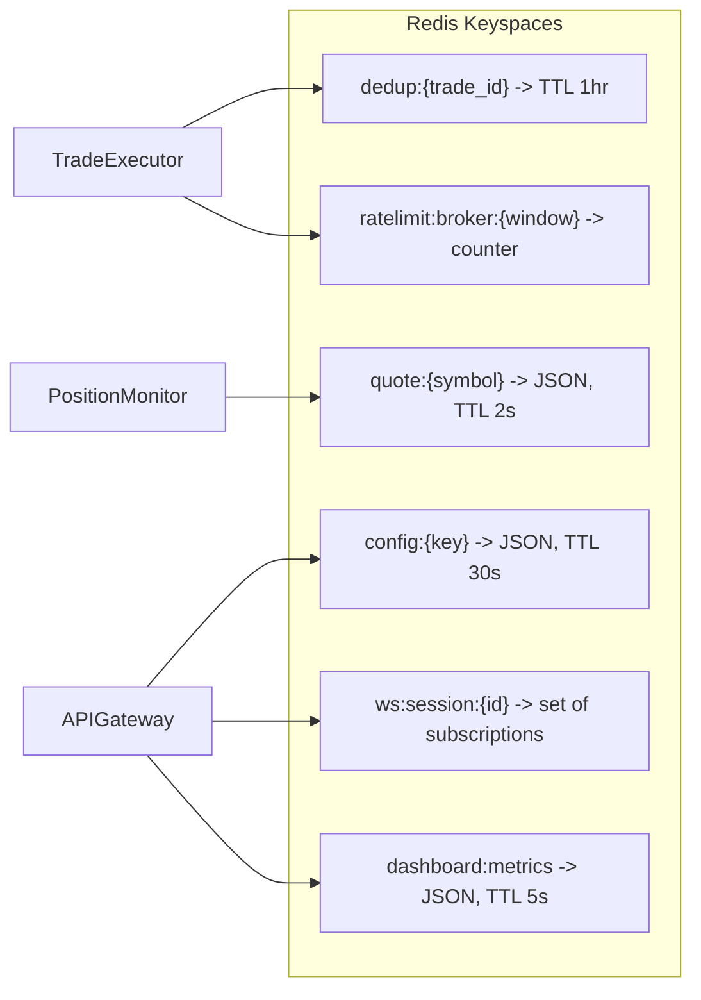

---

## 5. Trade Lifecycle and Storage

### 5.1 Complete Trade Lifecycle

Every trade passes through a state machine. Every state transition is recorded in both the `trades` table (status update) and the `trade_events` table (immutable event).

```mermaid
stateDiagram-v2
    [*] --> PENDING: Parser publishes parsed-trade
    PENDING --> APPROVED: Gateway approves (auto or human)
    PENDING --> REJECTED: Gateway rejects (human, timeout, validation)
    APPROVED --> PROCESSING: Executor begins execution
    PROCESSING --> EXECUTED: Broker confirms order
    PROCESSING --> ERROR: Broker rejects or network failure
    PROCESSING --> REJECTED: Risk check fails at execution time
    ERROR --> PENDING: Manual retry
    EXECUTED --> CLOSED: Position monitor triggers exit or manual close
    CLOSED --> [*]
    REJECTED --> [*]

    note right of PENDING: trade_events: PARSED
    note right of APPROVED: trade_events: APPROVED
    note right of REJECTED: trade_events: REJECTED (with reason)
    note right of PROCESSING: trade_events: EXECUTING
    note right of EXECUTED: trade_events: EXECUTED (with order_id, fill_price)
    note right of ERROR: trade_events: ERROR (with error detail)
    note right of CLOSED: trade_events: CLOSED (with PnL, close_reason)
```

### 5.2 What Gets Stored

| Trade Outcome | Stored in `trades`? | Stored in `trade_events`? | Stored in `positions`? | Stored in `daily_metrics`? |
|--------------|--------------------|--------------------------|-----------------------|---------------------------|
| Parsed (non-trade message) | No | No | No | No |
| Parsed trade signal | Yes (PENDING) | Yes (PARSED) | No | Yes (total_trades++) |
| Approved | Yes (APPROVED) | Yes (APPROVED) | No | No |
| Rejected by human | Yes (REJECTED) | Yes (REJECTED) | No | Yes (rejected_trades++) |
| Rejected by timeout | Yes (REJECTED) | Yes (REJECTED) | No | Yes (rejected_trades++) |
| Rejected by validator | Yes (REJECTED) | Yes (REJECTED) | No | Yes (rejected_trades++) |
| Execution error | Yes (ERROR) | Yes (ERROR) | No | Yes (errored_trades++) |
| Successfully executed | Yes (EXECUTED) | Yes (EXECUTED) | Yes (OPEN) | Yes (executed_trades++) |
| Closed at profit target | Yes (CLOSED) | Yes (CLOSED) | Yes (CLOSED) | Yes (winning_trades++, total_pnl) |
| Closed at stop loss | Yes (CLOSED) | Yes (CLOSED) | Yes (CLOSED) | Yes (losing_trades++, total_pnl) |
| Closed manually | Yes (CLOSED) | Yes (CLOSED) | Yes (CLOSED) | Yes (total_pnl) |

### 5.3 Trade Event Examples

**PARSED event:**
```json
{
  "trade_id": "a1b2c3d4-...",
  "event_type": "PARSED",
  "source_service": "trade-parser",
  "event_data": {
    "raw_message": "Bought SPX 6940C at 4.80",
    "source": "discord",
    "author": "analyst_joe",
    "channel_id": "123456789"
  }
}
```

**EXECUTED event:**
```json
{
  "trade_id": "a1b2c3d4-...",
  "event_type": "EXECUTED",
  "source_service": "trade-executor",
  "event_data": {
    "broker_order_id": "ord_xyz",
    "requested_price": 4.80,
    "buffered_price": 5.52,
    "fill_price": 5.10,
    "slippage_pct": 0.0625,
    "execution_latency_ms": 185
  }
}
```

**REJECTED event:**
```json
{
  "trade_id": "a1b2c3d4-...",
  "event_type": "REJECTED",
  "source_service": "trade-gateway",
  "event_data": {
    "reason": "TIMEOUT",
    "detail": "No approval within 300 seconds"
  }
}
```

**CLOSED event:**
```json
{
  "trade_id": "a1b2c3d4-...",
  "event_type": "CLOSED",
  "source_service": "trade-executor",
  "event_data": {
    "close_reason": "TAKE_PROFIT",
    "entry_price": 5.10,
    "close_price": 6.63,
    "realized_pnl": 153.00,
    "pnl_pct": 0.30,
    "holding_time_minutes": 47
  }
}
```

---

## 6. Multi-Tenant and Auth Architecture

### 6.1 Auth Service

The `auth-service` is a stateless FastAPI microservice responsible for user registration, login, and JWT issuance. It owns the `users` table.

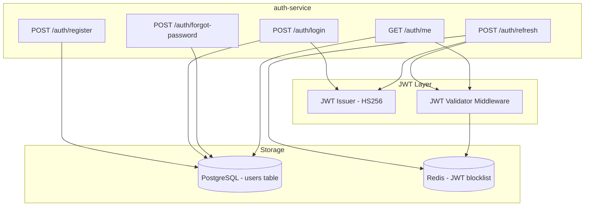

**JWT Token Structure:**

```json
{
  "sub": "user-uuid",
  "email": "user@example.com",
  "iat": 1708000000,
  "exp": 1708000900,
  "type": "access"
}
```

| Property | Access Token | Refresh Token |
|----------|-------------|--------------|
| TTL | 15 minutes | 7 days |
| Stored in | Memory (JS) | HttpOnly cookie |
| Revocation | Not revocable (short TTL) | Redis blocklist |

### 6.2 Source Orchestrator

The `source-orchestrator` is a control-plane service that manages per-user ingestor workers. It watches the `data_sources` table and spawns/stops ingestor processes accordingly.

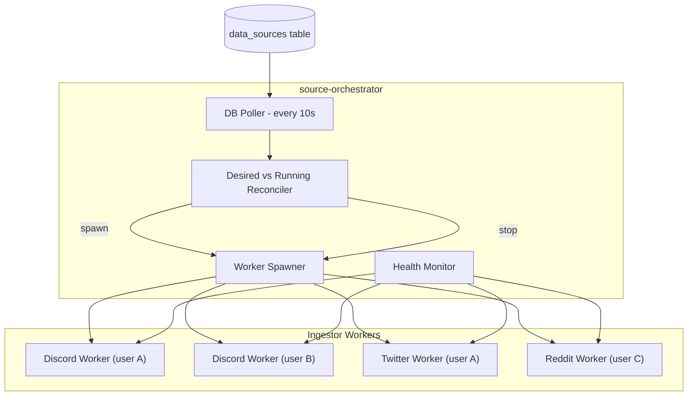

**Reconciliation logic:**

1. Query all enabled `data_sources` with their `channels`.
2. Compare against running workers (tracked in Redis `workers:{source_id}`).
3. Spawn new workers for sources with no running worker.
4. Stop workers for disabled or deleted sources.
5. Restart unhealthy workers (no heartbeat in 30s).

Each ingestor worker tags every Kafka message with `user_id` and `channel_id` in the message headers, enabling downstream services to route signals to the correct trading accounts.

### 6.3 Tenant Isolation Strategy

| Layer | Isolation Mechanism |
|-------|-------------------|
| API Gateway | JWT middleware extracts `user_id` from token and injects it into request state |
| Database | Every query includes `WHERE user_id = ?` via ORM base query mixin |
| Kafka | Messages carry `user_id` in headers; consumers filter if needed |
| Redis | Keys are prefixed with `user:{user_id}:` for user-specific data |
| Ingestors | Each user's data source spawns a dedicated worker process |
| Credentials | Broker keys and source tokens encrypted per-row with Fernet; decryption key from K8s Secret |

### 6.4 Credential Encryption

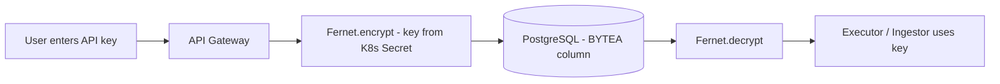

The Fernet encryption key is a 32-byte URL-safe base64 string mounted as a Kubernetes Secret (env var `CREDENTIAL_ENCRYPTION_KEY`). Rotation requires re-encrypting all stored credentials via a migration script.

---

## 7. Dashboard Architecture

### 7.1 Dashboard System Overview

The dashboard is a multi-tab configuration portal and monitoring tool. It communicates with the `api-gateway` via REST and WebSocket and runs as a separate Docker container serving a React SPA. All data is scoped to the authenticated user.

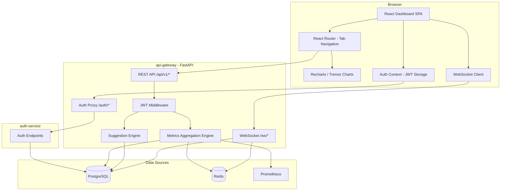

### 7.2 Navigation Structure

The dashboard uses a tabbed navigation layout. On mobile, this renders as a bottom tab bar. On desktop, it renders as a fixed sidebar.

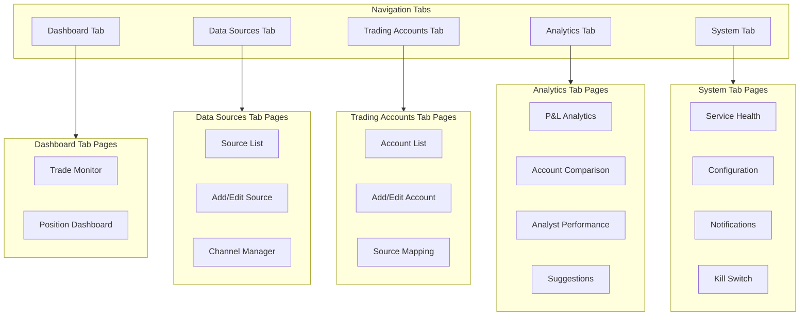

### 7.3 Dashboard Pages and Panels

#### Tab 1: Dashboard

**Trade Monitor (Home)**

| Panel | Data Source | Update Method | Description |
|-------|-----------|---------------|-------------|
| **Live Trade Feed** | `GET /api/v1/trades?limit=50` + `WS /ws/trades` | Real-time WebSocket | Scrolling feed of all trades with status badges |
| **Status Breakdown** | `GET /api/v1/metrics/trade-status` | Poll 10s | Donut chart: counts by status |
| **Today's Stats** | `GET /api/v1/metrics/daily` | Poll 30s | Cards: total trades, executed, rejected, error rate |
| **Pending Approvals** | `GET /api/v1/trades?status=PENDING` | WebSocket | List with APPROVE / REJECT buttons |
| **Rejection Reasons** | `GET /api/v1/metrics/rejection-reasons` | Poll 60s | Bar chart of rejection reasons |
| **Risk Utilization Gauges** | `GET /api/v1/metrics/risk-utilization` | Poll 10s | Visual meters: position size, daily loss, notional vs limits |
| **Trade Replay Timeline** | `GET /api/v1/trades?date=today` | On load | Interactive timeline scrubbing through the day's trades |

**Position Dashboard**

| Panel | Data Source | Update Method | Description |
|-------|-----------|---------------|-------------|
| **Open Positions** | `GET /api/v1/positions?status=OPEN` + `WS /ws/positions` | Real-time | Table with live P&L, color-coded (green/red) |
| **Position Heat Map** | `GET /api/v1/positions?status=OPEN` | Poll 5s | Visual grid colored by P&L percentage |
| **Closed Today** | `GET /api/v1/positions?status=CLOSED&from=today` | Poll 30s | Table with P&L and close reason |
| **Close Reason Distribution** | Aggregation on `positions` | Poll 60s | Pie chart: TAKE_PROFIT vs STOP_LOSS vs TRAILING_STOP vs MANUAL |
| **Sector/Ticker Exposure** | `GET /api/v1/metrics/exposure` | Poll 60s | Pie chart of open position allocation by ticker |

#### Tab 2: Data Sources

| Panel | Data Source | Update Method | Description |
|-------|-----------|---------------|-------------|
| **Source List** | `GET /api/v1/sources` | On load | Cards showing each source with status indicator (CONNECTED/ERROR) |
| **Add Source Form** | `POST /api/v1/sources` | On submit | Select type (Discord/Twitter/Reddit), enter credentials, test connection |
| **Channel Manager** | `GET /api/v1/sources/{id}/channels` | On load | List of channels per source with enable/disable toggles |
| **Connection Status** | `POST /api/v1/sources/{id}/test` | On demand | Tests connection and displays result |

#### Tab 3: Trading Accounts

| Panel | Data Source | Update Method | Description |
|-------|-----------|---------------|-------------|
| **Account List** | `GET /api/v1/accounts` | On load | Cards for each account: broker icon, paper/live badge, health status |
| **Add Account Form** | `POST /api/v1/accounts` | On submit | Select broker, enter credentials, set risk limits |
| **Paper/Live Toggle** | `POST /api/v1/accounts/{id}/toggle-mode` | Immediate | Switch with confirmation modal |
| **Risk Configuration** | `PUT /api/v1/accounts/{id}` | On save | Editable risk limits per account |
| **Source Mapping** | `GET /api/v1/accounts/{id}/mappings` | On load | Visual mapping of channels to this account with per-mapping overrides |
| **Health Check** | `POST /api/v1/accounts/{id}/test` | On demand | Verify broker credentials and connectivity |

#### Tab 4: Analytics

| Panel | Data Source | Update Method | Description |
|-------|-----------|---------------|-------------|
| **Cumulative P&L Line Chart** | `GET /api/v1/metrics/pnl?range=30d` | Poll 60s | Running total P&L over time |
| **P&L Calendar Heatmap** | `GET /api/v1/metrics/pnl/daily?range=90d` | Poll 60s | Green/red day-grid like GitHub contributions |
| **Daily P&L Bar Chart** | `GET /api/v1/metrics/pnl/daily?range=30d` | Poll 60s | Green/red bars per day |
| **Win Rate Trend** | `GET /api/v1/metrics/win-rate?range=30d` | Poll 60s | Line chart of rolling 7-day win rate |
| **Win/Loss Streak Tracker** | `GET /api/v1/metrics/streaks` | Poll 60s | Current and longest streaks |
| **Average Holding Time** | `GET /api/v1/metrics/holding-time` | Poll 60s | Distribution chart |
| **Account Comparison** | `GET /api/v1/metrics/pnl?account_ids=a,b` | Poll 60s | Side-by-side P&L for paper vs live or across accounts |
| **Source Signal Quality** | `GET /api/v1/metrics/signal-quality` | Poll 60s | Matrix showing win rate per source/channel |
| **Drawdown Chart** | `GET /api/v1/metrics/drawdown?range=30d` | Poll 60s | Max drawdown from peak equity |
| **Risk/Reward Scatter** | Aggregation on `positions` | Poll 60s | Scatter plot: holding time vs P&L |
| **Analyst Leaderboard** | `GET /api/v1/metrics/analysts` | Poll 60s | Table: author, win rate, avg P&L |
| **AI Suggestions** | `GET /api/v1/suggestions` | Poll 5m | Cards with actionable insights |
| **Buffer Analysis** | Aggregation on `trades` | Poll 5m | Buffer used vs actual slippage |
| **Stop Loss / Profit Target Analysis** | Aggregation on `positions` | Poll 5m | Recommends SL/PT levels |

#### Tab 5: System

| Panel | Data Source | Update Method | Description |
|-------|-----------|---------------|-------------|
| **Service Status** | `GET /api/v1/health/services` | Poll 10s | Green/red indicators per service |
| **Kafka Consumer Lag** | Prometheus metrics | Poll 10s | Bar chart per consumer group |
| **Execution Latency** | `GET /api/v1/metrics/latency` | Poll 30s | Histogram of execution times |
| **Broker API Health** | Prometheus metrics | Poll 10s | Latency p99 and error rate |
| **Notification Center** | `GET /api/v1/notifications?unread=true` | Poll 30s | Bell icon with unread count, filterable history |
| **Configuration** | `GET /api/v1/config` | On load | Editable risk, execution, monitor, approval, and notification settings |
| **Kill Switch** | `POST /api/v1/config/kill-switch` | Immediate | Big red button with confirmation modal |

### 7.4 Mobile-First Responsive Design

| Breakpoint | Layout | Navigation | Cards |
|-----------|--------|------------|-------|
| `< 640px` (sm) | Single column, stacked | Bottom tab bar (5 icons) | Full-width, touch-friendly (min 44px tap targets) |
| `640-1024px` (md) | 2-column grid | Collapsible hamburger sidebar | 2-up cards |
| `> 1024px` (lg) | Multi-column with sidebar | Fixed sidebar with labels + icons | Flexible grid |

**Mobile-specific adaptations:**
- Tables collapse into card views on mobile
- Charts render at reduced data density (fewer data points)
- Bottom sheet modals replace dialog modals
- Swipe gestures for tab navigation
- Pull-to-refresh on all list views

### 7.5 Dashboard Data Flow

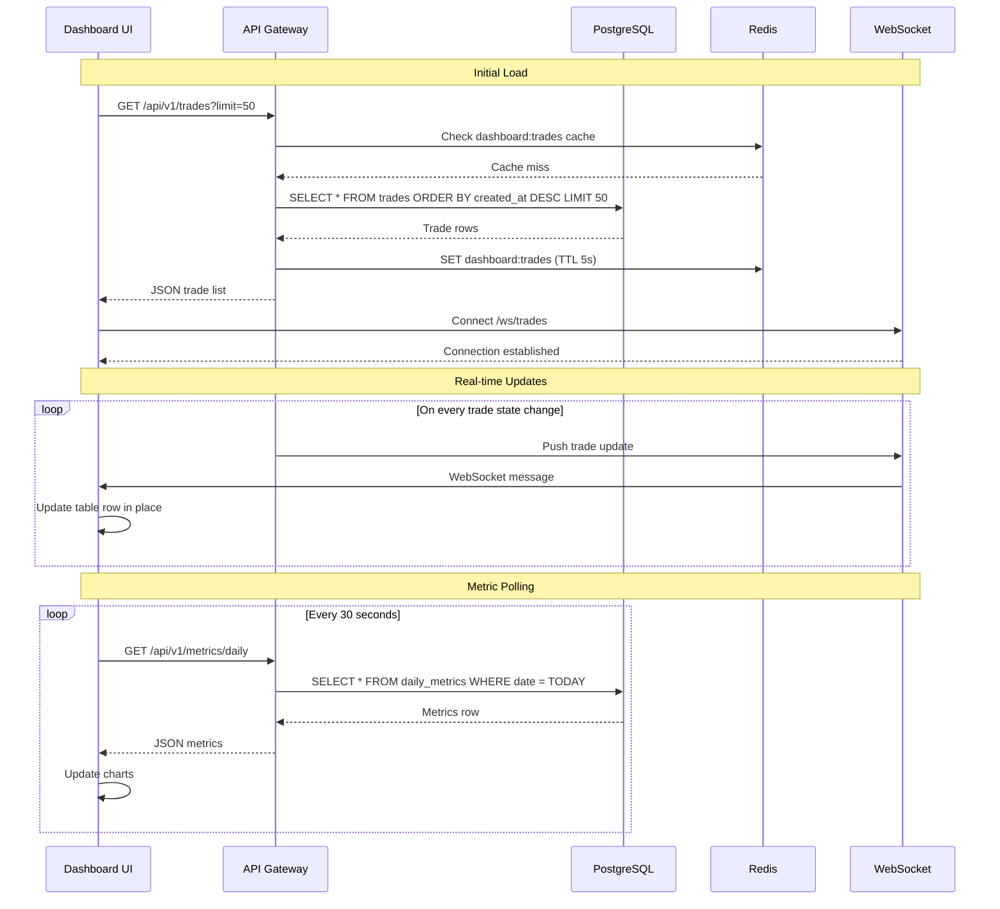

### 7.6 Suggestion Engine

The API Gateway includes a suggestion engine that analyzes historical trade data and generates actionable recommendations displayed on the dashboard.

**Suggestion Categories:**

| Category | Analysis | Example Suggestion |
|----------|----------|-------------------|
| **Buffer Optimization** | Compare `buffered_price` vs `fill_price` across executed trades | "Your average fill is 3% below buffer. Consider reducing buffer from 15% to 12% to save ~$0.15/contract." |
| **Stop Loss Tuning** | Analyze max adverse excursion of winning trades | "68% of your winning trades dipped 15% before recovering. Consider widening stop loss from 20% to 25%." |
| **Profit Target Tuning** | Analyze max favorable excursion of all trades | "42% of trades exceeded 50% profit before close. Consider raising profit target from 30% to 40%." |
| **Analyst Ranking** | Compare win rates and P&L per analyst source | "Analyst 'trader_mike' has a 72% win rate vs platform average of 55%. Consider weighting their signals higher." |
| **Timing Patterns** | Analyze success rate by time of day and day of week | "Trades placed between 10:00-11:00 AM have a 65% win rate vs 45% in the first 30 minutes. Consider delaying execution." |
| **Ticker Concentration** | Analyze P&L by ticker | "SPX trades account for 80% of volume but only 45% win rate. Consider reducing SPX exposure." |
| **Risk Exposure** | Calculate portfolio Greeks and concentration | "65% of open positions expire this Friday. Consider diversifying expiration dates." |

**Suggestion API Response:**

```json
{
  "suggestions": [
    {
      "id": "sug_001",
      "category": "buffer_optimization",
      "severity": "info",
      "title": "Buffer percentage may be too high",
      "description": "Average fill price is 3.2% below your buffered price...",
      "current_value": "0.15",
      "recommended_value": "0.12",
      "confidence": 0.82,
      "data_points": 156,
      "action": {
        "type": "config_change",
        "key": "BUFFER_PERCENTAGE",
        "value": "0.12"
      }
    }
  ],
  "generated_at": "2026-02-20T14:30:00Z"
}
```

Each suggestion includes an optional `action` that the user can apply directly from the dashboard with a single click (which sends a `PUT /api/v1/config` request).

### 7.7 Configurable Dashboard Metrics

All dashboard metrics are customizable from the Configuration page. The `configurations` table stores overrides:

| Config Key | Category | Dashboard Effect | Default |
|------------|----------|-----------------|---------|
| `dashboard.refresh_interval` | Display | How often charts auto-refresh | `30` (seconds) |
| `dashboard.pnl_range_days` | Analytics | Default date range for P&L charts | `30` |
| `dashboard.trade_feed_limit` | Display | Max trades in live feed | `50` |
| `metrics.profit_target` | Risk | Highlight threshold on P&L charts | `0.30` |
| `metrics.stop_loss` | Risk | Highlight threshold on P&L charts | `0.20` |
| `metrics.win_rate_window` | Analytics | Rolling window for win rate calc | `7` (days) |
| `metrics.max_drawdown_alert` | Alerting | Alert when drawdown exceeds this | `500.00` |
| `metrics.daily_loss_warning_pct` | Alerting | Warn at this % of MAX_DAILY_LOSS | `0.80` |
| `dashboard.visible_panels` | Display | JSON array of enabled panel IDs | all |
| `suggestions.enabled` | Suggestions | Enable/disable suggestion engine | `true` |
| `suggestions.min_data_points` | Suggestions | Min trades before generating suggestions | `50` |

---

## 8. Infrastructure Architecture

### 7.1 Container Architecture

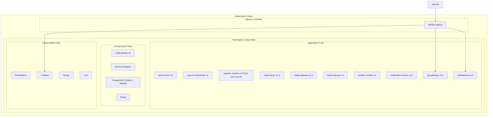

### 8.2 Network Architecture

| Source | Destination | Protocol | Port | Purpose |
|--------|------------|----------|------|---------|
| auth-service | PostgreSQL | TCP | 5432 | User CRUD |
| auth-service | Redis | TCP | 6379 | JWT blocklist |
| source-orchestrator | PostgreSQL | TCP | 5432 | Read data_sources |
| source-orchestrator | Redis | TCP | 6379 | Worker registry |
| ingestor-workers | Kafka | TCP | 9092 | Produce messages |
| ingestor-workers | Discord/Twitter/Reddit APIs | HTTPS | 443 | Ingest signals |
| trade-parser | Kafka | TCP | 9092 | Consume/Produce |
| trade-gateway | Kafka | TCP | 9092 | Consume/Produce |
| trade-executor | Kafka | TCP | 9092 | Consume/Produce |
| trade-executor | Alpaca/IB API | HTTPS | 443 | Place orders |
| position-monitor | Kafka | TCP | 9092 | Consume/Produce |
| position-monitor | Alpaca/IB API | HTTPS | 443 | Get quotes |
| All services | PostgreSQL | TCP | 5432 | DB queries |
| api-gateway, trade-executor | Redis | TCP | 6379 | Caching, dedup |
| api-gateway | 0.0.0.0 | TCP | 8000 | REST/WS API |
| dashboard-ui | 0.0.0.0 | TCP | 3000 | Serve SPA |
| All services | Schema Registry | HTTP | 8081 | Schema validation |

### 8.3 Scaling Rules

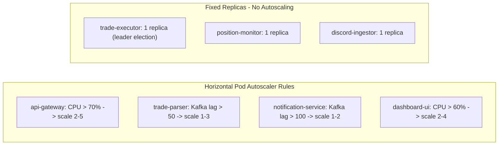

---

## 9. Security Architecture

### 9.1 Security Zones

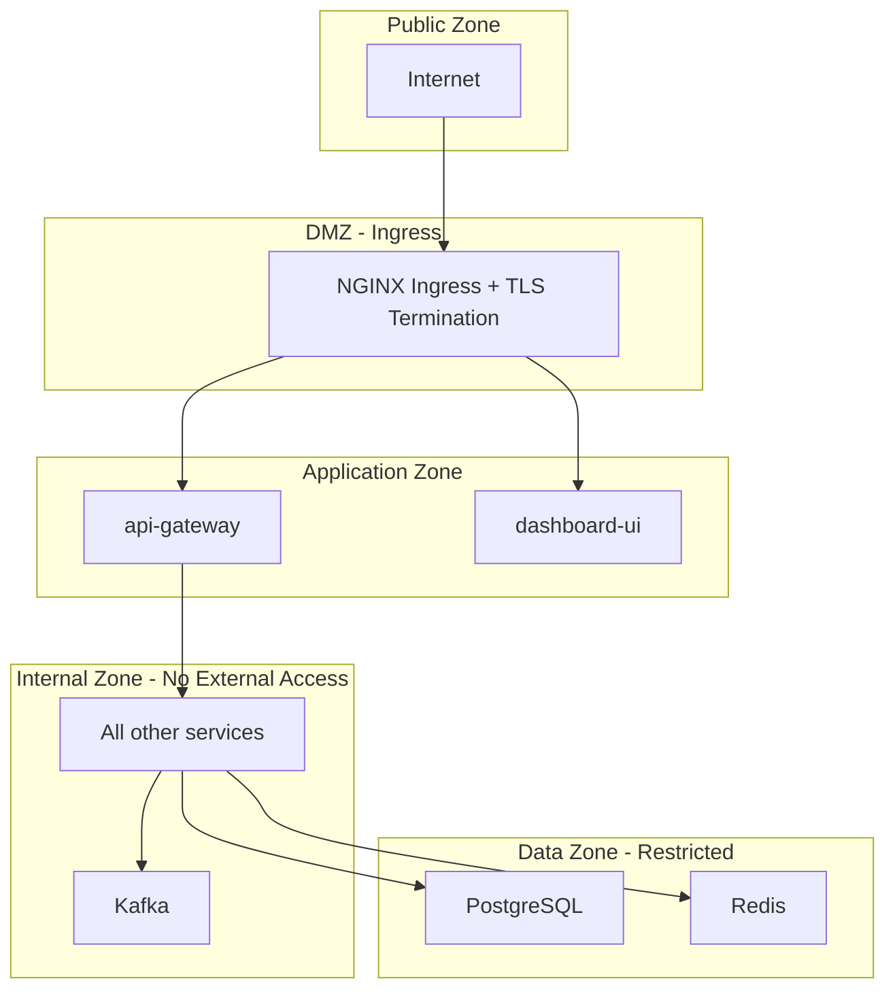

### 9.2 Authentication and Authorization

| Component | Authentication | Authorization |
|-----------|---------------|--------------|
| Dashboard UI | JWT (issued by auth-service) | Tenant-scoped: user sees only their data |
| API Gateway | JWT Bearer token (validated via shared secret) | `user_id` extracted and injected into every request |
| Auth Service | bcrypt password verification | Issues JWT access + refresh tokens |
| Discord Commands | Discord user ID allowlist | Per-command permissions |
| Inter-service | mTLS (Istio) | Kubernetes NetworkPolicy |
| Broker API | Per-user encrypted credentials (Fernet) | Decrypted at runtime by executor/ingestor |
| Database | Per-service credentials | Per-service schema permissions + row-level `user_id` filtering |

### 9.3 Secrets Flow

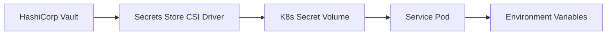

---

## 10. Observability Architecture

### 10.1 Observability Stack

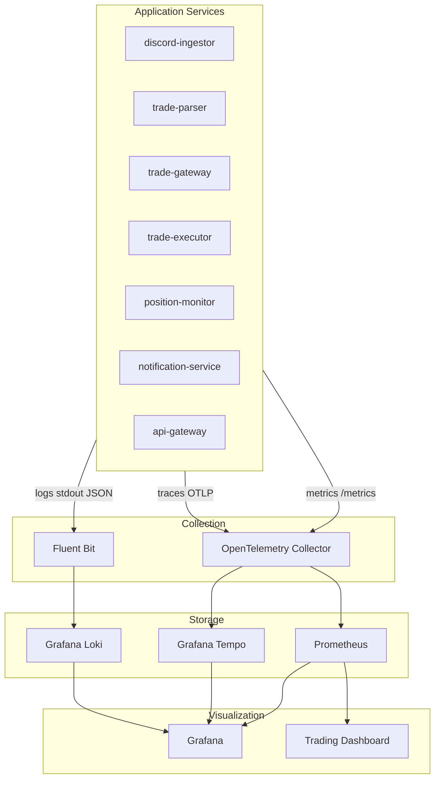

### 10.2 Distributed Trace Example

A single trade flows through multiple services. OpenTelemetry traces correlate all steps:

```
Trace: abc123
├── discord-ingestor: receive_message (2ms)
│   └── kafka_produce: raw-messages (3ms)
├── trade-parser: consume_message (1ms)
│   ├── parse_trade_signal (2ms)
│   ├── db_write: trade_events (4ms)
│   └── kafka_produce: parsed-trades (3ms)
├── trade-gateway: consume_trade (1ms)
│   ├── auto_approve (1ms)
│   ├── db_write: trades (4ms)
│   └── kafka_produce: approved-trades (3ms)
├── trade-executor: consume_trade (1ms)
│   ├── validate_trade (3ms)
│   ├── calculate_buffer_price (1ms)
│   ├── broker_place_order (185ms)  ← dominant latency
│   ├── db_write: trades + positions (8ms)
│   └── kafka_produce: execution-results (3ms)
└── Total: 225ms
```

### 10.3 Key Prometheus Metrics

| Metric | Type | Labels | Purpose |
|--------|------|--------|---------|
| `copytrader_trades_total` | Counter | `status`, `action`, `ticker`, `source` | Total trades by outcome |
| `copytrader_trade_latency_seconds` | Histogram | `stage` (parse, approve, execute) | Per-stage latency |
| `copytrader_positions_open` | Gauge | `ticker` | Currently open positions |
| `copytrader_pnl_realized_total` | Counter | `close_reason` | Cumulative realized P&L |
| `copytrader_pnl_unrealized` | Gauge | `ticker` | Current unrealized P&L |
| `copytrader_buffer_slippage_pct` | Histogram | `ticker` | Buffer vs fill price diff |
| `copytrader_kafka_consumer_lag` | Gauge | `topic`, `group` | Consumer lag per topic |
| `copytrader_broker_api_latency` | Histogram | `operation` (place_order, get_quote) | Broker API response time |
| `copytrader_broker_api_errors` | Counter | `operation`, `error_type` | Broker API failures |
| `copytrader_daily_loss` | Gauge | - | Current day loss |
| `copytrader_buying_power` | Gauge | - | Available buying power |
| `copytrader_risk_utilization` | Gauge | `metric` (position_size, contracts, notional) | Risk limit utilization % |

### 10.4 Alerting Rules

| Alert | Condition | Severity | Action |
|-------|-----------|----------|--------|
| HighConsumerLag | `kafka_consumer_lag > 100 for 2m` | Warning | Investigate slow consumer |
| ExecutionErrorRate | `rate(trades_total{status="ERROR"}) > 0.05 for 5m` | Critical | Check broker connectivity |
| DailyLossApproaching | `daily_loss > MAX_DAILY_LOSS * 0.8` | Critical | Notify operator, consider kill switch |
| BrokerAPIDown | `broker_api_errors > 5 in 1m` | Critical | Circuit break, notify |
| ServiceDown | `up{service="*"} == 0 for 30s` | Critical | K8s will restart; alert if persistent |
| HighExecutionLatency | `trade_latency_seconds{stage="execute"} p99 > 1s` | Warning | Check broker/network |

---

## 11. Agentic Extension Architecture

### 11.1 Plugin Architecture

```mermaid
flowchart TB
    subgraph core [Core Pipeline]
        Parser[Trade Parser]
        Gateway[Trade Gateway]
        Executor[Trade Executor]
        Monitor[Position Monitor]
    end

    subgraph agentBus [Agent Event Bus - Kafka]
        AgentScores[agent-scores]
        AgentRisk[agent-risk]
        AgentDecisions[agent-decisions]
    end

    subgraph agents [Agent Plugins]
        SignalScorer[Signal Scoring Agent]
        RiskAssessor[Risk Assessment Agent]
        ExecOptimizer[Execution Optimizer Agent]
        SentimentAnalyzer[Sentiment Agent]
    end

    subgraph mlInfra [ML Infrastructure]
        FeatureStore[Feature Store]
        ModelRegistry[MLflow Registry]
        VectorDB[pgvector]
        InferenceAPI[Inference Service]
    end

    Parser --> AgentScores
    AgentScores --> SignalScorer
    SignalScorer --> AgentDecisions
    AgentDecisions --> Gateway

    Gateway --> AgentRisk
    AgentRisk --> RiskAssessor
    RiskAssessor --> AgentDecisions

    agents --> FeatureStore
    agents --> ModelRegistry
    agents --> InferenceAPI
    SentimentAnalyzer --> VectorDB
```

### 11.2 Extension Points Summary

| Extension Point | Location in Pipeline | Input | Output | Use Case |
|----------------|---------------------|-------|--------|----------|
| Signal Scoring | After parser, before gateway | ParsedTrade | Confidence score 0-1 | Filter low-quality signals |
| Sentiment Analysis | After ingestor, before parser | RawMessage | Sentiment label + score | Enrich trade context |
| Risk Assessment | After gateway, before executor | ApprovedTrade + Portfolio | Risk score + recommendation | Dynamic position sizing |
| Execution Optimization | Inside executor, before broker call | Trade + MarketData | Optimized buffer + timing | Reduce slippage |
| Portfolio Rebalancing | Inside monitor | All positions + market data | Rebalance signals | Maintain target allocations |

---

## Appendix: Architecture Decision Records

### ADR-001: Kafka over RabbitMQ

**Decision:** Use Apache Kafka (KRaft mode) for inter-service messaging.

**Rationale:**
- Message replay capability (essential for debugging and re-processing trades).
- Higher throughput for future ML streaming workloads.
- Native partitioning for ordered processing per ticker.
- KRaft eliminates Zookeeper dependency (simpler operations).
- Ecosystem: Schema Registry, Kafka Connect for future data integrations.

**Trade-off:** Higher operational complexity than RabbitMQ; mitigated by Strimzi operator on K8s.

### ADR-002: PostgreSQL over MongoDB

**Decision:** Use PostgreSQL as the primary database.

**Rationale:**
- ACID transactions for trade state management (critical for financial data).
- Rich query capabilities for dashboard aggregations.
- pgvector extension enables future ML vector search.
- Partial unique indexes (e.g., unique open position per contract).
- Mature tooling for backups, replication, and monitoring.

### ADR-003: Single Trade Executor Instance

**Decision:** Run exactly one trade-executor instance (with leader election for failover).

**Rationale:**
- Prevents duplicate order submission to the broker.
- Simplifies position tracking (single writer).
- Broker API rate limits are easier to manage with one instance.
- Trade volume is low enough (< 100 trades/day) that single instance handles load.

**Failover:** If the instance dies, Kubernetes restarts it. A Redis-based leader election ensures only one instance is active in HA setups.

### ADR-004: Dashboard as a Separate Service

**Decision:** Build the dashboard as a standalone React SPA served by its own container, communicating with the API Gateway.

**Rationale:**
- Decoupled frontend/backend deployment cycles.
- Static asset serving (NGINX) is lightweight and horizontally scalable.
- WebSocket support for real-time updates without polling overhead.
- Can be replaced with a different frontend framework without touching the backend.

### ADR-005: Store All Trades Regardless of Outcome

**Decision:** Persist every parsed trade in the `trades` table, including rejected and errored trades.

**Rationale:**
- Complete audit trail required for financial compliance.
- Rejection analysis: understanding why trades are rejected improves configuration.
- Analyst performance tracking requires all signals, not just executed ones.
- Suggestion engine needs full dataset to generate meaningful recommendations.

### ADR-006: Row-Level Tenant Isolation over Schema-per-Tenant

**Decision:** Use `user_id` foreign keys on every table for tenant isolation, rather than separate schemas or databases per tenant.

**Rationale:**
- Simpler migration and schema management (single Alembic migration set).
- Lower operational overhead (one connection pool, one backup, one monitoring target).
- Sufficient for expected scale (< 1000 tenants in first year).
- All queries are scoped via ORM base mixin that automatically appends `WHERE user_id = ?`.
- Can migrate to schema-per-tenant or sharding later if needed.

**Trade-off:** Noisy neighbor risk at very high scale; mitigated by per-user rate limiting and Kafka partitioning.

### ADR-007: Per-User Ingestor Workers via Source Orchestrator

**Decision:** Each user's data source spawns a dedicated ingestor worker managed by a central source-orchestrator service.

**Rationale:**
- Isolation: one user's broken Discord token doesn't affect others.
- Independent scaling: heavy users get more workers.
- Clean lifecycle: disabling a source stops its worker immediately.
- Credential isolation: each worker only has access to its user's decrypted credentials.

**Trade-off:** Higher memory footprint than a single multiplexed ingestor; acceptable because each worker is lightweight (~30MB).

### ADR-008: Fernet Symmetric Encryption for Credentials

**Decision:** Encrypt broker API keys and source tokens at rest using Fernet symmetric encryption. The encryption key is mounted from a Kubernetes Secret.

**Rationale:**
- Fernet provides authenticated encryption (AES-128-CBC + HMAC-SHA256).
- Single key simplifies implementation; key rotation is a batch re-encrypt operation.
- Encrypted values are stored as `BYTEA` in PostgreSQL; never appear in logs or API responses.
- No need for asymmetric encryption since only backend services decrypt.
