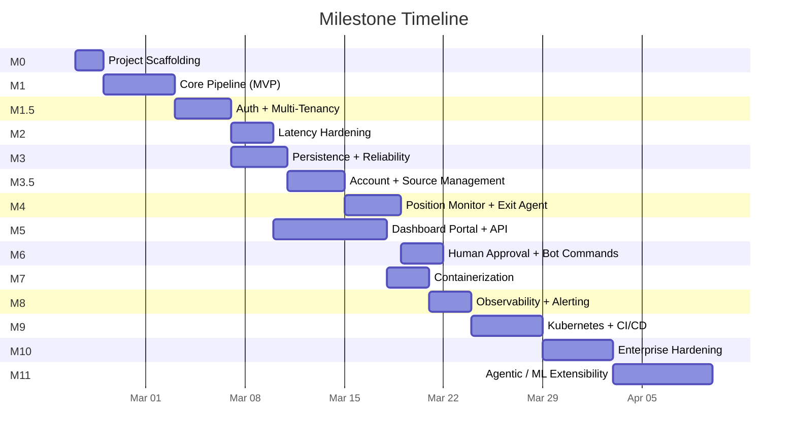

# Milestones: Copy Trading Platform

**Version:** 1.0
**Date:** 2026-02-20
**Companion Documents:** [PRD.md](PRD.md) | [Architecture.md](Architecture.md) | [Implementation.md](Implementation.md)

---

## Table of Contents

1. [Gap Analysis](#1-gap-analysis)
2. [Latency Audit and Hardening](#2-latency-audit-and-hardening)
3. [Milestone Plan](#3-milestone-plan)
4. [Milestone Detail](#4-milestone-detail)
5. [Acceptance Criteria](#5-acceptance-criteria)
6. [Risk Register](#6-risk-register)

---

## 1. Gap Analysis

A full review of PRD.md, Architecture.md, and Implementation.md surfaced the following gaps grouped by severity.

### 1.1 Critical -- Latency and Performance

These directly impact trade execution speed. Options prices can move 10-20% in seconds; every millisecond matters.

| ID | Gap | Where | Impact |
|----|-----|-------|--------|
| **L1** | JSON serialization on Kafka hot path | Implementation.md -- `KafkaProducerWrapper` uses `json.dumps` | JSON encode/decode adds ~0.5ms per hop. Over 4 hops (ingestor->parser->gateway->executor) that is 4ms wasted. Use **msgpack** (3-5x faster than JSON) or binary Avro with schema registry. |
| **L2** | `send_and_wait` blocks on every Kafka produce | Implementation.md -- `producer.send_and_wait()` | Forces a full network round-trip per message. Use **fire-and-forget** with `linger_ms=5` and `batch_size=16384` for batching, then async callback for error handling. |
| **L3** | `run_in_executor` on every broker call | Implementation.md -- `AlpacaBrokerAdapter` wraps every call | Spins a thread pool thread per call. Replace with a **persistent async HTTP session** (`httpx.AsyncClient`) calling Alpaca REST directly, eliminating the synchronous SDK overhead entirely. |
| **L4** | Position monitor fetches quotes one-by-one | Implementation.md -- `monitor_loop` calls `get_quote` per position | 50 open positions = 50 sequential HTTP calls = 5-10 seconds. Use **batch quote API** or **Alpaca WebSocket streaming** for real-time price feed. |
| **L5** | Synchronous DB write on parser hot path | Implementation.md -- parser writes `TradeEvent` to DB before producing to Kafka | DB round-trip (~5ms) is on the critical path. Move audit writes to a **background task** or a separate `trade-events` Kafka topic consumed by a dedicated writer. |
| **L6** | Per-message Kafka offset commit | Implementation.md -- `consumer.commit()` after every message | Commit overhead is ~5ms per call. Switch to **batch commit** (every N messages or every T seconds). |
| **L7** | No connection reuse on broker data client | Implementation.md -- `get_quote` creates a new `StockHistoricalDataClient` per call | Object creation + TLS handshake on every quote. Use a **singleton client** initialized once at startup. |
| **L8** | No Kafka producer batching config | Implementation.md -- default `linger_ms=0` | Every produce is a separate network packet. Set `linger_ms=5, batch_size=32768` for 5ms batching window with negligible latency increase but 10x throughput. |

### 1.2 High -- Reliability and Enterprise Readiness

| ID | Gap | Where | Impact |
|----|-----|-------|--------|
| **R1** | No circuit breaker for broker API | Architecture.md, Implementation.md | If Alpaca is down, executor retries endlessly, filling logs and wasting resources. Need a circuit breaker that trips after N failures and auto-recovers. |
| **R2** | No dead-letter queue (DLQ) | Architecture.md -- Kafka topology | Poison messages crash the consumer loop. Failed messages need a DLQ topic for later inspection and replay. |
| **R3** | No graceful shutdown / signal handling | Implementation.md -- no SIGTERM handler in any service | Kubernetes sends SIGTERM before killing pods. Without handling, in-flight trades are lost mid-execution. |
| **R4** | No database migrations tool | Implementation.md -- uses `Base.metadata.create_all` | Schema changes in production will fail silently or corrupt data. Need **Alembic** for versioned, reversible migrations. |
| **R5** | No order fill tracking | PRD.md, Implementation.md | A limit order may not fill. There is no polling or WebSocket to track order status after submission. Orders could sit unfilled indefinitely. |
| **R6** | No partial fill handling | PRD.md | Broker may partially fill an order (3 of 5 contracts). Position manager assumes full fill. |
| **R7** | No retry with backoff | Implementation.md | Transient broker/DB failures cause immediate ERROR status. Need configurable retry (exponential backoff, max attempts). |
| **R8** | No structured error taxonomy | All docs | Errors are free-form strings. Need error codes for dashboard filtering and alerting (e.g., `BROKER_TIMEOUT`, `INSUFFICIENT_BUYING_POWER`, `RATE_LIMITED`). |
| **R9** | No data retention / archival policy | Architecture.md | `trade_events` table grows unbounded. Need partition-by-month and archival to cold storage after 90 days. |

### 1.3 Medium -- Functional Gaps

| ID | Gap | Where | Impact |
|----|-----|-------|--------|
| **F1** | No multi-tenant / multi-account support | PRD.md, Architecture.md | System assumes single user with one Alpaca account. No login, no per-user data isolation, no multi-broker support. |
| **F1a** | No user authentication | All docs | No registration, login, or JWT-based access control. Anyone can access API and dashboard. |
| **F1b** | No data source management UI | All docs | Discord token is a global env var. Users cannot configure their own sources or channels via dashboard. |
| **F1c** | No account-to-source mapping | All docs | No way to route signals from specific channels to specific trading accounts. |
| **F1d** | No credential encryption at rest | All docs | Broker API keys stored as plaintext env vars. Need Fernet encryption in DB with K8s Secret key. |
| **F2** | No order status WebSocket from broker | PRD.md, Implementation.md | Platform "fires and forgets" orders. Real fill price, fill time, and partial fills are unknown. |
| **F3** | PRD P8 -- time references in messages ("4hr") | PRD.md -- listed as "Not implemented" | Analyst messages sometimes imply expiration by time reference. Parsing these would improve data quality. |
| **F4** | No feature flags | Architecture.md | New features (trailing stop, agent plugins) cannot be gradually rolled out. Need a simple feature flag system (DB-backed or LaunchDarkly). |
| **F5** | No position sizing intelligence | PRD.md | Every trade uses the same quantity. No Kelly criterion, no volatility-adjusted sizing, no portfolio-level risk budget. |
| **F6** | Dashboard WebSocket not backed by Kafka | Architecture.md -- API gateway reads DB for WS updates | API gateway must poll DB to push WebSocket updates. Should consume `execution-results` topic directly for zero-latency dashboard feed. |
| **F7** | No duplicate message detection at ingestor | Implementation.md | Discord can deliver the same message event twice (reconnection). Ingestor has no dedup. Need `message_id`-based idempotency in Redis. |

### 1.4 Low -- Operational and Polish

| ID | Gap | Where | Impact |
|----|-----|-------|--------|
| **O1** | No API rate limiting | Architecture.md -- API gateway | Public API has no throttling. A runaway dashboard bug or external client could overwhelm the gateway. |
| **O2** | No cost analysis | All docs | No estimate of Kafka/K8s/DB infrastructure cost per month. |
| **O3** | No incident response playbook | Architecture.md | Alerting rules exist but no documented response process. |
| **O4** | No canary / blue-green deploy strategy | Implementation.md -- CI/CD section | Rollback requires manual intervention. |
| **O5** | No load testing baseline | Implementation.md -- testing section | Locust is mentioned but no target throughput or latency benchmarks. |

---

## 2. Latency Audit and Hardening

### 2.1 Current vs Target Latency Budget

Every millisecond on the critical path (Discord message to broker order) is accounted for.

```
CURRENT (estimated from Implementation.md code):

Discord Event                          0 ms
  -> Ingestor Kafka produce (JSON, send_and_wait)    8 ms
  -> Kafka internal replication                      3 ms
  -> Parser consume                                  5 ms
  -> Parser parse regex                              1 ms
  -> Parser DB write (trade_events)                  5 ms  ** GAP L5 **
  -> Parser Kafka produce (JSON, send_and_wait)      8 ms
  -> Kafka internal replication                      3 ms
  -> Gateway consume                                 5 ms
  -> Gateway DB write (trades INSERT)                5 ms
  -> Gateway DB write (trades UPDATE to APPROVED)    5 ms
  -> Gateway Kafka produce (JSON, send_and_wait)     8 ms
  -> Kafka internal replication                      3 ms
  -> Executor consume                                5 ms
  -> Executor validate + buffer                      2 ms
  -> Executor broker call (run_in_executor)        180 ms  ** GAP L3 **
  -> Executor DB write (trades + positions)         10 ms
  -> Executor Kafka produce (JSON, send_and_wait)    8 ms
                                                   ------
  TOTAL                                           ~264 ms
  (broker dominates; non-broker overhead ~84ms)
```

```
TARGET (after hardening):

Discord Event                          0 ms
  -> Ingestor Kafka produce (msgpack, fire-and-forget)   1 ms
  -> Kafka internal replication                          2 ms
  -> Parser consume                                      2 ms
  -> Parser parse regex                                  1 ms
  -> Parser Kafka produce (msgpack, fire-and-forget)     1 ms
  -> (trade_events written async, off hot path)          0 ms
  -> Kafka internal replication                          2 ms
  -> Gateway consume                                     2 ms
  -> Gateway DB write (single INSERT with APPROVED)      4 ms
  -> Gateway Kafka produce (msgpack, fire-and-forget)    1 ms
  -> Kafka internal replication                          2 ms
  -> Executor consume                                    2 ms
  -> Executor validate + buffer (in-memory config)       1 ms
  -> Executor broker call (async httpx, persistent conn) 80 ms
  -> Executor DB write (batch: trades + positions)       6 ms
  -> Executor Kafka produce (msgpack, fire-and-forget)   1 ms
                                                        ------
  TOTAL                                                ~108 ms
  (broker dominates; non-broker overhead ~28ms)
```

**Result: 3x reduction in non-broker overhead (84ms down to 28ms).**

### 2.2 Key Hardening Changes

| Change | Latency Saved | Implementation |
|--------|--------------|----------------|
| Replace JSON with msgpack serialization | ~4ms (across 4 hops) | `msgpack.packb` / `msgpack.unpackb` -- 3-5x faster than `json.dumps`/`json.loads` |
| Fire-and-forget Kafka produce with `linger_ms=5` | ~24ms (6ms per hop x 4 hops) | Remove `send_and_wait`, use `send()` with error callback, set `linger_ms=5, batch_size=32768` |
| Move audit DB writes off hot path | ~5ms | Parser produces to `trade-events-raw` topic; a dedicated async writer batches inserts |
| Single DB round-trip in gateway | ~5ms | Combine INSERT + UPDATE into one INSERT with `status='APPROVED'` for auto mode |
| Replace `run_in_executor` with async HTTP | ~50-100ms | Use `httpx.AsyncClient` with connection pooling to call Alpaca REST API directly |
| Batch Kafka offset commits | ~20ms (5ms per commit x 4 services) | Commit every 100 messages or every 1 second, whichever comes first |
| Singleton broker client with connection warmup | ~5ms per call | Initialize `httpx.AsyncClient` once at startup with keep-alive and pre-connected socket |
| WebSocket price streaming for position monitor | Eliminates 5s poll | Subscribe to Alpaca WebSocket stream for real-time prices instead of polling |
| In-memory config cache with TTL | ~2ms per config lookup | Cache `configurations` table in Redis with 10s TTL; read from memory dict with 1s refresh |

### 2.3 Principles for Keeping the System Fast

1. **Nothing synchronous on the hot path.** Every I/O operation (DB, Kafka, broker) is async. No `run_in_executor`, no thread pool hops.
2. **Audit writes are eventual, not blocking.** The trade progresses through the pipeline immediately; audit events arrive within seconds via a separate Kafka consumer.
3. **Serialize once, deserialize once.** Use msgpack or Avro binary. No JSON on inter-service communication.
4. **Batch everything that can be batched.** Kafka produces, offset commits, DB writes, quote fetches.
5. **Connection pools are warmed at startup.** DB pools pre-connect. HTTP clients establish TLS during init. First trade pays zero cold-start cost.
6. **Read from memory, write to disk.** Configurations, risk limits, and blacklists are cached in-process. DB is the source of truth but not read on every trade.
7. **Measure, don't guess.** Every stage emits a latency histogram to Prometheus. The dashboard shows p50/p95/p99 per pipeline stage in real time.

---

## 3. Milestone Plan



### Summary Table

| Milestone | Name | Duration | Depends On | Deliverable |
|-----------|------|----------|-----------|-------------|
| **M0** | Project Scaffolding | 2 days | -- | Repo structure, shared libs, Docker Compose infra, DB migrations |
| **M1** | Core Pipeline (MVP) | 5 days | M0 | Discord -> Parser -> Gateway (auto) -> Executor -> Alpaca (dry run) |
| **M1.5** | Auth + Multi-Tenancy | 4 days | M1 | auth-service, user registration/login, JWT middleware, `user_id` on all tables, tenant-scoped queries, Fernet credential encryption |
| **M2** | Latency Hardening | 3 days | M1.5 | msgpack, fire-and-forget Kafka, async HTTP broker, batch commits, off-path auditing |
| **M3** | Persistence + Reliability | 4 days | M1.5 | All trades stored (executed + rejected + error), DLQ, circuit breaker, order fill tracking, graceful shutdown |
| **M3.5** | Account + Source Management | 4 days | M3 | Trading account CRUD, data source CRUD, channel management, account-source mapping, source-orchestrator, per-user ingestor workers |
| **M4** | Position Monitor + Exit Agent | 4 days | M3.5 | Profit target, stop loss, trailing stop, WebSocket price streaming, exit execution (per-account) |
| **M5** | Dashboard Portal + API Gateway | 8 days | M2 | React dashboard (5-tab portal), login/register, data sources tab, trading accounts tab, analytics tab, system tab, mobile-first responsive layout, suggestion engine |
| **M6** | Human Approval + Bot Commands | 3 days | M4 | Manual approval mode, Discord bot commands, timeout rejection |
| **M7** | Containerization | 3 days | M5 | Dockerfiles per service (11 services + dashboard), full `docker-compose.yml`, multi-stage builds, health probes |
| **M8** | Observability + Alerting | 3 days | M7 | OpenTelemetry traces, Prometheus metrics, Grafana dashboards, alerting rules |
| **M9** | Kubernetes + CI/CD | 5 days | M8 | K8s manifests, Strimzi Kafka, Helm charts, GitHub Actions pipeline, staging env |
| **M10** | Enterprise Hardening | 5 days | M9 | Rate limiting, feature flags, data retention, load testing, security audit, disaster recovery |
| **M11** | Agentic / ML Extensibility | 7 days | M10 | Agent plugin interface, signal scoring agent, feature store hooks, LangGraph orchestration |

---

## 4. Milestone Detail

### M0 -- Project Scaffolding (2 days)

**Goal:** Empty runnable structure. Every service starts, connects, and logs "ready". No business logic.

| Task | Details | Gaps Addressed |
|------|---------|---------------|
| Create repo directory structure | `shared/`, `services/` (8 dirs), `k8s/`, `tests/` | -- |
| Shared config library | `shared/config/base_config.py` -- dataclass configs, env loading | -- |
| Shared DB library | `shared/models/database.py` -- async PostgreSQL engine, session factory | -- |
| Shared models | `shared/models/trade.py` -- all 7 SQLAlchemy models | -- |
| Alembic setup | `alembic/` with initial migration creating all tables | **R4** |
| Shared Kafka library | `shared/kafka_utils/` -- producer and consumer with **msgpack** serialization, configurable `linger_ms` and batch commit | **L1, L2, L6, L8** |
| Shared broker adapter | `shared/broker/adapter.py` + `alpaca_adapter.py` using **async httpx** | **L3, L7** |
| Docker Compose infra | Kafka (KRaft), PostgreSQL, Redis, Schema Registry | -- |
| `.env.example` | All env vars documented | -- |
| Service boilerplates | Each service: `main.py` with health endpoint, signal handler, Kafka connection test | **R3** |

**Exit criteria:** `docker compose up` starts infra. Each service starts locally, prints "ready", handles SIGTERM cleanly.

---

### M1 -- Core Pipeline / MVP (5 days)

**Goal:** A Discord message containing "Bought SPX 6940C at 4.80" results in an Alpaca paper order. End-to-end, auto-approve mode, dry-run first then live paper.

| Task | Details |
|------|---------|
| Discord Ingestor | Connect to Discord, publish `RawMessage` to `raw-messages` topic. Dedup by `message_id` in Redis (TTL 1hr). |
| Trade Parser | Consume `raw-messages`, parse with existing regex engine, produce `ParsedTrade` to `parsed-trades`. |
| Trade Gateway (auto mode only) | Consume `parsed-trades`, INSERT trade row with `status=APPROVED`, produce to `approved-trades`. |
| Trade Executor | Consume `approved-trades`, validate, apply buffer pricing, call broker, update `trades` and `positions` tables, produce `ExecutionResult`. |
| Buffer pricing module | `calculate_buffered_price()` with per-ticker overrides. |
| Integration test | Docker Compose end-to-end: send mock Discord message -> verify Alpaca order appears. |

**Exit criteria:** Send a real Discord message, see it parsed, approved, and a paper order placed on Alpaca within 500ms. Dry-run toggle works.

---

### M1.5 -- Auth + Multi-Tenancy (4 days)

**Goal:** Users can register, login, and see only their own data. All tables gain `user_id`. Credentials encrypted at rest.

| Task | Details | Gap |
|------|---------|-----|
| Auth service | FastAPI service: `POST /auth/register`, `POST /auth/login`, `POST /auth/refresh`, `GET /auth/me`. bcrypt password hashing, JWT access + refresh tokens | **F1a** |
| User model + migration | `users` table with Alembic migration. UUID primary key, unique email index | **F1a** |
| JWT middleware | Middleware on api-gateway decodes JWT, extracts `user_id`, injects into `request.state`. Public paths excluded | **F1a** |
| Add `user_id` FK to all tables | Alembic migration adds `user_id` FK to: `trades`, `positions`, `trade_events`, `daily_metrics`, `configurations`, `notification_log` | **F1** |
| Tenant-scoped queries | `shared/models/tenant.py` utility: `scoped_query(model, user_id)`. Update all existing DB queries to include `user_id` filter | **F1** |
| Fernet credential encryption | `shared/crypto/credentials.py`: `encrypt_credentials(data) -> bytes`, `decrypt_credentials(token) -> dict`. Key from `CREDENTIAL_ENCRYPTION_KEY` env var | **F1d** |
| New tables migration | Alembic migration creating: `trading_accounts`, `data_sources`, `channels`, `account_source_mappings` (empty at this point, CRUD added in M3.5) | **F1** |
| Kafka user_id headers | All Kafka producers include `user_id` in message headers. Consumers extract and pass to handlers | **F1** |
| Dashboard login page | React login + register forms. Auth context stores JWT. Protected route wrapper redirects to login | **F1a** |

**Exit criteria:** Register a user, login, get JWT. All API calls return only that user's data. Second user cannot see first user's trades. Credentials stored encrypted in DB.

---

### M2 -- Latency Hardening (3 days)

**Goal:** Reduce non-broker pipeline overhead from ~84ms to <30ms. Every optimization from Section 2 is applied.

| Task | Details | Gap |
|------|---------|-----|
| msgpack serialization | Replace JSON with msgpack in `KafkaProducerWrapper` and `KafkaConsumerWrapper` | **L1** |
| Fire-and-forget produce | Remove `send_and_wait`, configure `linger_ms=5, batch_size=32768`, add error callback | **L2, L8** |
| Async HTTP broker adapter | Replace `run_in_executor` with `httpx.AsyncClient` calling Alpaca REST endpoints directly, persistent connection pool | **L3, L7** |
| Off-path audit writes | Parser and Gateway produce audit events to `trade-events-raw` Kafka topic. Separate `audit-writer` service (lightweight) batches inserts to `trade_events` table every 500ms | **L5** |
| Batch offset commits | Commit offsets every 200 messages or 1 second | **L6** |
| Connection warmup | All services pre-connect to Kafka, DB, Redis, and broker at startup. Health probe returns `not_ready` until warm | -- |
| Latency instrumentation | `copytrader_trade_latency_seconds` histogram per stage: `ingest`, `parse`, `approve`, `execute`, `total` | -- |
| Benchmark harness | Script that sends N synthetic messages and measures p50/p95/p99 end-to-end latency | -- |

**Exit criteria:** Benchmark shows p95 end-to-end < 200ms (with paper broker), non-broker overhead p95 < 30ms.

---

### M3 -- Persistence + Reliability (4 days)

**Goal:** Every trade is stored regardless of outcome. System recovers cleanly from failures.

| Task | Details | Gap |
|------|---------|-----|
| Full trade lifecycle persistence | Every status transition (PENDING, APPROVED, REJECTED, PROCESSING, EXECUTED, ERROR, CLOSED) writes to `trades` table + `trade_events` audit log | **R8** |
| Dead-letter queue | Failed messages (parse error, serialization error) routed to `dlq-<topic>` with original message + error metadata | **R2** |
| Circuit breaker | Broker adapter wraps calls in a circuit breaker (5 failures in 30s -> open for 60s -> half-open probe). State stored in Redis | **R1** |
| Order fill tracking | After placing an order, poll broker every 2s for order status. Update `trades.fill_price` when filled. Timeout after 5 minutes -> cancel order and mark ERROR | **R5** |
| Partial fill handling | If order partially fills, update `trades.resolved_quantity` and `positions.quantity` with actual fill quantity. Publish amended `ExecutionResult` | **R6** |
| Retry with exponential backoff | Transient broker/DB errors retry 3 times (1s, 2s, 4s). Non-transient errors fail immediately | **R7** |
| Graceful shutdown | SIGTERM handler: stop consuming, wait for in-flight trades to complete (30s timeout), commit offsets, close connections | **R3** |
| Structured error codes | Enum: `BROKER_TIMEOUT`, `BROKER_REJECTED`, `INSUFFICIENT_BUYING_POWER`, `RATE_LIMITED`, `VALIDATION_FAILED`, `POSITION_NOT_FOUND`, `BLACKLISTED`, `KILL_SWITCH` | **R8** |
| Ingestor dedup | Redis SET with `message_id` key, 1hr TTL. Duplicate messages silently dropped | **F7** |

**Exit criteria:** Kill a service mid-trade -> it recovers on restart, no data lost. Simulate broker outage -> circuit breaker trips and recovers. All rejection reasons queryable in dashboard.

---

### M3.5 -- Account + Source Management (4 days)

**Goal:** Users can connect broker accounts and data sources via API. Signal routing from channels to accounts works end-to-end.

| Task | Details | Gap |
|------|---------|-----|
| Trading account CRUD | `GET/POST /api/v1/accounts`, `GET/PUT/DELETE /api/v1/accounts/{id}`. Credentials encrypted via Fernet. Paper/live toggle. Per-account risk config (JSONB) | **F1** |
| Account health check | `POST /api/v1/accounts/{id}/test` -- instantiate BrokerAdapter with decrypted creds, call `get_account()`, update `health_status` | **F1** |
| Broker adapter factory | `create_broker_adapter(broker_type, credentials, paper_mode)` -- returns configured adapter. AlpacaBrokerAdapter updated to accept params | **F1** |
| Data source CRUD | `GET/POST /api/v1/sources`, `GET/PUT/DELETE /api/v1/sources/{id}`. Encrypted credentials. Connection status tracking | **F1b** |
| Channel management | `GET/POST/DELETE /api/v1/sources/{id}/channels`. Discord: auto-discover channels from bot. Twitter/Reddit: manual entry | **F1b** |
| Account-source mapping | `GET/POST/DELETE /api/v1/accounts/{id}/mappings`. Many-to-many. Per-mapping config overrides (buffer %, profit target, stop loss) | **F1c** |
| Source orchestrator | New service: polls `data_sources` table, spawns/stops per-user ingestor workers. Workers tracked in Redis. Health monitoring with 30s heartbeat | **F1b** |
| Per-user ingestor workers | Discord ingestor refactored to accept credentials at startup (not from env). Each worker tags messages with `user_id` + `channel_id` in Kafka headers | **F1b** |
| Trade routing | Trade parser reads `account_source_mappings` to determine which trading accounts should receive each parsed signal. Publishes one `ParsedTrade` per mapping | **F1c** |
| Connection test endpoints | `POST /api/v1/sources/{id}/test` -- attempt connection with stored credentials, update `connection_status` | **F1b** |

**Exit criteria:** User creates an Alpaca account + Discord source + channel + mapping. Discord message arrives, parsed, and routed to correct trading account. Second user's account does not receive the signal.

---

### M4 -- Position Monitor + Exit Agent (4 days)

**Goal:** Positions are monitored in real time. Profit targets and stop losses auto-execute.

| Task | Details | Gap |
|------|---------|-----|
| WebSocket price streaming | Subscribe to Alpaca WebSocket for all open position symbols. Maintain in-memory price cache. Fall back to REST polling if WebSocket disconnects | **L4** |
| Profit target engine | When `(current_price - entry_price) / entry_price >= profit_target`, publish `ExitSignal(TAKE_PROFIT)` | -- |
| Stop loss engine | When `(entry_price - current_price) / entry_price >= stop_loss`, publish `ExitSignal(STOP_LOSS)` | -- |
| Trailing stop engine | Track `high_water_mark` in DB. When drop from HWM >= offset, publish `ExitSignal(TRAILING_STOP)` | -- |
| Expiration check | Positions expiring within 1 day -> notification. Positions at expiration -> auto-close | -- |
| Exit execution | Trade Executor consumes `exit-signals` and places SELL orders through the same pipeline (validation, buffer, broker) | -- |
| Position close bookkeeping | Update `positions` (status=CLOSED, realized_pnl), update `trades` (status=CLOSED, close_reason), write `trade_events` (CLOSED) | -- |
| Daily metrics aggregation | Background task at 16:30 ET: aggregate into `daily_metrics` and `analyst_performance` tables | -- |

**Exit criteria:** Open a position, price rises 30% -> auto-sold. Open a position, price drops 20% -> auto-sold. Dashboard shows closed positions with P&L.

---

### M5 -- Dashboard Portal + API Gateway (8 days)

**Goal:** Full configuration portal and monitoring center. 5-tab responsive dashboard with login, account/source management, analytics, and mobile-first design.

| Task | Details | Gap |
|------|---------|-----|
| FastAPI API Gateway | REST endpoints for trades, positions, metrics, config, health, accounts, sources, mappings. CORS, JWT auth middleware | -- |
| WebSocket server | `/ws/trades`, `/ws/positions`, `/ws/notifications`. API Gateway consumes `execution-results` Kafka topic to push user-scoped updates | **F6** |
| React dashboard scaffold | Vite + TypeScript + Tailwind + shadcn/ui + Recharts + TanStack Query | -- |
| Mobile-first responsive layout | `AppShell` with sidebar (desktop) + bottom nav (mobile). `useMediaQuery` hook. Tailwind breakpoints: sm/md/lg | -- |
| Auth pages | Login + Register forms. AuthContext with JWT storage + auto-refresh | **F1a** |
| ProtectedRoute wrapper | Redirect unauthenticated users to `/login`. Inject auth headers on all API calls | **F1a** |
| **Tab 1: Dashboard** | Trade Monitor (live feed, risk gauges, trade replay timeline), Position Dashboard (open positions, heat map, exposure pie chart) | -- |
| **Tab 2: Data Sources** | Source list with status cards, add/edit source form, channel manager with enable/disable toggles, connection test | **F1b** |
| **Tab 3: Trading Accounts** | Account list with paper/live badges, add/edit account with risk config, paper/live toggle, source mapping editor, health check | **F1**, **F1c** |
| **Tab 4: Analytics** | P&L calendar heatmap, cumulative P&L, daily P&L bars, win rate trend, win/loss streak tracker, average holding time, account comparison, source signal quality matrix, drawdown chart, analyst leaderboard, AI suggestions | -- |
| **Tab 5: System** | Service health indicators, Kafka lag, execution latency, notification center (bell icon + unread count), configuration editor, kill switch | -- |
| New chart components | `PnLCalendarHeatmap`, `RiskGauges`, `ExposurePieChart`, `AccountComparisonChart`, `StreakTracker`, `HoldingTimeChart`, `TradeReplayTimeline` | -- |
| Notification center | `GET /api/v1/notifications` with unread count. Bell icon in header. Filterable notification history | -- |
| Config change propagation | Config changes written to DB + published to `config-updates` Kafka topic. Services consume and hot-reload | -- |

**Exit criteria:** Dashboard loads in < 2s on desktop and mobile. Trade feed updates within 1s. All 5 tabs functional. Login/logout works. Source and account management works. Mobile bottom nav renders correctly on `< 640px` viewport.

---

### M6 -- Human Approval + Bot Commands (3 days)

**Goal:** Operator can approve/reject trades via Discord and control the platform without opening the dashboard.

| Task | Details |
|------|---------|
| Trade Gateway manual mode | When `APPROVAL_MODE=manual`, trades stay PENDING. Timeout rejects after `APPROVAL_TIMEOUT_SECONDS` |
| Discord command handler | `!pending`, `!approve <id>`, `!approve all`, `!reject <id> [reason]`, `!positions`, `!stats`, `!config show`, `!config <key> <value>`, `!kill`, `!resume` |
| Command permission system | Only Discord user IDs in `DISCORD_ADMIN_IDS` can execute commands |
| Approval notification | When a trade lands in PENDING, send Discord embed with trade details and quick-approve reaction buttons |

**Exit criteria:** Set manual mode, send a trade signal, see pending notification in Discord, approve via `!approve`, trade executes.

---

### M7 -- Containerization (3 days)

**Goal:** `docker compose up` runs the entire platform from scratch including dashboard.

| Task | Details |
|------|---------|
| Multi-stage Dockerfiles | Stage 1: install deps. Stage 2: copy code. Minimizes image size (target < 150MB per service) |
| Dashboard Dockerfile | Node build stage -> nginx serve stage |
| Full `docker-compose.yml` | All 11 services (auth-service, source-orchestrator, discord-ingestor, trade-parser, trade-gateway, trade-executor, position-monitor, notification-service, api-gateway, dashboard-ui, audit-writer) + 4 infra containers. Health checks. Dependency ordering |
| Init container / script | Auto-creates Kafka topics, runs Alembic migrations, seeds default configs |
| Volume mounts for dev | Hot-reload in development via bind mounts for `shared/` and service `src/` dirs |
| `.dockerignore` | Exclude `tests/`, `legacy/`, `__pycache__/`, `.git/` |

**Exit criteria:** Fresh `docker compose up --build` on a clean machine -> all services healthy within 60s. Dashboard accessible at `localhost:3000`.

---

### M8 -- Observability + Alerting (3 days)

**Goal:** Full visibility into every trade, every latency, every error.

| Task | Details |
|------|---------|
| OpenTelemetry SDK | Instrument all services. Trace propagation via Kafka message headers (`traceparent`). Spans for each pipeline stage |
| Prometheus metrics | All metrics from Architecture.md Section 9.3. `/metrics` endpoint per service |
| Grafana dashboards | 4 dashboards: Trade Pipeline, P&L Overview, Broker Health, Infrastructure. Provisioned via Grafana provisioning API |
| Alerting rules | 6 rules from Architecture.md Section 9.4. Alert via Discord webhook + email |
| Structured logging | JSON to stdout. Fields: `timestamp`, `level`, `service`, `trade_id`, `trace_id`, `message` |
| Tempo for traces | Distributed trace backend. Linked from Grafana |
| Loki for logs | Log aggregation. Linked from Grafana with `trade_id` filter |

**Exit criteria:** A single trade creates a visible trace spanning all 4 services in Tempo. Grafana dashboards show live data. Simulate broker error -> alert fires within 30s.

---

### M9 -- Kubernetes + CI/CD (5 days)

**Goal:** Production-grade deployment with automated pipelines.

| Task | Details |
|------|---------|
| K8s namespace + RBAC | `copy-trader` namespace, service accounts per service |
| Strimzi Kafka operator | 3-broker Kafka cluster on K8s (KRaft mode) |
| PostgreSQL StatefulSet | Or connect to managed RDS/Cloud SQL |
| Redis Deployment | Or connect to managed ElastiCache/Memorystore |
| Service Deployments | One per service with resource limits from Architecture.md Section 7.3 |
| HPA rules | api-gateway and trade-parser auto-scale on CPU/custom metrics |
| Ingress + TLS | NGINX Ingress with Let's Encrypt TLS for dashboard and API |
| Secrets management | K8s Secrets for dev. Vault CSI driver for production |
| GitHub Actions CI | Lint -> unit test -> build images -> push to GHCR -> deploy to staging |
| GitHub Actions CD | Manual approval gate -> deploy to production |
| Staging environment | Full stack running paper trading for smoke/E2E tests |

**Exit criteria:** Push to `main` -> auto-deploys to staging within 5 minutes. Manual promote to production. Zero-downtime rolling updates.

---

### M10 -- Enterprise Hardening (5 days)

**Goal:** Production-ready for real money. Every edge case handled.

| Task | Details | Gap |
|------|---------|-----|
| API rate limiting | Redis-based sliding window. 100 req/min per IP for dashboard. 10 req/sec for broker calls | **O1** |
| Feature flags | DB-backed flags: `trailing_stop`, `agent_scoring`, `manual_approval`. Checked at runtime. Toggle via config API | **F4** |
| Data retention policy | `trade_events` partitioned by month. Archive to S3/GCS after 90 days. `notification_log` purged after 30 days | **R9** |
| Load testing | Locust scripts simulating 100 concurrent trades. Establish p50/p95/p99 baselines | **O5** |
| Security audit | Dependency scanning (Snyk/Trivy). No secrets in images. mTLS between services. JWT token rotation | -- |
| Disaster recovery | DB daily backups to S3. Kafka MirrorMaker to secondary cluster. Documented RTO < 1hr, RPO < 5min | -- |
| Credential rotation tooling | Script to re-encrypt all stored credentials when rotating the Fernet key. Zero-downtime key rotation | **F1d** |
| Incident response playbook | Documented procedures for: broker outage, Kafka lag, DB failover, kill switch activation, data corruption | **O3** |
| Canary deployments | Istio traffic splitting: 10% -> new version, 90% -> stable. Auto-rollback on error rate spike | **O4** |

**Exit criteria:** Load test passes (100 trades/min, p99 < 500ms). Security scan clean. DR drill completed. All edge cases documented.

---

### M11 -- Agentic / ML Extensibility (7 days)

**Goal:** Platform is ready for ML model integration. First agent (signal scorer) is live.

| Task | Details |
|------|---------|
| Agent plugin protocol | `shared/agents/` with `AgentPlugin`, `SignalScoringAgent`, `RiskAssessmentAgent`, `ExecutionOptimizationAgent` protocols |
| Agent registry | Register/deregister agents at runtime. Health checks. Version tracking |
| Kafka topics for agents | `agent-scores`, `agent-risk`, `agent-decisions` |
| Signal scoring agent | Consumes `parsed-trades`, scores based on historical analyst win rate, publishes to `agent-scores`. Gateway reads score to auto-approve only if > threshold |
| Feature store integration | Feast or custom: store analyst win rates, ticker volatility, time-of-day success rates |
| Model registry hook | MLflow integration point for versioned model deployment |
| LangGraph orchestration | DAG-based multi-agent workflow: parse -> score -> risk-check -> approve/reject |
| pgvector for semantic search | Enable vector search over historical trade messages for pattern matching |

**Exit criteria:** Signal scoring agent runs alongside core pipeline. Trades below confidence threshold are auto-rejected. Agent health visible in dashboard.

---

## 5. Acceptance Criteria

### Per-Milestone Quality Gates

Every milestone must pass these before moving to the next:

| Gate | Criteria |
|------|---------|
| **Unit tests** | > 80% coverage on new code. All tests pass |
| **Integration test** | End-to-end flow works with Docker Compose |
| **Latency benchmark** | p95 end-to-end < 200ms (non-broker < 30ms after M2) |
| **No data loss** | Kill any single service -> no trades lost on recovery |
| **Linting** | `ruff check` passes with zero errors |
| **Type checking** | `mypy --strict` passes on `shared/` |
| **Security** | No secrets in code. No `debug=True` in production configs |
| **Documentation** | README updated. Runbook entry for new operations |

### System-Level SLAs (post-M9)

| SLA | Target |
|-----|--------|
| End-to-end latency (p95) | < 200ms |
| End-to-end latency (p99) | < 500ms |
| Availability (market hours) | 99.9% |
| Message loss | 0 |
| Trade persistence | 100% (executed, rejected, errored -- all stored) |
| Dashboard refresh | < 1s for WebSocket, < 5s for polled metrics |
| Config change propagation | < 5s |
| Recovery time (single service) | < 30s (Kubernetes restart) |
| Recovery time (full platform) | < 5 minutes |

---

## 6. Risk Register

| Risk | Probability | Impact | Mitigation | Milestone |
|------|------------|--------|-----------|-----------|
| Alpaca API changes or goes down | Medium | High | BrokerAdapter abstraction. Circuit breaker. Dual-broker (IB fallback) at M10 | M1, M3, M10 |
| Kafka message loss | Low | Critical | `acks=all`, `min.insync.replicas=2`, DLQ for failures | M0, M3 |
| Duplicate order execution | Medium | Critical | Redis-based idempotency on `trade_id`. Executor is single-instance with leader election | M1, M3 |
| Database corruption during migration | Low | High | Alembic migrations. Pre-migration backups. Run old + new in parallel during M0 | M0 |
| Position monitor misses exit signal | Medium | High | WebSocket streaming (not polling). Heartbeat monitoring. Fallback REST poll every 30s | M4 |
| Dashboard overwhelms API gateway | Medium | Medium | Redis caching. Rate limiting. HPA autoscaling | M5, M10 |
| Latency regression in future releases | Medium | Medium | Benchmark harness in CI. Fail build if p95 regresses > 20% | M2 |
| Kubernetes complexity delays M9 | Medium | Medium | Start with Docker Compose (M7). K8s is additive, not blocking | M7, M9 |
| Secrets leak in logs or images | Low | Critical | Structured logging with field allowlist. Trivy scan in CI. No env dump in logs | M8, M10 |
| Analyst sends ambiguous message | High | Low | Parser returns empty actions (safe). Log unparseable messages for future training data | M1 |
| Tenant data leak (user sees other's data) | Low | Critical | `user_id` scoping enforced at ORM level via base mixin. Integration tests verify isolation. Periodic audit queries | M1.5 |
| Fernet key compromise | Low | Critical | Key stored in K8s Secret (not code). Rotation script re-encrypts all credentials. Monitor for unauthorized decryption attempts | M1.5, M10 |
| Source orchestrator single point of failure | Medium | Medium | Orchestrator runs with leader election. If it dies, existing workers continue; new sources just won't spawn until restart | M3.5 |
| Per-user ingestor memory overhead | Medium | Low | Each Discord worker ~30MB. 100 users = 3GB. Mitigated by K8s resource limits and horizontal node scaling | M3.5, M9 |
| Mobile UI usability issues | Medium | Medium | Design with touch targets >= 44px. Test on real devices. Progressive enhancement (desktop features hidden on mobile) | M5 |
