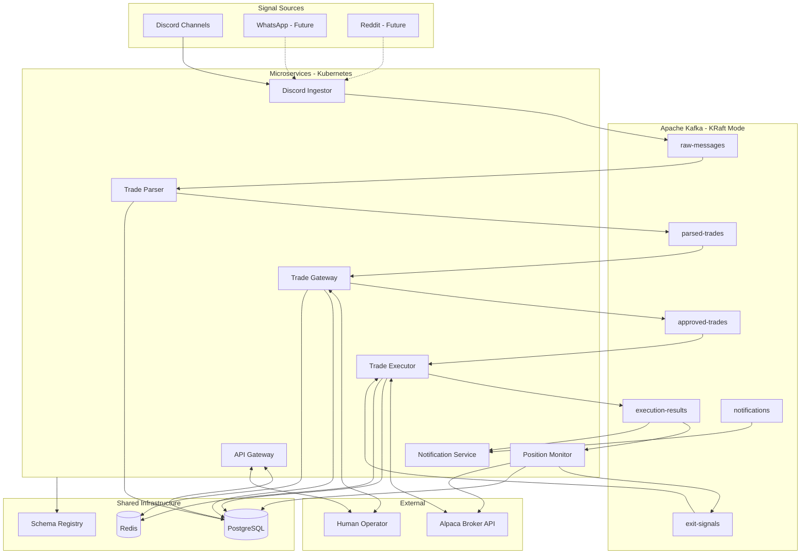
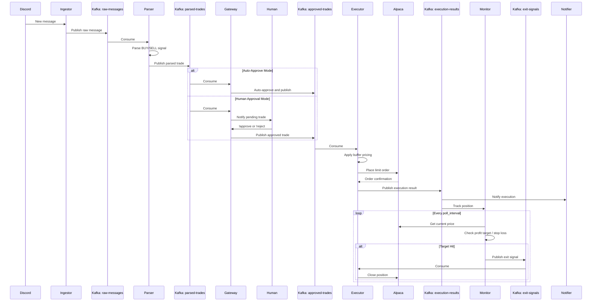
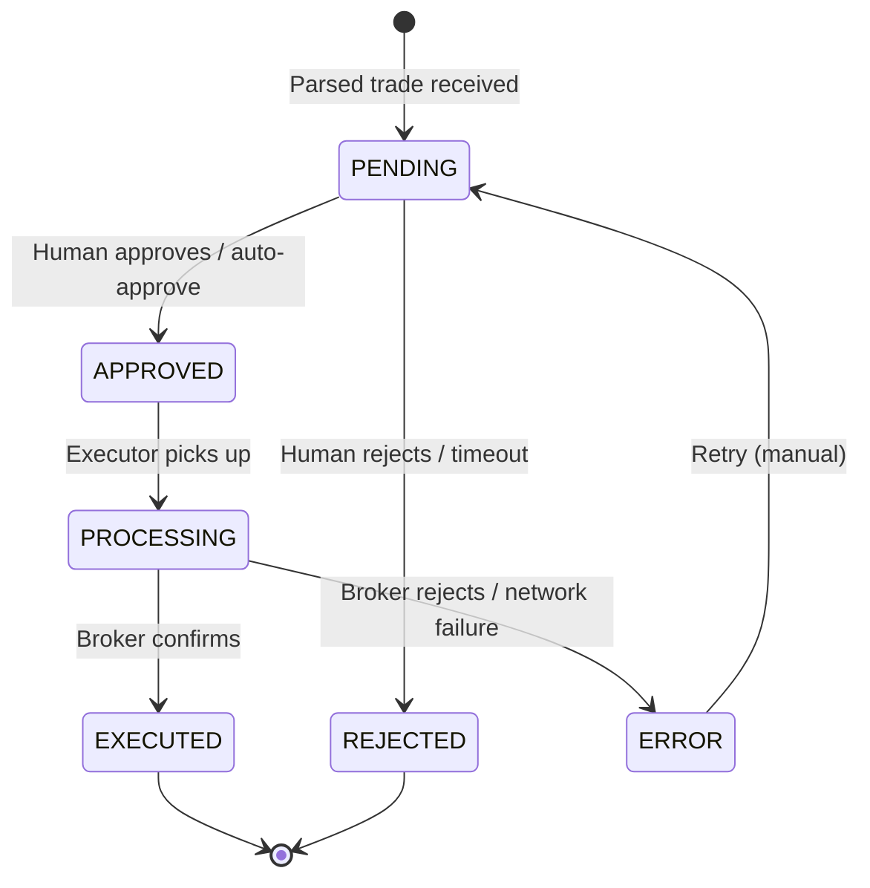
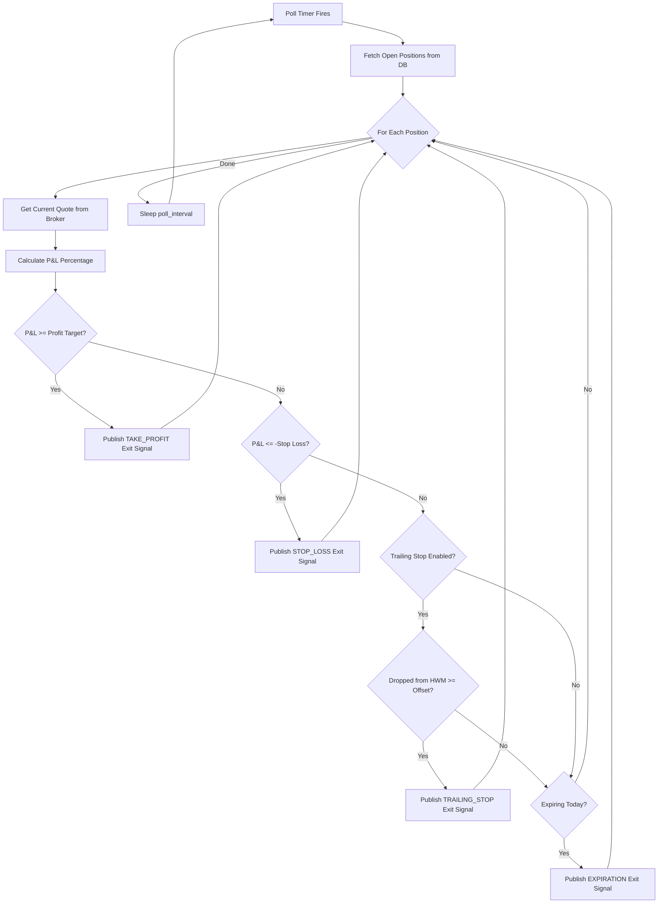
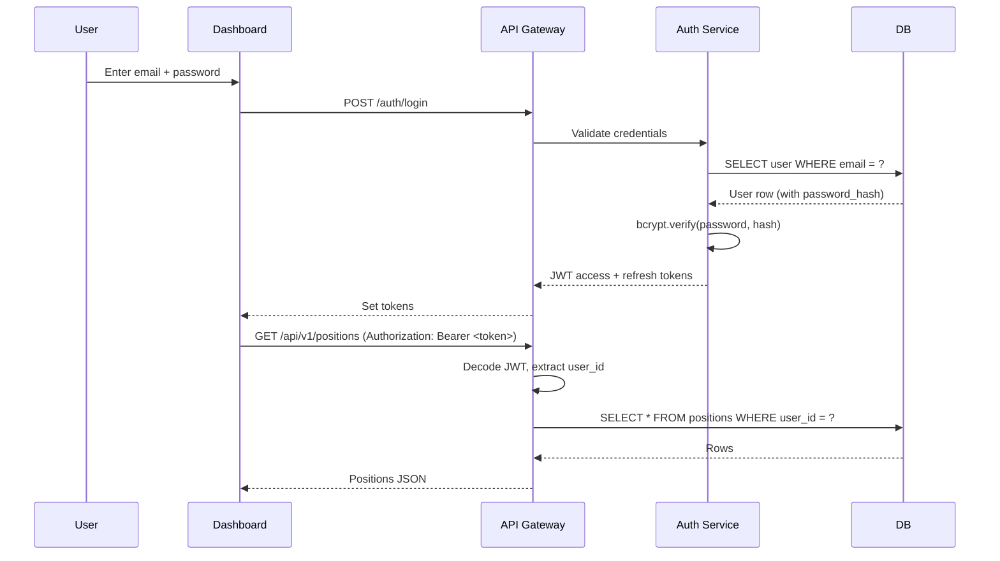
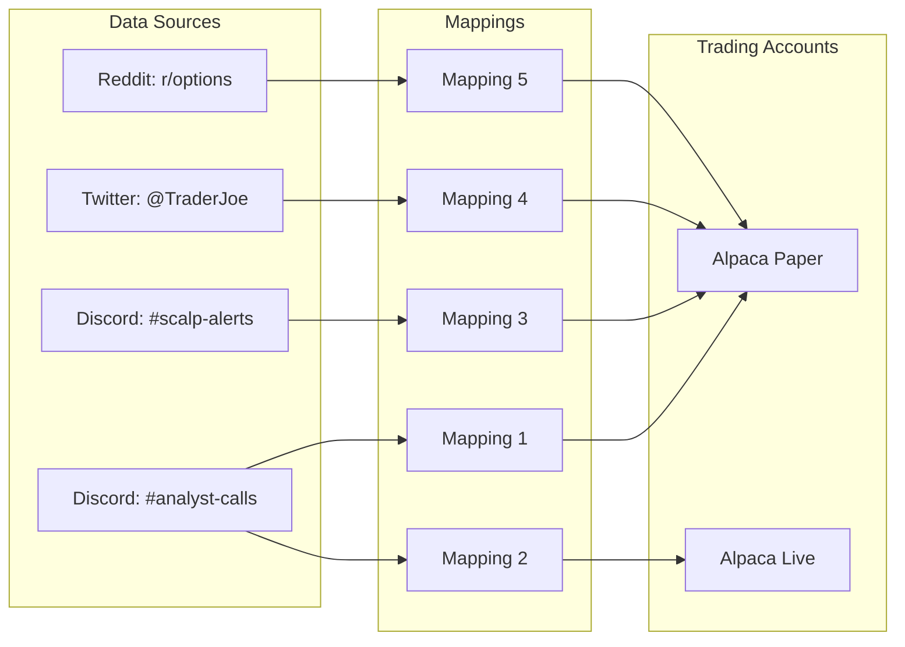
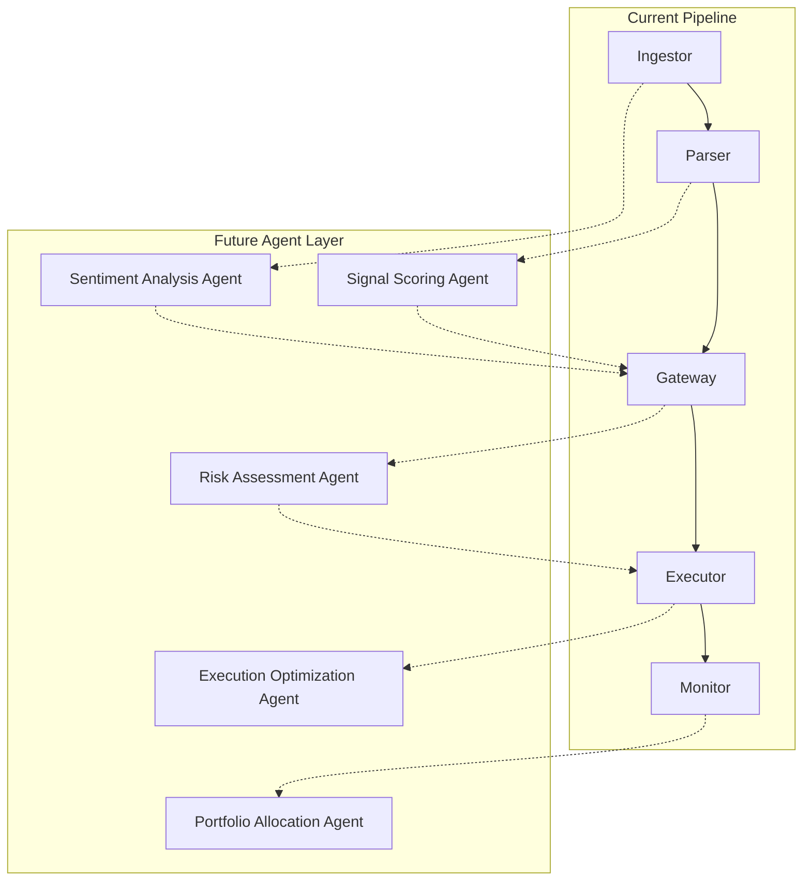

# Product Requirements Document: Copy Trading Platform

**Version:** 1.0
**Date:** 2026-02-20
**Status:** Draft

---

## Table of Contents

1. [Executive Summary](#1-executive-summary)
2. [Trading Platform Recommendation](#2-trading-platform-recommendation)
3. [System Architecture](#3-system-architecture)
4. [Detailed Service Specifications](#4-detailed-service-specifications)
5. [Buffer Price Execution](#5-buffer-price-execution)
6. [Position Monitoring Agent](#6-position-monitoring-agent)
7. [Human-in-the-Loop (Trade Gateway)](#7-human-in-the-loop-trade-gateway)
8. [Multi-Tenant Platform](#8-multi-tenant-platform)
9. [Data Models](#9-data-models)
10. [Infrastructure and Deployment](#10-infrastructure-and-deployment)
11. [Agentic / ML Extensibility](#11-agentic--ml-extensibility)
12. [Non-Functional Requirements](#12-non-functional-requirements)
13. [Migration Path](#13-migration-path)

---

## 1. Executive Summary

### Vision

Build an agentic copy-trading platform that ingests trade signals from Discord analysts (and future sources such as WhatsApp, Reddit, Telegram), parses and filters those signals, optionally gates them through human approval, executes them on a brokerage with configurable price buffers, and continuously monitors open positions for profit targets and stop losses.

### Problem Statement

Manual copy-trading from Discord analyst channels is slow, error-prone, and cannot scale. Price slippage during manual execution erodes profitability. There is no systematic way to enforce risk controls, take profit at targets, or cut losses automatically.

### Key Differentiators

- **Kafka-based event streaming** for zero-delay inter-service communication.
- **Kubernetes-native** deployment for horizontal scaling and self-healing.
- **Configurable price buffers** (default 15%) to handle fast-moving options prices.
- **Autonomous position monitoring agent** that enforces profit targets (default 30%) and stop losses.
- **Extensible to agentic/ML workflows** with defined plugin interfaces for signal scoring, risk models, and execution optimization.

### Current State

The existing codebase is a Python monolith with two logical services:

| Component | File | Purpose |
|-----------|------|---------|
| Discord Connector | `connectors/discord_connector.py` | Reads Discord messages |
| Trade Parser | `parsing/trade_parser.py` | Parses BUY/SELL signals |
| Message Parser Service | `services/message_parser_service.py` | Orchestrates parse + store |
| Execution Service | `services/execution_service.py` | Polls queue, executes trades |
| Alpaca Client | `trading/alpaca_client.py` | Alpaca API integration |
| Position Manager | `trading/position_manager.py` | Tracks positions in DB |
| Trade Validator | `trading/trade_validator.py` | Risk checks before execution |
| DB Models | `db/models.py` | SQLAlchemy models (SQLite) |
| Config | `config/config_loader.py` | Env + YAML config |

Communication is via a SQLite/CSV trade queue with polling. There is no Docker, Kubernetes, Kafka, or monitoring infrastructure.

---

## 2. Trading Platform Recommendation

### Broker Comparison

| Criteria | Alpaca | Interactive Brokers | Tradier |
|----------|--------|-------------------|---------|
| **Options API** | Yes | Yes | Yes |
| **Paper Trading** | Yes ($100k sandbox, real-time quotes) | Yes | Yes (sandbox) |
| **Limit Orders** | Yes | Yes | Yes |
| **Bracket Orders** | Yes (take-profit + stop-loss legs) | Yes | Limited |
| **Commission** | $0 | $0-1/contract | Varies |
| **Python SDK** | `alpaca-py` (actively maintained) | `ib_async` (Python 3.10+) | `pytradier`, `lumiwealth-tradier` |
| **API Latency** | Low (WebSocket streaming, FastAPI backend) | Low (binary protocol) | Moderate (REST) |
| **Global Availability** | 13+ countries | Global | US only |
| **Ease of Integration** | High (REST + WebSocket, simple auth) | Medium (requires TWS/Gateway running) | High (REST) |

### Recommendation

**Primary broker: Alpaca**

- Already integrated in the existing codebase (`trading/alpaca_client.py`).
- Commission-free options trading with paper trading sandbox.
- Bracket order support enables native stop-loss and take-profit execution.
- WebSocket streaming for real-time position price updates.
- Simple API key authentication (no desktop gateway requirement).

**Architecture decision:** Implement a `BrokerAdapter` interface so brokers can be swapped without touching execution logic. Alpaca is the first concrete implementation; Interactive Brokers can be added later for production scaling or international markets.

```python
class BrokerAdapter(Protocol):
    async def place_limit_order(self, symbol: str, qty: int, side: str, price: float) -> str: ...
    async def place_bracket_order(self, symbol: str, qty: int, side: str, price: float,
                                   take_profit: float, stop_loss: float) -> str: ...
    async def cancel_order(self, order_id: str) -> bool: ...
    async def get_positions(self) -> list[dict]: ...
    async def get_quote(self, symbol: str) -> dict: ...
    async def get_account(self) -> dict: ...
```

### Alpaca Paper Trading Limitations

- Does not simulate slippage, market impact, or order queue position.
- Does not account for dividends or regulatory fees.
- Fills are based on real-time quotes but may not reflect true execution dynamics.
- Buffer pricing (Section 5) partially compensates for these gaps.

---

## 3. System Architecture

### 3.1 High-Level Architecture



### 3.2 Service Directory Structure

```
copy-trading-platform/
├── docker-compose.yml
├── docker-compose.dev.yml
├── k8s/
│   ├── namespace.yaml
│   ├── kafka/
│   │   ├── kafka-cluster.yaml          # Strimzi KafkaCluster CR
│   │   ├── kafka-topics.yaml           # KafkaTopic CRs
│   │   └── schema-registry.yaml
│   ├── postgres/
│   │   ├── statefulset.yaml
│   │   ├── service.yaml
│   │   └── pvc.yaml
│   ├── redis/
│   │   ├── deployment.yaml
│   │   └── service.yaml
│   └── services/
│       ├── discord-ingestor.yaml
│       ├── trade-parser.yaml
│       ├── trade-gateway.yaml
│       ├── trade-executor.yaml
│       ├── position-monitor.yaml
│       ├── notification-service.yaml
│       └── api-gateway.yaml
├── shared/
│   ├── schemas/                        # Avro schemas for Kafka messages
│   │   ├── raw_message.avsc
│   │   ├── parsed_trade.avsc
│   │   ├── approved_trade.avsc
│   │   ├── execution_result.avsc
│   │   ├── exit_signal.avsc
│   │   └── notification.avsc
│   ├── models/                         # Shared SQLAlchemy models
│   │   ├── __init__.py
│   │   ├── base.py
│   │   ├── trade.py
│   │   ├── position.py
│   │   └── audit.py
│   ├── broker/                         # Broker abstraction layer
│   │   ├── __init__.py
│   │   ├── adapter.py                  # BrokerAdapter protocol
│   │   ├── alpaca_adapter.py
│   │   └── ib_adapter.py              # Future
│   ├── kafka_utils/                    # Kafka producer/consumer helpers
│   │   ├── __init__.py
│   │   ├── producer.py
│   │   ├── consumer.py
│   │   └── serialization.py
│   └── config/
│       ├── __init__.py
│       └── base_config.py
├── services/
│   ├── discord-ingestor/
│   │   ├── Dockerfile
│   │   ├── requirements.txt
│   │   ├── main.py
│   │   └── src/
│   │       ├── connector.py
│   │       └── producer.py
│   ├── trade-parser/
│   │   ├── Dockerfile
│   │   ├── requirements.txt
│   │   ├── main.py
│   │   └── src/
│   │       ├── consumer.py
│   │       ├── parser.py
│   │       └── producer.py
│   ├── trade-gateway/
│   │   ├── Dockerfile
│   │   ├── requirements.txt
│   │   ├── main.py
│   │   └── src/
│   │       ├── consumer.py
│   │       ├── approval_engine.py
│   │       ├── discord_commands.py
│   │       └── producer.py
│   ├── trade-executor/
│   │   ├── Dockerfile
│   │   ├── requirements.txt
│   │   ├── main.py
│   │   └── src/
│   │       ├── consumer.py
│   │       ├── buffer_pricing.py
│   │       ├── executor.py
│   │       └── producer.py
│   ├── position-monitor/
│   │   ├── Dockerfile
│   │   ├── requirements.txt
│   │   ├── main.py
│   │   └── src/
│   │       ├── monitor.py
│   │       ├── profit_target.py
│   │       ├── stop_loss.py
│   │       └── producer.py
│   ├── notification-service/
│   │   ├── Dockerfile
│   │   ├── requirements.txt
│   │   ├── main.py
│   │   └── src/
│   │       ├── consumer.py
│   │       ├── discord_notifier.py
│   │       ├── email_notifier.py
│   │       └── webhook_notifier.py
│   └── api-gateway/
│       ├── Dockerfile
│       ├── requirements.txt
│       ├── main.py
│       └── src/
│           ├── routes/
│           │   ├── trades.py
│           │   ├── positions.py
│           │   ├── config.py
│           │   └── health.py
│           └── websocket.py
└── tests/
    ├── unit/
    ├── integration/
    └── e2e/
```

### 3.3 Kafka Topic Design

| Topic | Partitions | Key | Producer | Consumer(s) | Retention |
|-------|-----------|-----|----------|-------------|-----------|
| `raw-messages` | 3 | `source_id` | discord-ingestor | trade-parser | 7 days |
| `parsed-trades` | 6 | `ticker` | trade-parser | trade-gateway | 7 days |
| `approved-trades` | 6 | `ticker` | trade-gateway | trade-executor | 7 days |
| `execution-results` | 6 | `trade_id` | trade-executor | position-monitor, notification-service | 30 days |
| `exit-signals` | 6 | `position_id` | position-monitor | trade-executor | 7 days |
| `notifications` | 3 | `channel` | any service | notification-service | 3 days |

**Partitioning strategy:** Partition by `ticker` for trade topics to ensure ordered processing per underlying symbol. This guarantees that BUY and subsequent SELL messages for the same ticker are processed sequentially.

### 3.4 Data Flow



---

## 4. Detailed Service Specifications

### 4.1 Discord Ingestor

**Responsibility:** Connect to Discord, listen to configured channels, and publish raw messages to Kafka.

| Property | Value |
|----------|-------|
| **Source code** | `services/discord-ingestor/` |
| **Migrated from** | `connectors/discord_connector.py` |
| **Kafka produces** | `raw-messages` |
| **Kafka consumes** | None |
| **Database** | None (stateless) |
| **Replicas** | 1 (Discord bot token supports single connection) |

**Configuration:**

| Env Var | Description | Default |
|---------|-------------|---------|
| `DISCORD_BOT_TOKEN` | Discord bot authentication token | Required |
| `DISCORD_TARGET_CHANNELS` | Comma-separated channel IDs | Required |
| `KAFKA_BOOTSTRAP_SERVERS` | Kafka broker addresses | `kafka:9092` |
| `KAFKA_TOPIC_RAW_MESSAGES` | Output topic | `raw-messages` |

**Kafka Message Schema (`raw_message.avsc`):**

```json
{
  "type": "record",
  "name": "RawMessage",
  "namespace": "com.copytrader.messages",
  "fields": [
    {"name": "message_id", "type": "string"},
    {"name": "source", "type": {"type": "enum", "name": "Source", "symbols": ["DISCORD", "WHATSAPP", "REDDIT", "TELEGRAM"]}},
    {"name": "channel_id", "type": "string"},
    {"name": "author", "type": "string"},
    {"name": "content", "type": "string"},
    {"name": "timestamp", "type": {"type": "long", "logicalType": "timestamp-millis"}},
    {"name": "metadata", "type": ["null", {"type": "map", "values": "string"}], "default": null}
  ]
}
```

**Extensibility:** New source connectors (WhatsApp, Reddit) follow the same pattern -- connect to the source platform and publish `RawMessage` events to `raw-messages`. Each connector is a separate service with its own Dockerfile.

---

### 4.2 Trade Parser

**Responsibility:** Consume raw messages, parse trade signals (BUY/SELL, ticker, strike, option type, expiration, quantity, price), filter non-trade messages, and publish parsed trades to Kafka.

| Property | Value |
|----------|-------|
| **Source code** | `services/trade-parser/` |
| **Migrated from** | `parsing/trade_parser.py`, `services/message_parser_service.py` |
| **Kafka produces** | `parsed-trades` |
| **Kafka consumes** | `raw-messages` |
| **Database** | PostgreSQL (write: `trade_events` audit log) |
| **Replicas** | 1-3 (stateless, scales horizontally) |

**Configuration:**

| Env Var | Description | Default |
|---------|-------------|---------|
| `KAFKA_BOOTSTRAP_SERVERS` | Kafka broker addresses | `kafka:9092` |
| `KAFKA_TOPIC_RAW_MESSAGES` | Input topic | `raw-messages` |
| `KAFKA_TOPIC_PARSED_TRADES` | Output topic | `parsed-trades` |
| `KAFKA_CONSUMER_GROUP` | Consumer group | `trade-parser-group` |
| `DATABASE_URL` | PostgreSQL connection string | Required |

**Kafka Message Schema (`parsed_trade.avsc`):**

```json
{
  "type": "record",
  "name": "ParsedTrade",
  "namespace": "com.copytrader.trades",
  "fields": [
    {"name": "trade_id", "type": "string"},
    {"name": "source_message_id", "type": "string"},
    {"name": "source", "type": "com.copytrader.messages.Source"},
    {"name": "action", "type": {"type": "enum", "name": "Action", "symbols": ["BUY", "SELL"]}},
    {"name": "ticker", "type": "string"},
    {"name": "strike", "type": "double"},
    {"name": "option_type", "type": {"type": "enum", "name": "OptionType", "symbols": ["CALL", "PUT"]}},
    {"name": "expiration", "type": ["null", "string"], "default": null},
    {"name": "quantity", "type": "string"},
    {"name": "is_percentage", "type": "boolean"},
    {"name": "price", "type": "double"},
    {"name": "raw_message", "type": "string"},
    {"name": "parsed_at", "type": {"type": "long", "logicalType": "timestamp-millis"}}
  ]
}
```

**Parsing Rules (carried from existing `parsing/trade_parser.py`):**

- Detect `Bought/Buy` and `Sold/Sell` action keywords.
- Extract ticker (1-5 uppercase letters), strike price, option type (C/P mapped to CALL/PUT).
- Handle percentage quantities (e.g., `Sold 50% SPX 6950C`) and absolute quantities (e.g., `Bought 5 SPX 6940C`).
- Extract expiration from `Exp: MM/DD/YYYY` or inline date patterns.
- Default quantity is 1 if not specified.
- Non-trade messages (no parseable action) are silently dropped.

---

### 4.3 Trade Gateway

**Responsibility:** Receive parsed trades, manage approval workflow (auto or human), persist trade state, and publish approved trades for execution.

| Property | Value |
|----------|-------|
| **Source code** | `services/trade-gateway/` |
| **Migrated from** | `services/trade_queue_writer.py` (partial) |
| **Kafka produces** | `approved-trades`, `notifications` |
| **Kafka consumes** | `parsed-trades` |
| **Database** | PostgreSQL (owns: `trades` table) |
| **Replicas** | 1-2 |

**Configuration:**

| Env Var | Description | Default |
|---------|-------------|---------|
| `APPROVAL_MODE` | `auto` or `manual` | `auto` |
| `APPROVAL_TIMEOUT_SECONDS` | Timeout before auto-reject in manual mode | `300` |
| `KAFKA_TOPIC_PARSED_TRADES` | Input topic | `parsed-trades` |
| `KAFKA_TOPIC_APPROVED_TRADES` | Output topic | `approved-trades` |
| `KAFKA_TOPIC_NOTIFICATIONS` | Notification topic | `notifications` |

**Discord Bot Commands (when `APPROVAL_MODE=manual`):**

| Command | Description |
|---------|-------------|
| `!pending` | List all pending trades with IDs |
| `!approve <id>` | Approve a specific trade |
| `!approve all` | Approve all pending trades |
| `!reject <id> [reason]` | Reject a trade with optional reason |
| `!positions` | List open positions |
| `!config sl <value>` | Set default stop loss |
| `!config pt <value>` | Set default profit target |
| `!kill` | Emergency: disable all trading |

**Trade State Machine:**



---

### 4.4 Trade Executor

**Responsibility:** Consume approved trades, apply buffer pricing, execute on the broker, update positions, and publish execution results.

| Property | Value |
|----------|-------|
| **Source code** | `services/trade-executor/` |
| **Migrated from** | `services/execution_service.py`, `trading/alpaca_client.py` |
| **Kafka produces** | `execution-results`, `notifications` |
| **Kafka consumes** | `approved-trades`, `exit-signals` |
| **Database** | PostgreSQL (writes: `trades`, `positions`) |
| **Replicas** | 1 (single executor to prevent duplicate orders; use leader election for HA) |

**Configuration:**

| Env Var | Description | Default |
|---------|-------------|---------|
| `BUFFER_PERCENTAGE` | Default price buffer (see Section 5) | `0.15` |
| `BUFFER_OVERRIDES` | JSON map of ticker-specific buffers | `{}` |
| `DRY_RUN_MODE` | Validate without executing | `false` |
| `ENABLE_TRADING` | Master kill switch | `true` |
| `MAX_POSITION_SIZE` | Max contracts per position | `10` |
| `MAX_TOTAL_CONTRACTS` | Max contracts across all positions | `100` |
| `MAX_NOTIONAL_VALUE` | Max notional value per position | `50000.0` |
| `MAX_DAILY_LOSS` | Max daily loss in dollars | `1000.0` |
| `TICKER_BLACKLIST` | Comma-separated blocked tickers | `` |
| `ALPACA_API_KEY` | Broker API key | Required |
| `ALPACA_SECRET_KEY` | Broker secret key | Required |
| `ALPACA_PAPER` | Use paper trading | `true` |
| `DEFAULT_PROFIT_TARGET` | Default profit target percentage | `0.30` |
| `DEFAULT_STOP_LOSS` | Default stop loss percentage | `0.20` |

**Kafka Message Schema (`execution_result.avsc`):**

```json
{
  "type": "record",
  "name": "ExecutionResult",
  "namespace": "com.copytrader.execution",
  "fields": [
    {"name": "trade_id", "type": "string"},
    {"name": "order_id", "type": ["null", "string"], "default": null},
    {"name": "status", "type": {"type": "enum", "name": "ExecStatus", "symbols": ["EXECUTED", "REJECTED", "ERROR"]}},
    {"name": "action", "type": "com.copytrader.trades.Action"},
    {"name": "ticker", "type": "string"},
    {"name": "strike", "type": "double"},
    {"name": "option_type", "type": "com.copytrader.trades.OptionType"},
    {"name": "expiration", "type": ["null", "string"], "default": null},
    {"name": "quantity", "type": "int"},
    {"name": "requested_price", "type": "double"},
    {"name": "buffered_price", "type": "double"},
    {"name": "fill_price", "type": ["null", "double"], "default": null},
    {"name": "error_message", "type": ["null", "string"], "default": null},
    {"name": "executed_at", "type": {"type": "long", "logicalType": "timestamp-millis"}},
    {"name": "profit_target", "type": "double"},
    {"name": "stop_loss", "type": "double"}
  ]
}
```

**Execution Flow:**

1. Consume from `approved-trades` or `exit-signals`.
2. Pre-execution validation (risk checks: position size, notional value, buying power, blacklist, daily loss).
3. Resolve percentage quantities against current positions.
4. Apply buffer pricing (Section 5).
5. If `DRY_RUN_MODE`: log and mark executed without broker call.
6. Format OCC option symbol (e.g., `SPX20260220C06940000`).
7. Submit limit order via `BrokerAdapter`.
8. On fill confirmation: update `positions` table, publish `ExecutionResult`.
9. On failure: publish error result, publish notification.

---

### 4.5 Position Monitor

**Responsibility:** Continuously poll open positions, check current market prices against profit targets and stop losses, and publish exit signals when thresholds are breached.

| Property | Value |
|----------|-------|
| **Source code** | `services/position-monitor/` |
| **New service** | Yes |
| **Kafka produces** | `exit-signals`, `notifications` |
| **Kafka consumes** | `execution-results` |
| **Database** | PostgreSQL (reads: `positions`, `trades`) |
| **Replicas** | 1 |

**Configuration:**

| Env Var | Description | Default |
|---------|-------------|---------|
| `MONITOR_POLL_INTERVAL_SECONDS` | Seconds between position checks | `5` |
| `DEFAULT_PROFIT_TARGET` | Default profit target (fraction) | `0.30` |
| `DEFAULT_STOP_LOSS` | Default stop loss (fraction) | `0.20` |
| `TRAILING_STOP_ENABLED` | Enable trailing stop loss | `false` |
| `TRAILING_STOP_OFFSET` | Trailing stop offset (fraction) | `0.10` |

**Kafka Message Schema (`exit_signal.avsc`):**

```json
{
  "type": "record",
  "name": "ExitSignal",
  "namespace": "com.copytrader.monitor",
  "fields": [
    {"name": "position_id", "type": "int"},
    {"name": "trade_id", "type": "string"},
    {"name": "ticker", "type": "string"},
    {"name": "strike", "type": "double"},
    {"name": "option_type", "type": "com.copytrader.trades.OptionType"},
    {"name": "expiration", "type": ["null", "string"], "default": null},
    {"name": "action", "type": {"type": "enum", "name": "ExitAction", "symbols": ["TAKE_PROFIT", "STOP_LOSS", "TRAILING_STOP", "MANUAL_EXIT", "EXPIRATION"]}},
    {"name": "quantity", "type": "int"},
    {"name": "entry_price", "type": "double"},
    {"name": "current_price", "type": "double"},
    {"name": "pnl_percentage", "type": "double"},
    {"name": "signal_time", "type": {"type": "long", "logicalType": "timestamp-millis"}}
  ]
}
```

**Monitoring Logic:**

```
for each open position:
    current_price = broker.get_quote(position.symbol)
    pnl_pct = (current_price - position.avg_entry_price) / position.avg_entry_price

    if pnl_pct >= position.profit_target:
        publish ExitSignal(action=TAKE_PROFIT)

    elif pnl_pct <= -position.stop_loss:
        publish ExitSignal(action=STOP_LOSS)

    elif trailing_stop_enabled:
        if current_price > position.high_water_mark:
            update high_water_mark
        elif (position.high_water_mark - current_price) / position.high_water_mark >= trailing_stop_offset:
            publish ExitSignal(action=TRAILING_STOP)
```

---

### 4.6 Notification Service

**Responsibility:** Consume notification events from all services and deliver them through configured channels (Discord, email, webhooks).

| Property | Value |
|----------|-------|
| **Source code** | `services/notification-service/` |
| **New service** | Yes |
| **Kafka produces** | None |
| **Kafka consumes** | `notifications`, `execution-results` |
| **Database** | PostgreSQL (write: `notification_log`) |
| **Replicas** | 1-2 |

**Notification Types:**

| Event | Channel | Priority |
|-------|---------|----------|
| Trade executed | Discord, Webhook | Normal |
| Trade rejected/error | Discord, Email | High |
| Profit target hit | Discord | Normal |
| Stop loss triggered | Discord, Email | High |
| Daily loss limit approaching | Discord, Email | Critical |
| Kill switch activated | Discord, Email, Webhook | Critical |
| Service health alert | Email, Webhook | Critical |

**Kafka Message Schema (`notification.avsc`):**

```json
{
  "type": "record",
  "name": "Notification",
  "namespace": "com.copytrader.notifications",
  "fields": [
    {"name": "notification_id", "type": "string"},
    {"name": "type", "type": {"type": "enum", "name": "NotificationType", "symbols": [
      "TRADE_EXECUTED", "TRADE_REJECTED", "TRADE_ERROR",
      "PROFIT_TARGET_HIT", "STOP_LOSS_TRIGGERED",
      "DAILY_LOSS_WARNING", "KILL_SWITCH", "HEALTH_ALERT"
    ]}},
    {"name": "priority", "type": {"type": "enum", "name": "Priority", "symbols": ["LOW", "NORMAL", "HIGH", "CRITICAL"]}},
    {"name": "title", "type": "string"},
    {"name": "body", "type": "string"},
    {"name": "metadata", "type": ["null", {"type": "map", "values": "string"}], "default": null},
    {"name": "timestamp", "type": {"type": "long", "logicalType": "timestamp-millis"}}
  ]
}
```

---

### 4.7 API Gateway

**Responsibility:** Provide REST and WebSocket APIs for external consumers (web UI, CLI, third-party integrations).

| Property | Value |
|----------|-------|
| **Source code** | `services/api-gateway/` |
| **New service** | Yes |
| **Kafka produces** | `notifications` |
| **Kafka consumes** | None (reads DB directly) |
| **Database** | PostgreSQL (read: all tables; write: `configurations`) |
| **Framework** | FastAPI |
| **Replicas** | 2-3 |

**REST Endpoints:**

| Method | Path | Description |
|--------|------|-------------|
| `GET` | `/api/v1/trades` | List trades with filters (status, ticker, date range) |
| `GET` | `/api/v1/trades/{id}` | Get trade details |
| `POST` | `/api/v1/trades/{id}/approve` | Approve a pending trade |
| `POST` | `/api/v1/trades/{id}/reject` | Reject a pending trade |
| `GET` | `/api/v1/positions` | List open positions |
| `GET` | `/api/v1/positions/{id}` | Get position details with P&L |
| `POST` | `/api/v1/positions/{id}/close` | Manually close a position |
| `GET` | `/api/v1/account` | Get broker account summary |
| `GET` | `/api/v1/config` | Get current configuration |
| `PUT` | `/api/v1/config` | Update configuration |
| `POST` | `/api/v1/config/kill-switch` | Toggle kill switch |
| `GET` | `/api/v1/metrics` | Get platform metrics (PnL, success rate) |
| `GET` | `/api/v1/health` | Health check |

**WebSocket Endpoints:**

| Path | Description |
|------|-------------|
| `/ws/trades` | Real-time trade status updates |
| `/ws/positions` | Real-time position P&L updates |
| `/ws/notifications` | Real-time notifications stream |

---

## 5. Buffer Price Execution

### Problem

Options prices move rapidly. By the time a Discord signal is parsed and an order is placed, the market price may have moved significantly from the analyst's quoted price. Without a buffer, limit orders frequently go unfilled.

### Solution

Apply a configurable buffer percentage to the parsed price before submitting the limit order. This increases the probability of fills while capping maximum slippage.

### Configuration

| Parameter | Description | Default |
|-----------|-------------|---------|
| `BUFFER_PERCENTAGE` | Global default buffer as a decimal fraction | `0.15` (15%) |
| `BUFFER_OVERRIDES` | Per-ticker buffer overrides (JSON) | `{}` |
| `BUFFER_MIN_PRICE` | Minimum buffered price (floor) | `0.01` |
| `BUFFER_MAX_PERCENTAGE` | Maximum allowed buffer | `0.30` (30%) |

### Pricing Logic

```
For BUY orders:
    buffered_price = parsed_price * (1 + buffer_percentage)

For SELL orders:
    buffered_price = parsed_price * (1 - buffer_percentage)

Per-ticker override:
    if ticker in BUFFER_OVERRIDES:
        buffer_percentage = BUFFER_OVERRIDES[ticker]

Constraints:
    buffered_price = max(buffered_price, BUFFER_MIN_PRICE)
    effective_buffer = min(buffer_percentage, BUFFER_MAX_PERCENTAGE)
```

### Examples

| Scenario | Parsed Price | Action | Buffer | Limit Price |
|----------|-------------|--------|--------|-------------|
| Default BUY | $4.80 | BUY | 15% | $5.52 |
| Default SELL | $6.50 | SELL | 15% | $5.53 |
| SPX override BUY | $4.80 | BUY | 10% | $5.28 |
| Low-price option BUY | $0.05 | BUY | 15% | $0.06 |

### Audit Trail

Every execution records both `requested_price` (the analyst's price) and `buffered_price` (the actual limit price submitted) in the `trades` table and the `ExecutionResult` Kafka message.

---

## 6. Position Monitoring Agent

### Overview

The Position Monitor is a standalone service that continuously watches all open positions and enforces automated exit rules. It runs independently of the execution flow and communicates exclusively through Kafka.

### Exit Rules

#### Profit Target

| Parameter | Description | Default |
|-----------|-------------|---------|
| `DEFAULT_PROFIT_TARGET` | Target P&L percentage for auto-exit | `0.30` (30%) |
| Per-position override | Set via API or Discord command | N/A |

When `(current_price - avg_entry_price) / avg_entry_price >= profit_target`, the monitor publishes an `ExitSignal` with `action=TAKE_PROFIT`.

#### Stop Loss

| Parameter | Description | Default |
|-----------|-------------|---------|
| `DEFAULT_STOP_LOSS` | Maximum loss percentage before auto-exit | `0.20` (20%) |
| Per-position override | Set via API or Discord command | N/A |

When `(avg_entry_price - current_price) / avg_entry_price >= stop_loss`, the monitor publishes an `ExitSignal` with `action=STOP_LOSS`.

#### Trailing Stop (Optional)

| Parameter | Description | Default |
|-----------|-------------|---------|
| `TRAILING_STOP_ENABLED` | Enable trailing stop functionality | `false` |
| `TRAILING_STOP_OFFSET` | Distance from high-water mark | `0.10` (10%) |

Tracks the highest price since entry. When price drops by `trailing_stop_offset` from the high-water mark, publishes `ExitSignal` with `action=TRAILING_STOP`.

#### Expiration Check

Positions approaching expiration (< 1 day to expiry) are flagged with a notification. Positions at expiration are auto-closed.

### Monitoring Flow



---

## 7. Human-in-the-Loop (Trade Gateway)

### Approval Modes

| Mode | Behavior |
|------|----------|
| `auto` | All parsed trades are immediately approved and forwarded for execution. |
| `manual` | Trades are queued as `PENDING`. Human must approve via Discord command or API. |

### Discord Command Interface

The Trade Gateway runs a secondary Discord bot (or reuses the ingestor bot with a command prefix) that accepts commands in a designated control channel.

**Command Reference:**

```
!pending                     List all pending trades
!approve <id>                Approve trade by ID
!approve all                 Approve all pending trades
!reject <id> [reason]        Reject trade by ID
!positions                   Show all open positions with P&L
!position <id>               Show details for a specific position
!config show                 Show current configuration
!config buffer <pct>         Set buffer percentage (e.g., !config buffer 0.15)
!config sl <pct>             Set default stop loss (e.g., !config sl 0.20)
!config pt <pct>             Set default profit target (e.g., !config pt 0.30)
!config mode <auto|manual>   Switch approval mode
!kill                        Emergency kill switch (stops all trading)
!resume                      Re-enable trading after kill
!stats                       Show daily stats (trades, P&L, win rate)
```

### REST API Approval

The same operations are available through the API Gateway REST endpoints (Section 4.7), enabling a future web UI.

### Timeout Behavior

In `manual` mode, if a trade is not acted upon within `APPROVAL_TIMEOUT_SECONDS` (default: 300s / 5 min), it is automatically rejected with reason `TIMEOUT`. A notification is sent.

---

## 8. Multi-Tenant Platform

The platform is a multi-tenant SaaS. Each user signs up, connects their own broker accounts and data sources, and sees a fully isolated dashboard. All data is scoped by `user_id`.

### 8.1 User Management

| Req ID | Requirement | Details |
|--------|-------------|---------|
| U1 | User registration | Email + password. Password hashed with bcrypt (cost factor 12). Email must be unique. |
| U2 | User login | Returns JWT access token (15 min TTL) + refresh token (7 day TTL). |
| U3 | Token refresh | `POST /auth/refresh` with valid refresh token returns new access + refresh pair. |
| U4 | Password reset | User requests reset via email. Server sends a time-limited token (1 hr). User sets new password. |
| U5 | User profile | Name, email, timezone, notification preferences (Discord webhook, email). Editable via dashboard. |
| U6 | Tenant isolation | Every API call is scoped by the authenticated user's ID. No user can see another user's data. |

**Auth Flow:**



### 8.2 Trading Account Management

Each user can connect one or more broker accounts. Each account is independently configurable.

| Req ID | Requirement | Details |
|--------|-------------|---------|
| TA1 | Create trading account | User selects broker type (Alpaca, Interactive Brokers, Tradier), enters API credentials, gives it a display name. |
| TA2 | Credential encryption | API keys and secrets encrypted at rest using Fernet symmetric encryption. Encryption key from K8s Secret / env var. Never stored in plaintext. |
| TA3 | Paper / Live toggle | Each account has a `paper_mode` boolean. Toggling is instant (no restart). Executor reads this flag before every trade. |
| TA4 | Per-account risk limits | Each account has its own: `max_position_size`, `max_total_contracts`, `max_notional_value`, `max_daily_loss`, `ticker_blacklist`. Stored as JSONB. |
| TA5 | Account health check | `POST /api/v1/accounts/{id}/test` verifies credentials by calling the broker's account endpoint. Returns balance or error. |
| TA6 | Enable / disable | Disabled accounts stop receiving trades. In-flight trades for disabled accounts are rejected. |
| TA7 | Multiple accounts | A user can have multiple accounts (e.g., one Alpaca paper, one Alpaca live, one IB). Each runs independently. |
| TA8 | Source mapping | When creating an account, user selects which data source channels should feed trades into this account (see Section 8.4). |

**Supported Brokers:**

| Broker | Status | Paper Trading | Credentials Required |
|--------|--------|---------------|---------------------|
| Alpaca | Supported | Yes | API Key + Secret Key |
| Interactive Brokers | Planned | Yes | Username + Port (TWS/Gateway must run separately) |
| Tradier | Planned | Yes (sandbox) | Access Token + Account ID |

### 8.3 Data Source Management

Each user configures their own signal sources. Each source can have multiple channels.

| Req ID | Requirement | Details |
|--------|-------------|---------|
| DS1 | Create data source | User selects source type (Discord, Twitter, Reddit), enters credentials, gives it a display name. |
| DS2 | Discord source | Requires: Bot Token. User adds the bot to their Discord server. System discovers available channels. User selects which channels to monitor. |
| DS3 | Twitter/X source | Requires: API Bearer Token. User enters usernames or list IDs to follow. |
| DS4 | Reddit source | Requires: Client ID + Client Secret. User enters subreddit names to monitor. |
| DS5 | Channel management | Each source has N channels. Each channel can be independently enabled/disabled. |
| DS6 | Connection status | Each source shows: CONNECTED, DISCONNECTED, ERROR, CONNECTING. Tested on creation and polled periodically. |
| DS7 | Enable / disable | Disabled sources stop ingesting. Channels under disabled sources are inactive. |
| DS8 | Credential encryption | Same Fernet encryption as trading accounts (TA2). |

**Source Types:**

| Source | Channels | Credentials | Parser |
|--------|----------|-------------|--------|
| Discord | Server text channels | Bot Token | Trade parser (BUY/SELL regex) |
| Twitter/X | User timelines, lists | Bearer Token | Trade parser (adapted for tweet format) |
| Reddit | Subreddits | Client ID + Secret | Trade parser (adapted for post/comment format) |

### 8.4 Source-to-Account Mapping

This is the core configuration that controls which signals flow to which broker accounts.

| Req ID | Requirement | Details |
|--------|-------------|---------|
| SM1 | Many-to-many mapping | A single channel can feed into multiple trading accounts. A single trading account can receive from multiple channels. |
| SM2 | Per-mapping overrides | Each mapping can override: `buffer_percentage`, `profit_target`, `stop_loss`, `max_position_size`, `approval_mode`. |
| SM3 | Visual mapping UI | Dashboard shows a drag-and-drop or selection UI to connect channels to accounts. |
| SM4 | Enable / disable | Individual mappings can be toggled without deleting them. |
| SM5 | Default config | Mappings without overrides inherit from the trading account's risk config. |

**Mapping Data Flow:**



### 8.5 Dashboard Portal

The dashboard is a mobile-first responsive web application serving as both a monitoring tool and a configuration portal.

**Navigation Structure:**

| Tab | Sub-Pages | Description |
|-----|-----------|-------------|
| **Dashboard** | Trade Monitor, Positions, P&L Analytics | Real-time trading activity and performance |
| **Data Sources** | Source List, Add/Edit Source, Channel Manager | Configure where trade signals come from |
| **Trading Accounts** | Account List, Add/Edit Account, Source Mapping | Configure where trades execute |
| **Analytics** | Per-Account P&L, Analyst Performance, Suggestions, Risk Analysis | Deep performance analytics |
| **System** | Service Health, Configuration, Notifications, Kill Switch | Platform administration |

**Dashboard Analytics Panels (all scoped to authenticated user):**

| Panel | Category | Description |
|-------|----------|-------------|
| P&L Calendar Heatmap | Analytics | Green/red day-grid (like GitHub contributions) showing daily P&L |
| Trade Replay Timeline | Dashboard | Scrub through the day's trades on an interactive timeline |
| Risk Utilization Gauges | Dashboard | Visual meters: position size, daily loss, notional value vs limits |
| Source Signal Quality | Analytics | Matrix showing win rate per source/channel combination |
| Account Comparison | Analytics | Side-by-side P&L for paper vs live or across accounts |
| Win/Loss Streak Tracker | Analytics | Current and longest winning/losing streaks |
| Average Holding Time | Analytics | Distribution of trade holding times |
| Sector/Ticker Exposure | Analytics | Pie chart of open position allocation by ticker |
| Notification Center | System | Bell icon with unread count, filterable notification history |
| Drawdown Chart | Analytics | Maximum drawdown from peak equity over time |

**Mobile-First Design:**

| Breakpoint | Layout | Navigation |
|-----------|--------|------------|
| `< 640px` (mobile) | Single column, stacked cards | Bottom tab bar (5 tabs) |
| `640-1024px` (tablet) | 2-column grid | Collapsible sidebar |
| `> 1024px` (desktop) | Multi-column with sidebar | Fixed sidebar, full navigation |

---

## 9. Data Models

### Database: PostgreSQL

Migrated from SQLite to PostgreSQL for concurrent access from multiple services, ACID transactions, and production readiness. All tables are tenant-scoped via `user_id` foreign keys.

### 9.0 `users` Table

| Column | Type | Nullable | Description |
|--------|------|----------|-------------|
| `id` | `UUID` (PK) | No | User ID (UUID v4) |
| `email` | `VARCHAR(255)` | No | Unique email address |
| `password_hash` | `VARCHAR(255)` | No | bcrypt hash (cost 12) |
| `name` | `VARCHAR(100)` | Yes | Display name |
| `timezone` | `VARCHAR(50)` | No | IANA timezone (default UTC) |
| `notification_prefs` | `JSONB` | No | `{"discord_webhook": null, "email_enabled": true}` |
| `is_active` | `BOOLEAN` | No | Account active flag (default true) |
| `created_at` | `TIMESTAMP` | No | Registration time |
| `last_login` | `TIMESTAMP` | Yes | Last successful login |

**Indexes:**
- `idx_users_email` on `(email)` UNIQUE

### 9.0a `trading_accounts` Table

| Column | Type | Nullable | Description |
|--------|------|----------|-------------|
| `id` | `UUID` (PK) | No | Account ID |
| `user_id` | `UUID` (FK → users) | No | Owning user |
| `broker_type` | `VARCHAR(30)` | No | ALPACA, INTERACTIVE_BROKERS, TRADIER |
| `display_name` | `VARCHAR(100)` | No | User-friendly name (e.g., "My Paper Account") |
| `credentials_encrypted` | `BYTEA` | No | Fernet-encrypted JSON blob of broker credentials |
| `paper_mode` | `BOOLEAN` | No | true = paper trading, false = live |
| `enabled` | `BOOLEAN` | No | Active toggle (default true) |
| `risk_config` | `JSONB` | No | `{"max_position_size": 10, "max_daily_loss": 1000, ...}` |
| `last_health_check` | `TIMESTAMP` | Yes | Last connectivity test |
| `health_status` | `VARCHAR(20)` | No | HEALTHY, UNHEALTHY, UNKNOWN |
| `created_at` | `TIMESTAMP` | No | Creation time |
| `updated_at` | `TIMESTAMP` | No | Last modification |

**Indexes:**
- `idx_ta_user` on `(user_id)`
- `idx_ta_user_broker` on `(user_id, broker_type)`

### 9.0b `data_sources` Table

| Column | Type | Nullable | Description |
|--------|------|----------|-------------|
| `id` | `UUID` (PK) | No | Source ID |
| `user_id` | `UUID` (FK → users) | No | Owning user |
| `source_type` | `VARCHAR(20)` | No | DISCORD, TWITTER, REDDIT |
| `display_name` | `VARCHAR(100)` | No | User-friendly name |
| `credentials_encrypted` | `BYTEA` | No | Fernet-encrypted JSON blob of source credentials |
| `enabled` | `BOOLEAN` | No | Active toggle (default true) |
| `connection_status` | `VARCHAR(20)` | No | CONNECTED, DISCONNECTED, ERROR, CONNECTING |
| `last_connected_at` | `TIMESTAMP` | Yes | Last successful connection |
| `created_at` | `TIMESTAMP` | No | Creation time |
| `updated_at` | `TIMESTAMP` | No | Last modification |

**Indexes:**
- `idx_ds_user` on `(user_id)`
- `idx_ds_user_type` on `(user_id, source_type)`

### 9.0c `channels` Table

| Column | Type | Nullable | Description |
|--------|------|----------|-------------|
| `id` | `UUID` (PK) | No | Channel ID |
| `data_source_id` | `UUID` (FK → data_sources) | No | Parent source |
| `channel_identifier` | `VARCHAR(200)` | No | Platform-specific ID (Discord channel ID, subreddit name, Twitter username) |
| `display_name` | `VARCHAR(100)` | No | Friendly name |
| `enabled` | `BOOLEAN` | No | Active toggle (default true) |
| `created_at` | `TIMESTAMP` | No | Creation time |

**Indexes:**
- `idx_ch_source` on `(data_source_id)`
- `idx_ch_source_identifier` on `(data_source_id, channel_identifier)` UNIQUE

### 9.0d `account_source_mappings` Table

| Column | Type | Nullable | Description |
|--------|------|----------|-------------|
| `id` | `UUID` (PK) | No | Mapping ID |
| `trading_account_id` | `UUID` (FK → trading_accounts) | No | Target account |
| `channel_id` | `UUID` (FK → channels) | No | Source channel |
| `config_overrides` | `JSONB` | Yes | Per-mapping overrides: `{"buffer_pct": 0.10, "profit_target": 0.25}` |
| `enabled` | `BOOLEAN` | No | Active toggle (default true) |
| `created_at` | `TIMESTAMP` | No | Creation time |

**Indexes:**
- `idx_asm_account` on `(trading_account_id)`
- `idx_asm_channel` on `(channel_id)`
- `idx_asm_unique` on `(trading_account_id, channel_id)` UNIQUE

### 9.1 `trades` Table

The central trade lifecycle table, owned by the Trade Gateway and updated by the Trade Executor.

| Column | Type | Nullable | Description |
|--------|------|----------|-------------|
| `id` | `SERIAL` (PK) | No | Auto-increment ID |
| `trade_id` | `UUID` | No | Globally unique trade identifier |
| `user_id` | `UUID` (FK → users) | No | Owning user |
| `trading_account_id` | `UUID` (FK → trading_accounts) | No | Target broker account |
| `channel_id` | `UUID` (FK → channels) | Yes | Originating channel |
| `ticker` | `VARCHAR(10)` | No | Underlying symbol (e.g., SPX, IWM) |
| `strike` | `DECIMAL(10,2)` | No | Strike price |
| `option_type` | `VARCHAR(4)` | No | CALL or PUT |
| `expiration` | `DATE` | Yes | Option expiration date |
| `action` | `VARCHAR(4)` | No | BUY or SELL |
| `quantity` | `VARCHAR(20)` | No | Integer or percentage string (e.g., "50%") |
| `resolved_quantity` | `INTEGER` | Yes | Actual contracts after resolving percentages |
| `price` | `DECIMAL(10,2)` | No | Analyst's quoted price |
| `buffered_price` | `DECIMAL(10,2)` | Yes | Price after buffer applied |
| `fill_price` | `DECIMAL(10,2)` | Yes | Actual fill price from broker |
| `source` | `VARCHAR(20)` | No | discord, twitter, reddit |
| `source_message_id` | `VARCHAR(100)` | Yes | Original message ID |
| `raw_message` | `TEXT` | Yes | Full original message text |
| `status` | `VARCHAR(20)` | No | PENDING, APPROVED, PROCESSING, EXECUTED, REJECTED, ERROR |
| `error_message` | `TEXT` | Yes | Error details if status is ERROR/REJECTED |
| `broker_order_id` | `VARCHAR(100)` | Yes | Broker-assigned order ID |
| `profit_target` | `DECIMAL(5,4)` | No | Position profit target (default 0.30) |
| `stop_loss` | `DECIMAL(5,4)` | No | Position stop loss (default 0.20) |
| `approved_by` | `VARCHAR(100)` | Yes | User who approved (null for auto) |
| `approved_at` | `TIMESTAMP` | Yes | Approval timestamp |
| `created_at` | `TIMESTAMP` | No | When trade was parsed |
| `processed_at` | `TIMESTAMP` | Yes | When trade was executed/rejected |

**Indexes:**
- `idx_trades_user` on `(user_id)`
- `idx_trades_account` on `(trading_account_id)`
- `idx_trades_status` on `(user_id, status)`
- `idx_trades_ticker` on `(ticker, strike, option_type, expiration)`
- `idx_trades_created` on `(user_id, created_at)`
- `idx_trades_trade_id` on `(trade_id)` UNIQUE

### 9.2 `positions` Table

Tracks current open positions, owned by the Trade Executor.

| Column | Type | Nullable | Description |
|--------|------|----------|-------------|
| `id` | `SERIAL` (PK) | No | Auto-increment ID |
| `user_id` | `UUID` (FK → users) | No | Owning user |
| `trading_account_id` | `UUID` (FK → trading_accounts) | No | Broker account holding this position |
| `ticker` | `VARCHAR(10)` | No | Underlying symbol |
| `strike` | `DECIMAL(10,2)` | No | Strike price |
| `option_type` | `VARCHAR(4)` | No | CALL or PUT |
| `expiration` | `DATE` | No | Expiration date |
| `quantity` | `INTEGER` | No | Net contracts (negative = short) |
| `avg_entry_price` | `DECIMAL(10,2)` | No | Weighted average entry price |
| `total_cost` | `DECIMAL(12,2)` | No | Total cost basis |
| `profit_target` | `DECIMAL(5,4)` | No | Position-specific profit target |
| `stop_loss` | `DECIMAL(5,4)` | No | Position-specific stop loss |
| `high_water_mark` | `DECIMAL(10,2)` | Yes | Highest price since entry (for trailing stop) |
| `broker_symbol` | `VARCHAR(50)` | No | OCC-formatted symbol |
| `status` | `VARCHAR(10)` | No | OPEN, CLOSED |
| `opened_at` | `TIMESTAMP` | No | When position was opened |
| `closed_at` | `TIMESTAMP` | Yes | When position was closed |
| `close_reason` | `VARCHAR(20)` | Yes | TAKE_PROFIT, STOP_LOSS, TRAILING_STOP, MANUAL, EXPIRATION |
| `realized_pnl` | `DECIMAL(12,2)` | Yes | Realized P&L when closed |
| `last_updated` | `TIMESTAMP` | No | Last update timestamp |

**Indexes:**
- `idx_positions_user` on `(user_id)`
- `idx_positions_account` on `(trading_account_id)`
- `idx_positions_unique` on `(user_id, ticker, strike, option_type, expiration)` UNIQUE (for OPEN positions)
- `idx_positions_status` on `(user_id, status)`

### 9.3 `trade_events` Table (Audit Log)

Append-only event log for full trade lifecycle audit.

| Column | Type | Description |
|--------|------|-------------|
| `id` | `BIGSERIAL` (PK) | Auto-increment |
| `user_id` | `UUID` (FK → users) | Owning user |
| `trade_id` | `UUID` | Reference to trades table |
| `event_type` | `VARCHAR(30)` | PARSED, APPROVED, REJECTED, EXECUTING, EXECUTED, ERROR, EXIT_SIGNAL, CLOSED |
| `event_data` | `JSONB` | Event-specific payload |
| `source_service` | `VARCHAR(30)` | Service that generated the event |
| `created_at` | `TIMESTAMP` | Event timestamp |

**Indexes:**
- `idx_te_user` on `(user_id)`

### 9.4 `configurations` Table

Runtime configuration that can be updated via API or Discord commands. Scoped per user.

| Column | Type | Description |
|--------|------|-------------|
| `id` | `SERIAL` (PK) | Auto-increment |
| `user_id` | `UUID` (FK → users) | Owning user |
| `key` | `VARCHAR(100)` | Config key |
| `value` | `JSONB` | Config value |
| `updated_by` | `VARCHAR(100)` | Who updated |
| `updated_at` | `TIMESTAMP` | When updated |

**Indexes:**
- `idx_conf_user_key` on `(user_id, key)` UNIQUE

### 9.5 `daily_metrics` Table

Aggregated daily performance metrics per user and account.

| Column | Type | Description |
|--------|------|-------------|
| `id` | `BIGSERIAL` (PK) | Auto-increment |
| `user_id` | `UUID` (FK → users) | Owning user |
| `trading_account_id` | `UUID` (FK → trading_accounts) | Account |
| `date` | `DATE` | Metric date |
| `total_trades` | `INTEGER` | Trades executed that day |
| `winning_trades` | `INTEGER` | Trades with positive P&L |
| `losing_trades` | `INTEGER` | Trades with negative P&L |
| `total_pnl` | `DECIMAL(12,2)` | Net P&L for the day |
| `max_drawdown` | `DECIMAL(12,2)` | Worst peak-to-trough drop |
| `created_at` | `TIMESTAMP` | When computed |

**Indexes:**
- `idx_dm_user_date` on `(user_id, date)`
- `idx_dm_account_date` on `(trading_account_id, date)` UNIQUE

### 9.6 `notification_log` Table

| Column | Type | Description |
|--------|------|-------------|
| `id` | `BIGSERIAL` (PK) | Auto-increment |
| `user_id` | `UUID` (FK → users) | Owning user |
| `notification_type` | `VARCHAR(30)` | Type enum |
| `channel` | `VARCHAR(20)` | discord, email, webhook |
| `title` | `VARCHAR(200)` | Notification title |
| `body` | `TEXT` | Notification body |
| `status` | `VARCHAR(10)` | SENT, FAILED |
| `read` | `BOOLEAN` | Whether user has read it (default false) |
| `created_at` | `TIMESTAMP` | When created |

**Indexes:**
- `idx_nl_user` on `(user_id)`
- `idx_nl_user_read` on `(user_id, read)`

---

## 10. Infrastructure and Deployment

### 10.1 Docker

Each service has its own `Dockerfile` based on a common Python base image.

**Base Image:**

```dockerfile
FROM python:3.13-slim AS base
WORKDIR /app
RUN pip install --no-cache-dir --upgrade pip
COPY shared/ /app/shared/
```

**Service Dockerfile (example: trade-executor):**

```dockerfile
FROM base AS service
COPY services/trade-executor/requirements.txt .
RUN pip install --no-cache-dir -r requirements.txt
COPY services/trade-executor/ .
CMD ["python", "main.py"]
```

### 10.2 Docker Compose (Local Development)

```yaml
version: "3.9"
services:
  kafka:
    image: apache/kafka-native:3.8
    ports:
      - "9092:9092"
    environment:
      KAFKA_NODE_ID: 1
      KAFKA_PROCESS_ROLES: broker,controller
      KAFKA_CONTROLLER_QUORUM_VOTERS: 1@kafka:9093
      KAFKA_LISTENERS: PLAINTEXT://0.0.0.0:9092,CONTROLLER://0.0.0.0:9093
      KAFKA_ADVERTISED_LISTENERS: PLAINTEXT://kafka:9092
      KAFKA_CONTROLLER_LISTENER_NAMES: CONTROLLER
      KAFKA_LISTENER_SECURITY_PROTOCOL_MAP: CONTROLLER:PLAINTEXT,PLAINTEXT:PLAINTEXT
      KAFKA_LOG_DIRS: /tmp/kraft-combined-logs

  schema-registry:
    image: confluentinc/cp-schema-registry:7.6.0
    depends_on: [kafka]
    ports:
      - "8081:8081"
    environment:
      SCHEMA_REGISTRY_HOST_NAME: schema-registry
      SCHEMA_REGISTRY_KAFKASTORE_BOOTSTRAP_SERVERS: kafka:9092

  postgres:
    image: postgres:16-alpine
    ports:
      - "5432:5432"
    environment:
      POSTGRES_DB: copytrader
      POSTGRES_USER: copytrader
      POSTGRES_PASSWORD: localdev
    volumes:
      - pgdata:/var/lib/postgresql/data

  redis:
    image: redis:7-alpine
    ports:
      - "6379:6379"

  discord-ingestor:
    build:
      context: .
      dockerfile: services/discord-ingestor/Dockerfile
    depends_on: [kafka]
    env_file: .env

  trade-parser:
    build:
      context: .
      dockerfile: services/trade-parser/Dockerfile
    depends_on: [kafka, postgres, schema-registry]
    env_file: .env

  trade-gateway:
    build:
      context: .
      dockerfile: services/trade-gateway/Dockerfile
    depends_on: [kafka, postgres]
    env_file: .env

  trade-executor:
    build:
      context: .
      dockerfile: services/trade-executor/Dockerfile
    depends_on: [kafka, postgres, redis]
    env_file: .env

  position-monitor:
    build:
      context: .
      dockerfile: services/position-monitor/Dockerfile
    depends_on: [kafka, postgres]
    env_file: .env

  notification-service:
    build:
      context: .
      dockerfile: services/notification-service/Dockerfile
    depends_on: [kafka, postgres]
    env_file: .env

  api-gateway:
    build:
      context: .
      dockerfile: services/api-gateway/Dockerfile
    depends_on: [postgres, redis]
    ports:
      - "8000:8000"
    env_file: .env

volumes:
  pgdata:
```

### 10.3 Kubernetes Deployment

**Cluster Components:**

| Component | K8s Resource | Operator / Notes |
|-----------|-------------|-----------------|
| Kafka | `KafkaCluster` CR | Strimzi Operator (KRaft mode) |
| Schema Registry | `Deployment` | Confluent Schema Registry image |
| PostgreSQL | `StatefulSet` | Or managed (RDS, Cloud SQL) |
| Redis | `Deployment` | Or managed (ElastiCache, Memorystore) |
| Services (7) | `Deployment` each | With `HPA` for scalable services |

**Resource Allocation:**

| Service | CPU Request | CPU Limit | Memory Request | Memory Limit | Min Replicas | Max Replicas |
|---------|------------|-----------|---------------|-------------|-------------|-------------|
| discord-ingestor | 100m | 250m | 128Mi | 256Mi | 1 | 1 |
| trade-parser | 100m | 500m | 128Mi | 512Mi | 1 | 3 |
| trade-gateway | 100m | 500m | 128Mi | 512Mi | 1 | 2 |
| trade-executor | 200m | 500m | 256Mi | 512Mi | 1 | 1 |
| position-monitor | 100m | 250m | 128Mi | 256Mi | 1 | 1 |
| notification-service | 100m | 250m | 128Mi | 256Mi | 1 | 2 |
| api-gateway | 200m | 1000m | 256Mi | 512Mi | 2 | 5 |

**Health Checks:**

Every service exposes:
- `GET /healthz` -- liveness probe (returns 200 if process is alive)
- `GET /readyz` -- readiness probe (returns 200 if Kafka/DB connections are healthy)

**Secrets Management:**

- Kubernetes Secrets for API keys and tokens (Discord, Alpaca).
- In production: HashiCorp Vault or cloud-native secret manager with CSI driver.
- Secrets are never stored in config maps, environment files committed to git, or container images.

### 10.4 CI/CD Pipeline

```mermaid
flowchart LR
    Push[Git Push] --> Lint[Lint + Type Check]
    Lint --> UnitTests[Unit Tests]
    UnitTests --> BuildImages[Build Docker Images]
    BuildImages --> IntegTests[Integration Tests - Docker Compose]
    IntegTests --> PushRegistry[Push to Container Registry]
    PushRegistry --> DeployDev[Deploy to Dev K8s]
    DeployDev --> SmokeTests[Smoke Tests]
    SmokeTests --> DeployStaging[Deploy to Staging]
    DeployStaging --> E2ETests[E2E Tests]
    E2ETests --> ManualGate[Manual Approval]
    ManualGate --> DeployProd[Deploy to Production]
```



**Environments:**

| Environment | Purpose | Broker Mode | Kafka |
|-------------|---------|-------------|-------|
| `dev` | Local development | Paper (Alpaca sandbox) | Single-node Docker |
| `staging` | Integration testing | Paper (Alpaca sandbox) | 3-node cluster |
| `production` | Live trading | Paper initially, then live | 3+ node cluster |

---

## 11. Agentic / ML Extensibility

### Vision

The platform is designed to evolve from rule-based copy-trading into a multi-agent system where ML models participate in signal scoring, risk assessment, and execution optimization.

### Extension Points



### Agent Plugin Interface

Each agent extension point follows a standardized interface:

```python
class AgentPlugin(Protocol):
    """Base protocol for all agent plugins."""
    name: str
    version: str

    async def initialize(self, config: dict) -> None:
        """Called once at startup."""
        ...

    async def process(self, event: dict) -> dict:
        """Process an event and return enriched/modified event."""
        ...

    async def health_check(self) -> bool:
        """Return True if the agent is healthy."""
        ...


class SignalScoringAgent(AgentPlugin):
    """Scores parsed trades based on ML model confidence."""
    async def score(self, parsed_trade: dict) -> float:
        """Return confidence score 0.0-1.0."""
        ...


class RiskAssessmentAgent(AgentPlugin):
    """Evaluates portfolio risk before execution."""
    async def assess(self, trade: dict, portfolio: dict) -> dict:
        """Return risk assessment with recommendation."""
        ...


class ExecutionOptimizationAgent(AgentPlugin):
    """Optimizes execution timing and buffer pricing."""
    async def optimize(self, trade: dict, market_data: dict) -> dict:
        """Return optimized execution parameters."""
        ...
```

### Kafka Topics for Agents

| Topic | Purpose |
|-------|---------|
| `agent-signals` | Agent-generated trade signals |
| `agent-scores` | ML confidence scores for parsed trades |
| `agent-risk` | Risk assessments |
| `agent-decisions` | Final agent decisions (approve/reject/modify) |

### ML Infrastructure Integration Points

| Component | Purpose | Technology |
|-----------|---------|-----------|
| **Feature Store** | Store and serve ML features (price history, volatility, sentiment) | Feast or custom |
| **Model Registry** | Version and deploy ML models | MLflow |
| **Vector Store** | Semantic search over historical signals | pgvector (PostgreSQL extension) |
| **Inference Service** | Serve model predictions | FastAPI + ONNX Runtime or TorchServe |

### Agent Communication Protocols

- **Internal:** Kafka topics with Avro-serialized messages (same as existing services).
- **LLM Agents:** Model Context Protocol (MCP) for orchestrator-to-agent communication.
- **Agent-to-Agent:** A2A protocol (peer communication) over gRPC or Kafka.
- **Orchestration:** LangGraph for DAG-based multi-agent workflow coordination.

---

## 12. Non-Functional Requirements

### 11.1 Performance

| Metric | Target | Measurement |
|--------|--------|-------------|
| End-to-end latency (Discord message to order submission) | < 500ms | OpenTelemetry trace |
| Kafka produce latency | < 10ms | Kafka producer metrics |
| Kafka consume latency | < 50ms | Consumer lag |
| Position monitor poll cycle | < 2s for 100 positions | Service metrics |
| API Gateway response time (p99) | < 200ms | Prometheus histogram |

### 12.2 Reliability

| Metric | Target |
|--------|--------|
| Service availability (during market hours) | 99.9% |
| Zero message loss | Kafka `acks=all`, `min.insync.replicas=2` |
| At-least-once delivery | Kafka consumer with manual offset commit |
| Idempotent execution | Deduplication by `trade_id` in executor |

### 12.3 Observability

**Tracing:**
- OpenTelemetry SDK in every service.
- Trace propagation through Kafka message headers.
- Jaeger or Tempo for trace visualization.

**Metrics:**
- Prometheus exposition format on `/metrics` endpoint per service.
- Key metrics:
  - `trades_total` (counter, labels: status, action, ticker)
  - `trade_latency_seconds` (histogram, labels: stage)
  - `positions_open` (gauge)
  - `pnl_realized_total` (counter)
  - `pnl_unrealized` (gauge)
  - `kafka_consumer_lag` (gauge, labels: topic, group)
  - `broker_api_latency_seconds` (histogram)
  - `broker_api_errors_total` (counter)

**Dashboards (Grafana):**
- Trade pipeline overview (message count, parse rate, execution rate).
- Position P&L dashboard (open positions, unrealized/realized P&L).
- Infrastructure health (Kafka lag, DB connections, CPU/memory).
- Alerting rules for: consumer lag > 100, execution error rate > 5%, daily loss approaching limit.

**Logging:**
- Structured JSON logs to stdout.
- Collected by Fluentd/Fluent Bit into Elasticsearch or Loki.
- Correlation via `trace_id` and `trade_id` across services.

### 12.4 Security

| Concern | Solution |
|---------|----------|
| Secrets storage | K8s Secrets (dev), HashiCorp Vault (prod) |
| Inter-service communication | mTLS via service mesh (Istio) or Kafka SASL/SSL |
| API authentication | JWT tokens (API Gateway) |
| Discord bot token | Mounted as K8s Secret, never in code |
| Broker API keys | Mounted as K8s Secret, rotated quarterly |
| Database access | Per-service credentials with minimal privileges |
| Audit trail | Immutable `trade_events` table, all mutations logged |

### 12.5 Scalability

| Component | Scaling Strategy |
|-----------|-----------------|
| trade-parser | Horizontal (add replicas in same consumer group) |
| api-gateway | Horizontal (stateless, behind load balancer) |
| notification-service | Horizontal (partition by notification type) |
| trade-executor | Single instance with leader election (prevent duplicate orders) |
| position-monitor | Single instance (or sharded by ticker range) |
| Kafka | Add partitions and brokers as throughput grows |
| PostgreSQL | Read replicas for query load; vertical scaling for write load |

---

## 13. Migration Path

### Phase 1: Repository Restructure (Week 1)

**Goal:** Reorganize the monolith into the microservice directory structure without changing behavior.

| Task | Details |
|------|---------|
| Create `shared/` directory | Move `db/models.py` to `shared/models/`, `config/` to `shared/config/` |
| Create `shared/broker/` | Extract `BrokerAdapter` protocol from `trading/alpaca_client.py` |
| Create service directories | `services/discord-ingestor/`, `services/trade-parser/`, etc. |
| Migrate Discord connector | `connectors/discord_connector.py` -> `services/discord-ingestor/src/connector.py` |
| Migrate parser | `parsing/trade_parser.py` -> `services/trade-parser/src/parser.py` |
| Migrate executor | `services/execution_service.py` + `trading/` -> `services/trade-executor/src/` |
| Add Dockerfiles | One per service |
| Add `docker-compose.yml` | Services still communicate via shared DB (no Kafka yet) |

### Phase 2: Kafka + PostgreSQL (Week 2)

**Goal:** Replace SQLite queue with Kafka and PostgreSQL.

| Task | Details |
|------|---------|
| Add Kafka to docker-compose | `apache/kafka-native:3.8` (KRaft mode) |
| Add Schema Registry | Confluent Schema Registry |
| Add PostgreSQL | Replace SQLite, migrate schema |
| Implement Kafka producers | In discord-ingestor and trade-parser |
| Implement Kafka consumers | In trade-parser and trade-executor |
| Add `shared/kafka_utils/` | Reusable producer/consumer with Avro serialization |
| Remove SQLite/CSV queue | Replace `trade_queue_writer.py` and `trade_queue_reader.py` |
| Add Redis | For rate limiting and caching |

### Phase 3: New Services (Week 3)

**Goal:** Add position-monitor, trade-gateway, notification-service, and api-gateway.

| Task | Details |
|------|---------|
| Build trade-gateway | Approval engine, Discord commands, state machine |
| Build position-monitor | Poll loop, profit target / stop loss logic |
| Build notification-service | Discord, email, webhook notification channels |
| Build api-gateway | FastAPI REST + WebSocket endpoints |
| Implement buffer pricing | `services/trade-executor/src/buffer_pricing.py` |
| Add human-in-the-loop | Discord command handler in trade-gateway |

### Phase 4: Kubernetes Deployment (Week 4)

**Goal:** Deploy to Kubernetes with production-grade infrastructure.

| Task | Details |
|------|---------|
| Install Strimzi operator | Deploy Kafka on K8s |
| Create K8s manifests | Deployments, Services, ConfigMaps, Secrets |
| Create Helm charts | Parameterized deployment |
| Add health probes | `/healthz` and `/readyz` on all services |
| Add HPA | Autoscaling for stateless services |
| Add observability | OpenTelemetry, Prometheus, Grafana |
| CI/CD pipeline | GitHub Actions or equivalent |
| Staging environment | Full end-to-end with paper trading |

### Phase 5: Agentic / ML Extensions (Week 5+)

**Goal:** Add ML model integration and agentic capabilities.

| Task | Details |
|------|---------|
| Define agent plugin interface | `shared/agents/` with protocols |
| Add signal scoring agent | ML-based trade confidence scoring |
| Add sentiment analysis | NLP on Discord messages before parsing |
| Add feature store | Historical data pipeline for ML training |
| Add model registry | MLflow for model versioning |
| Add LangGraph orchestration | Multi-agent workflow coordination |

### Risk Mitigation

| Risk | Mitigation |
|------|-----------|
| Data loss during migration | Run old and new systems in parallel; compare outputs |
| Kafka complexity | Start with single-node Kafka in dev; use managed Kafka in prod |
| Broker API rate limits | Redis-based rate limiter in trade-executor |
| Duplicate order execution | Idempotency via `trade_id` deduplication in executor |
| Position monitor lag | Alert on consumer lag; configurable poll interval |

---

## Appendix A: Technology Stack Summary

| Layer | Technology | Version | Purpose |
|-------|-----------|---------|---------|
| Language | Python | 3.13+ | No-GIL option for high throughput |
| Web Framework | FastAPI | Latest | API Gateway, health endpoints |
| Message Broker | Apache Kafka | 3.8+ (KRaft) | Event streaming between services |
| Schema Registry | Confluent | 7.6+ | Avro schema management |
| Database | PostgreSQL | 16+ | Persistent storage |
| Cache | Redis | 7+ | Rate limiting, caching |
| ORM | SQLAlchemy | 2.0+ | Database access |
| Kafka Client | aiokafka | Latest | Async Kafka producer/consumer |
| Broker SDK | alpaca-py | Latest | Alpaca trading API |
| Serialization | Apache Avro | Latest | Kafka message schemas |
| Containerization | Docker | Latest | Service packaging |
| Orchestration | Kubernetes | 1.28+ | Production deployment |
| Kafka on K8s | Strimzi | Latest | Kafka operator |
| Observability | OpenTelemetry | Latest | Distributed tracing |
| Metrics | Prometheus + Grafana | Latest | Monitoring and dashboards |
| Logging | Fluent Bit + Loki | Latest | Log aggregation |
| CI/CD | GitHub Actions | N/A | Build and deploy pipeline |

## Appendix B: Environment Variables Reference

| Variable | Service(s) | Required | Default |
|----------|-----------|----------|---------|
| `DISCORD_BOT_TOKEN` | discord-ingestor, trade-gateway | Yes | - |
| `DISCORD_TARGET_CHANNELS` | discord-ingestor | Yes | - |
| `KAFKA_BOOTSTRAP_SERVERS` | All | Yes | `kafka:9092` |
| `SCHEMA_REGISTRY_URL` | All | Yes | `http://schema-registry:8081` |
| `DATABASE_URL` | All (except discord-ingestor) | Yes | - |
| `REDIS_URL` | trade-executor, trade-gateway, api-gateway | No | `redis://redis:6379` |
| `ALPACA_API_KEY` | trade-executor, position-monitor | Yes | - |
| `ALPACA_SECRET_KEY` | trade-executor, position-monitor | Yes | - |
| `ALPACA_PAPER` | trade-executor, position-monitor | No | `true` |
| `BUFFER_PERCENTAGE` | trade-executor | No | `0.15` |
| `BUFFER_OVERRIDES` | trade-executor | No | `{}` |
| `APPROVAL_MODE` | trade-gateway | No | `auto` |
| `APPROVAL_TIMEOUT_SECONDS` | trade-gateway | No | `300` |
| `DEFAULT_PROFIT_TARGET` | trade-executor, position-monitor | No | `0.30` |
| `DEFAULT_STOP_LOSS` | trade-executor, position-monitor | No | `0.20` |
| `TRAILING_STOP_ENABLED` | position-monitor | No | `false` |
| `TRAILING_STOP_OFFSET` | position-monitor | No | `0.10` |
| `MONITOR_POLL_INTERVAL_SECONDS` | position-monitor | No | `5` |
| `DRY_RUN_MODE` | trade-executor | No | `false` |
| `ENABLE_TRADING` | trade-executor | No | `true` |
| `MAX_POSITION_SIZE` | trade-executor | No | `10` |
| `MAX_TOTAL_CONTRACTS` | trade-executor | No | `100` |
| `MAX_NOTIONAL_VALUE` | trade-executor | No | `50000.0` |
| `MAX_DAILY_LOSS` | trade-executor | No | `1000.0` |
| `TICKER_BLACKLIST` | trade-executor | No | `` |
| `NOTIFICATION_DISCORD_WEBHOOK` | notification-service | No | - |
| `NOTIFICATION_EMAIL_SMTP` | notification-service | No | - |
| `LOG_LEVEL` | All | No | `INFO` |
