---
pdf_options:
  format: A4
  margin: 25mm 20mm 25mm 20mm
  printBackground: true
  headerTemplate: '<div style="font-size:8px;width:100%;text-align:center;color:#888;">Phoenix Trade Bot -- Technical Documentation</div>'
  footerTemplate: '<div style="font-size:8px;width:100%;text-align:center;color:#888;"><span class="pageNumber"></span> / <span class="totalPages"></span></div>'
  displayHeaderFooter: true
stylesheet: []
body_class: pdf-doc
---

<style>
  body { font-family: 'Segoe UI', Tahoma, Geneva, Verdana, sans-serif; color: #1a1a2e; line-height: 1.6; }
  h1 { color: #6c3fc5; border-bottom: 3px solid #6c3fc5; padding-bottom: 8px; page-break-after: avoid; }
  h2 { color: #2d2d5e; border-bottom: 1px solid #ddd; padding-bottom: 4px; margin-top: 2em; page-break-after: avoid; }
  h3 { color: #444; page-break-after: avoid; }
  h4 { color: #555; page-break-after: avoid; }
  code { background: #f0f0f5; padding: 1px 4px; border-radius: 3px; font-size: 0.9em; }
  pre { background: #1a1a2e; color: #e0e0e0; padding: 12px; border-radius: 6px; overflow-x: auto; font-size: 0.85em; }
  pre code { background: none; color: inherit; }
  table { border-collapse: collapse; width: 100%; margin: 1em 0; font-size: 0.9em; }
  th { background: #6c3fc5; color: white; padding: 8px 12px; text-align: left; }
  td { border: 1px solid #ddd; padding: 6px 12px; }
  tr:nth-child(even) { background: #f8f8fc; }
  blockquote { border-left: 4px solid #6c3fc5; padding-left: 12px; color: #555; margin: 1em 0; }
  .page-break { page-break-before: always; }
  .cover { text-align: center; padding-top: 200px; }
  .cover h1 { font-size: 42px; border: none; }
  .cover p { font-size: 16px; color: #666; }
</style>

<div class="cover">

# Phoenix Trade Bot

**Comprehensive Technical Documentation**

Version 2.0 | February 2026

Enterprise-Grade Automated Trading Platform

Discord Signal Ingestion | NLP Parsing | Broker Execution | Real-Time Monitoring

---

*This document covers the complete architecture, feature set, component internals, and end-to-end process flows of the Phoenix Trade Bot platform.*

</div>

<div class="page-break"></div>

# Table of Contents

1. [Project Overview](#1-project-overview)
2. [Features Inventory](#2-features-inventory)
3. [Architecture](#3-architecture)
4. [Component Deep Dives](#4-component-deep-dives)
5. [End-to-End Process Flows](#5-end-to-end-process-flows)

---

<div class="page-break"></div>

# 1. Project Overview

## 1.1 What is Phoenix Trade Bot?

Phoenix Trade Bot is an enterprise-grade, multi-tenant automated trading platform that transforms trading signals from social media (Discord, Twitter, Reddit) into executed broker orders. It bridges the gap between human trading intelligence shared in online communities and automated trade execution with comprehensive risk management.

The platform solves several critical problems for active traders:

- **Speed**: Manually copying trades from Discord channels into a broker takes 30-60 seconds. Phoenix executes in under 2 seconds.
- **Accuracy**: Human transcription errors (wrong strike price, wrong ticker) are eliminated through NLP parsing.
- **Risk Management**: Every trade passes through configurable buffer pricing, position sizing limits, stop-loss, and profit targets.
- **Scale**: A single user can monitor multiple Discord channels, Twitter feeds, and Reddit threads simultaneously.
- **Analysis**: Built-in sentiment analysis, signal scoring, and performance analytics help traders make better decisions.

## 1.2 Tech Stack

| Layer | Technology | Purpose |
|-------|-----------|---------|
| **Backend** | Python 3.13, FastAPI | Microservices with async I/O |
| **Frontend** | React 18, TypeScript, Tailwind CSS | Single-page dashboard application |
| **Message Broker** | Apache Kafka (KRaft mode) | Event-driven service communication |
| **Database** | PostgreSQL 16 + SQLAlchemy 2.0 (async) | Persistent storage with ORM |
| **Cache** | Redis 7 | Deduplication, rate limiting, sessions |
| **NLP** | FinBERT, spaCy, Flan-T5 | Intent classification, entity extraction |
| **Broker** | Alpaca API (alpaca-py SDK) | Paper and live trade execution |
| **UI Components** | Radix UI (shadcn/ui), Recharts, TradingView | Charts, widgets, interactive components |
| **Pipeline Editor** | React Flow (@xyflow/react) | Visual drag-and-drop pipeline builder |
| **Containerization** | Docker, Docker Compose | Service packaging and orchestration |
| **Deployment** | Coolify, Kubernetes-ready | Production hosting |

## 1.3 Architecture Philosophy

Phoenix follows an **event-driven microservices architecture** with these principles:

- **Loose Coupling via Kafka**: Services communicate through Kafka topics, not direct HTTP calls. A trade signal flows through `raw-messages` -> `parsed-trades` -> `approved-trades` -> `execution-results` without any service needing to know about others.
- **Shared-Nothing State**: Each service maintains its own consumer group offset. The only shared state is the PostgreSQL database and Redis cache.
- **Multi-Tenancy**: Every database record is scoped by `user_id`. Users see only their own data, pipelines, and trades.
- **Resilience**: Circuit breakers protect broker calls, dead-letter queues catch poison messages, and retry logic handles transient failures.
- **Configuration as Code**: All behavior is controlled through environment variables loaded into typed dataclass configs.

## 1.4 Deployment Model

Phoenix supports three deployment modes:

1. **Local Development** (`docker-compose.dev.yml`): Starts only infrastructure (Kafka, PostgreSQL, Redis). Services run natively with hot-reload.
2. **Full Docker** (`docker-compose.yml`): All 20 services containerized. One command to start the entire platform.
3. **Production** (`docker-compose.coolify.yml`): Resource-limited, health-checked, persistent-volume configuration for Coolify or similar platforms.

Kubernetes manifests are available in `k8s/` for cloud deployment.

<div class="page-break"></div>

# 2. Features Inventory

## 2.1 Trade Pipeline Management

The core feature of Phoenix. Users connect data sources (Discord accounts), discover channels, and create pipelines that automatically ingest, parse, approve, and execute trades.

**How it works:**
1. User connects their Discord account (encrypted credentials stored with Fernet)
2. Source Orchestrator discovers available servers and channels
3. User creates a Pipeline: selects a channel, maps it to a trading account, configures approval mode
4. Messages from the channel flow through Kafka: parse -> approve -> execute
5. Results appear in real-time on the dashboard via WebSocket

**Key Settings:**
- Auto-approve vs. manual approval mode
- Paper mode vs. live trading
- Market hours enforcement (regular only, extended, 24/7, queue)
- Per-pipeline risk overrides

## 2.2 Market Command Center

A customizable, multi-tab dashboard with 60+ market widgets for day trading and swing trading.

**Capabilities:**
- **Multi-Tab Canvases**: Create unlimited tabs (e.g., "Market News", "Options Flow", "SPX Setup"), each with independent widget layouts
- **Drag-and-Drop Grid**: Widgets can be repositioned and resized using react-grid-layout
- **Configurable Widgets**: 12 widgets accept custom ticker/symbol configuration via a settings dialog
- **Persistent State**: All tab names, widget positions, and configurations are saved to localStorage

**Widget Categories (60+ widgets):**

| Category | Widgets |
|----------|---------|
| Market Pulse | Fear & Greed, VIX, Global Indices, Futures, Market Clock, Ticker Tape |
| Equities | Mag 7, Top Movers, Market Heatmap, Sector Performance, TradingView Chart |
| Options | Gamma Exposure (GEX), Options Flow, Put/Call Ratio, Options Expiry |
| Volatility | VIX Term Structure, Volatility Dashboard, Market Internals |
| Technical | Technical Analysis, Mini Chart, Symbol Info, Key Levels (Pivots/S&R) |
| News & Social | Breaking News, Top Stories, RSS Feed, Trending Videos, Social Feed |
| Crypto & Forex | Crypto Widget, Crypto Heatmap, Forex Cross Rates, Crypto Screener |
| Fixed Income | Bond Yields, Commodities |
| Tools | Position Size Calculator, Risk/Reward Visualizer, Trading Checklist, Quick Notes, Keyboard Shortcuts |
| Analytics | Day Trade P&L, Premarket Movers, Premarket Gaps, Correlation Matrix |
| Data | Fundamental Data, Company Profile, Stock Screener, ETF Heatmap |

## 2.3 Strategy Builder

A natural language strategy creation system powered by a ReAct (Reasoning + Acting) AI agent.

**How it works:**
1. User describes a strategy in plain English (e.g., "Buy SPY calls when RSI drops below 30 and VIX is above 20")
2. The ReAct agent loop interprets the request using an LLM (Ollama/Mistral)
3. Agent uses tools: `create_strategy`, `fetch_market_data`, `run_backtest`, `get_strategy_list`
4. Strategy is parsed into structured config and stored in the database
5. User can run backtests against historical data and view performance reports

**Key Metrics from Backtests:**
- Total return, Sharpe ratio, max drawdown
- Win rate, profit factor, average win/loss
- Equity curve visualization
- Benchmark comparison (SPY, QQQ)

## 2.4 Position Monitor

Real-time monitoring of open positions with automatic exit execution.

**Exit Conditions:**
- **Profit Target**: Configurable percentage (default 30%). When position gains exceed this threshold, an exit signal is generated.
- **Stop Loss**: Configurable percentage (default 20%). Limits downside risk.
- **Trailing Stop**: Tracks the high-water mark of a position. If price drops by the trailing offset from the peak, triggers exit.

**How it works:**
1. Position Monitor polls open positions every 5 seconds
2. For each position, queries current market price from the broker
3. Updates high-water mark if price has increased
4. Evaluates exit conditions via the ExitEngine
5. If triggered, publishes exit signal to Kafka `exit-signals` topic
6. Trade Executor processes the exit signal and places a SELL order

## 2.5 Analytics Dashboard

Performance analytics for trading activity.

**Metrics:**
- Total trades, executed, in-progress, rejected, errored (KPI cards)
- Daily P&L chart (7-day rolling)
- Recent trades table with sentiment indicators
- Search and filter capabilities
- CSV export for external analysis
- Analyst performance tracking (win rate, total P&L per signal source)

## 2.6 Sentiment Analysis

NLP-powered sentiment tracking for individual tickers.

**Components:**
- **FinBERT Model**: Pre-trained financial sentiment classifier (bullish/bearish/neutral)
- **Ticker Sentiment Aggregation**: Aggregates sentiment scores over time periods
- **Sentiment Alerts**: User-configurable alerts when sentiment shifts (e.g., "Alert me when AAPL sentiment turns bearish")
- **Traders Pulse Page**: Dashboard showing sentiment trends, mention volumes, and source breakdown

## 2.7 News Aggregation

Multi-source news aggregation with intelligent clustering.

**Features:**
- RSS feed ingestion from configurable sources
- News headline clustering using fuzzy matching (rapidfuzz)
- Importance scoring based on ticker mentions, sentiment, and source reputation
- Ticker extraction from headlines for cross-referencing with positions
- Category and sentiment labeling

## 2.8 Advanced Pipeline Editor

Visual drag-and-drop pipeline builder using React Flow.

**Node Types:**
- **Data Source Node**: Discord, Twitter, Reddit connectors
- **Processing Node**: Filters, transformers, NLP enrichment
- **AI Model Node**: Sentiment analysis, signal scoring
- **Broker Node**: Trade execution configuration
- **Control Node**: Conditionals, delays, splitters

**Features:**
- Pipeline versioning with change history
- Simulation/testing mode
- Template library for common patterns
- Visual connection of nodes with typed edges

## 2.9 AI Trade Decisions

ML-powered trade recommendation system.

**Flow:**
1. Trade signal arrives with parsed entities
2. Signal Scorer evaluates confidence (0-100) using 4 factors
3. Option Chain Analyzer identifies optimal contracts
4. AI Trade Recommender combines scores with market context
5. Decision is logged with full rationale for audit

## 2.10 Model Hub

Registry for ML models used across the platform.

**Seeded Models:**
- FinBERT (sentiment analysis)
- spaCy en_core_web_sm (entity extraction)
- Mistral 7B (strategy agent reasoning)
- Llama 3.1 (general-purpose LLM)
- Custom trade signal classifier

**Features:**
- Version tracking, health monitoring
- Performance metrics per model
- Input/output schema documentation
- Status management (active, inactive, deprecated)

## 2.11 Authentication System

Full-featured authentication with security best practices.

**Features:**
- **Registration**: Email + password with bcrypt hashing
- **Email Verification**: Token-based email verification flow
- **JWT Tokens**: Access tokens (30-min expiry) + refresh tokens (7-day expiry)
- **MFA**: TOTP-based two-factor authentication with QR code setup
- **RBAC**: Role-based access control (viewer, trader, manager, admin)
- **Permissions**: Granular permission flags per user

## 2.12 Notification System

Multi-channel notification delivery.

**Channels:**
- **Discord Bot**: Commands (`!pending`, `!approve`, `!reject`, `!stats`, `!kill`, `!resume`)
- **Email**: HTML-formatted trade notifications and daily reports
- **WhatsApp**: Optional WhatsApp message delivery
- **In-App**: Notification center in the dashboard

**Daily Reports:**
- Generated at 4:00 PM ET (market close)
- Per-user aggregation of daily trades
- HTML email with P&L summary, win rate, trade table

## 2.13 Sprint Board

Built-in Kanban-style task management.

**Features:**
- Board columns: Backlog, To Do, In Progress, Done
- Task cards with title, description, priority, labels
- Assignee management
- Due dates
- Drag-and-drop between columns

## 2.14 Trading Accounts

Broker integration management.

**Supported Brokers:**
- **Alpaca** (paper and live modes)
- Extensible adapter protocol for adding new brokers

**Features:**
- Encrypted credential storage (Fernet symmetric encryption)
- Health check verification on first use
- Paper/live mode per account
- Risk configuration per account (position limits, daily loss limits)
- Account-channel mapping for multi-pipeline setups

<div class="page-break"></div>

# 3. Architecture

## 3.1 System Architecture

The platform consists of 20 microservices, 3 infrastructure components, and a React frontend.

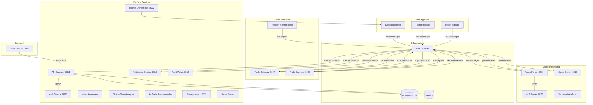

## 3.2 Kafka Event Flow

All inter-service communication flows through 8 Kafka topics:

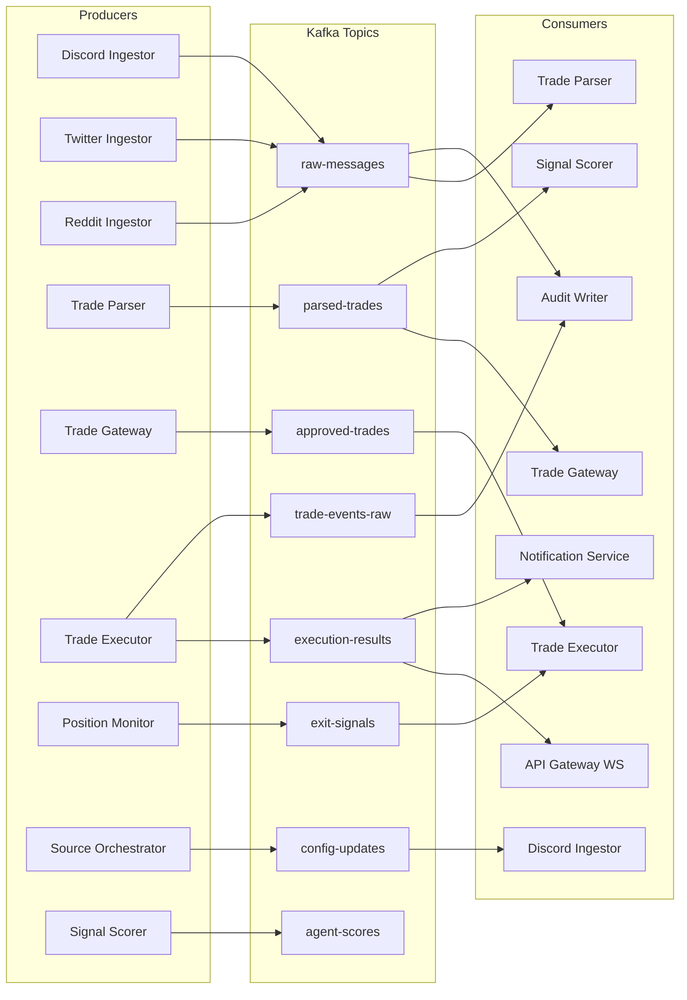

## 3.3 Database Entity Relationship Diagram

Core database tables and their relationships:

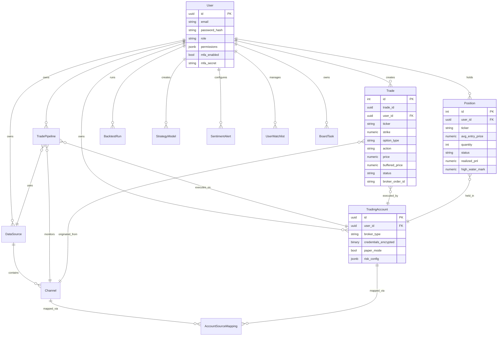

## 3.4 Frontend Page Map

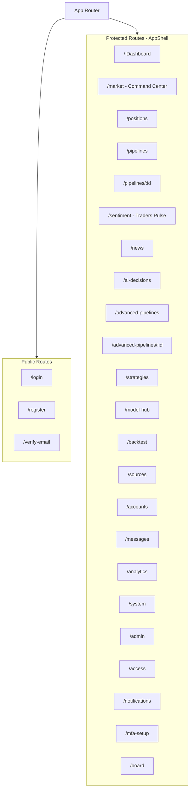

## 3.5 Authentication Flow

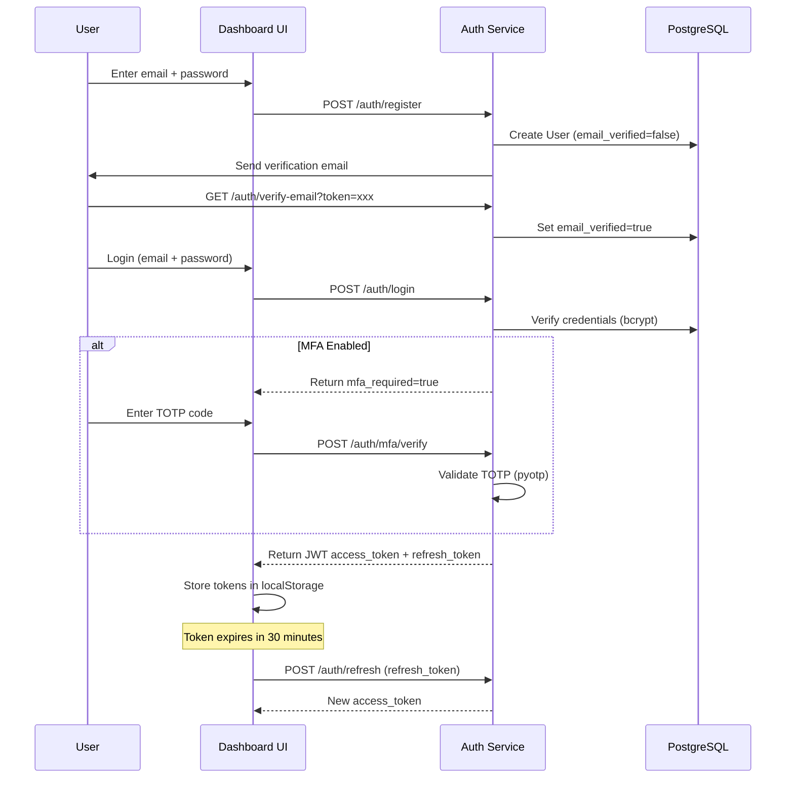

## 3.6 Deployment Architecture

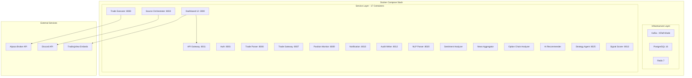

<div class="page-break"></div>

# 4. Component Deep Dives

## 4.1 Discord Ingestor

**Purpose:** Connects to Discord as a self-bot, monitors configured channels, and publishes raw messages to Kafka.

**Key Files:**
- `services/discord-ingestor/main.py` -- FastAPI service entry point
- `services/discord-ingestor/src/connector.py` -- Discord self-bot connection logic

**Core Logic:**

The Discord Ingestor uses `discord.py-self` (a self-bot library) to connect to Discord with a user's credentials. Unlike a bot token, a self-bot token allows reading messages in any channel the user has access to -- critical for monitoring private trading signal groups.

1. **Connection**: The Source Orchestrator launches an ingestor instance per user, passing encrypted Discord credentials.
2. **Message Capture**: The bot listens for `on_message` events in configured channels.
3. **Publishing**: Each message is published to the `raw-messages` Kafka topic with metadata:
   - `user_id` -- owner of the pipeline
   - `channel_id` -- Discord channel identifier
   - `author` -- message author's username
   - `content` -- raw message text
   - `source_message_id` -- Discord message ID (for deduplication)
   - `timestamp` -- message creation time

**Data Model:**
- `DataSource` -- stores encrypted Discord credentials and connection status
- `Channel` -- discovered channels within a Discord server

---

## 4.2 Trade Parser

**Purpose:** Consumes raw messages from Kafka, applies regex + NLP parsing to extract structured trade actions, and publishes parsed trades.

**Key Files:**
- `services/trade-parser/main.py` -- FastAPI service with Kafka consumer
- `services/trade-parser/src/parser.py` -- Core parsing logic

**Core Logic:**

The parser handles a wide variety of trading message formats commonly used in Discord channels:

```
"BTO AAPL 190C 3/21 @ 2.50"
"Bought SPY 580C 0DTE at 1.20"
"Sold 50% SPX 6950C at 6.50"
"STC NVDA 140P 3/28 for 3.80"
```

**Parsing Pipeline:**

1. **Reply Context Stripping**: `strip_reply_context()` removes quoted/forwarded text so only the author's original message is parsed.
2. **Regex Matching**: Multiple regex patterns match different formats:
   - BTO/STC format: `(BTO|STC|BUY|SELL)\s+(\w+)\s+(\d+(?:\.\d+)?)(C|P)\s+...`
   - Natural language: `Bought|Sold|Buying|Selling...`
   - Shorthand sells: `Sold 50% at 2.50` (contextual, uses `_CONTEXT` ticker)
3. **Entity Extraction**: For each match, extracts: ticker, strike price, option type (CALL/PUT), expiration date, quantity (absolute or percentage), entry price.
4. **NLP Enhancement**: Calls the NLP Parser service via HTTP for FinBERT intent classification and spaCy entity extraction when regex confidence is low.
5. **Expiration Resolution**: `_extract_expiration()` handles formats like `3/21`, `03/21/25`, `March 21`, `0DTE`, `weekly`.
6. **Default Expiration**: `_apply_default_expiration()` sets today's date for index/ETF options (SPX, SPY, QQQ) missing an expiration -- assumes 0DTE.
7. **Timeframe Parsing**: `extract_timeframe()` identifies `0DTE`, `weekly`, `monthly`, `leaps` and converts to days offset.

**Output:** A `parsed-trades` Kafka message containing:
```json
{
  "trade_id": "uuid",
  "user_id": "uuid",
  "channel_id": "channel-id",
  "ticker": "SPY",
  "strike": 580.0,
  "option_type": "CALL",
  "expiration": "2026-03-21",
  "action": "BUY",
  "quantity": "1",
  "price": 2.50,
  "source_author": "trader123",
  "raw_message": "BTO SPY 580C 3/21 @ 2.50"
}
```

---

## 4.3 NLP Parser

**Purpose:** Stateless HTTP service providing FinBERT-based intent classification and spaCy/BERT entity extraction for trade messages.

**Key Files:**
- `services/nlp-parser/main.py` -- FastAPI app (port 8020)
- `services/nlp-parser/src/intent_classifier.py` -- FinBERT + keyword intent classification
- `services/nlp-parser/src/entity_extractor.py` -- spaCy NER + regex entity extraction
- `services/nlp-parser/src/bert_entity_extractor.py` -- BERT-based extraction fallback

**Core Logic:**

**Intent Classification (`classify_intent`):**
1. **Keyword Scan**: Checks for explicit buy/sell keywords (BTO, STC, BOUGHT, SOLD, etc.)
2. **FinBERT Sentiment**: Runs the message through ProsusAI/finbert to get sentiment (positive/negative/neutral) with confidence score
3. **Heuristic Fallback**: If FinBERT is unavailable, uses pattern matching on ticker symbols, prices, and strike prices
4. **Output**: `{ is_trade_signal: bool, action: "BUY"|"SELL"|"HOLD", confidence: 0.0-1.0, sentiment: str, method: str }`

**Entity Extraction (`extract_entities`):**
1. **spaCy Processing**: Runs text through `en_core_web_sm` model with custom `Matcher` patterns
2. **Regex Patterns**: Extracts ticker symbols, strike prices (e.g., `100C`, `50P`), and prices (e.g., `@ 2.50`)
3. **Date Parsing**: `_parse_date()` handles multiple date formats (MM/DD, MM/DD/YY, Month DD, etc.)
4. **Ticker Validation**: Cross-references extracted symbols against a `COMMON_TICKERS` set
5. **Output**: `{ ticker: str, strike: float, option_type: str, expiration: str, price: float, quantity: int }`

**API Endpoints:**
- `POST /parse` -- Parse a single message (returns intent + entities)
- `POST /batch` -- Parse multiple messages in one request
- `GET /health` -- Health check (reports model load status)

---

## 4.4 Trade Gateway

**Purpose:** Receives parsed trades, performs deduplication and account resolution, and routes trades through auto-approval or manual approval workflows.

**Key Files:**
- `services/trade-gateway/main.py` -- FastAPI service (port 8007)
- `services/trade-gateway/src/gateway.py` -- `TradeGatewayService` class
- `services/trade-gateway/src/manual_mode.py` -- Manual approval queue

**Core Logic:**

The Trade Gateway is the decision point for every parsed trade. It determines whether a trade should be executed immediately or held for human review.

**Trade Handling Flow (`_handle_trade`):**

1. **Feature Flag Check**: Checks if `manual_approval` flag is enabled for the user, overriding global config.
2. **Paper Trading Check**: If `paper_trading_only` flag is set, forces paper mode.
3. **Account Resolution** (`_resolve_trading_account`):
   - First checks if `trading_account_id` is already set
   - If not, resolves `channel_id` to a `Channel` UUID
   - Looks up `AccountSourceMapping` to find the mapped trading account
   - Falls back to the user's first enabled trading account
4. **Deduplication** (`_is_duplicate`):
   - Checks for identical trades (same user, ticker, strike, option_type, action, price) within a 5-minute window
   - Prevents double-execution from repeated messages or edits
5. **Routing Decision**:
   - **Auto Mode**: Sets status to `IN_PROGRESS`, persists the Trade record, publishes to `approved-trades` topic
   - **Manual Mode**: Sets status to `PENDING`, persists the Trade record, waits for human approval via Discord bot or dashboard

**Trade Persistence (`_persist_trade`):**
Creates a Trade database record immediately so the dashboard shows the trade regardless of approval status. Fields include trade_id, user_id, ticker, strike, option_type, action, price, status, and source metadata.

---

## 4.5 Trade Executor

**Purpose:** Executes approved trades against broker APIs with buffer pricing, circuit breaker protection, and fill tracking.

**Key Files:**
- `services/trade-executor/main.py` -- FastAPI service (port 8008)
- `services/trade-executor/src/executor.py` -- `TradeExecutorService` class
- `services/trade-executor/src/buffer.py` -- Buffer price calculation
- `services/trade-executor/src/fill_tracker.py` -- Order fill polling
- `services/trade-executor/src/validator.py` -- Trade validation rules

**Core Logic:**

The Trade Executor is the most critical service -- it interacts with real money via broker APIs.

**Buffer Pricing (`calculate_buffered_price`):**

Options prices move fast. By the time a signal is parsed and approved, the price may have changed. Buffer pricing adds a configurable margin:
- **BUY orders**: `buffered_price = price * (1 + buffer_pct)` -- willing to pay slightly more
- **SELL orders**: `buffered_price = price * (1 - buffer_pct)` -- willing to accept slightly less
- Default buffer: 15%, max: 30%, min price: $0.01
- Ticker-specific overrides supported via `BUFFER_OVERRIDES` env var

**Trade Execution Flow (`_handle_trade`):**

1. **Header Merging**: Kafka message headers carry `user_id` and `trading_account_id` set by the gateway.
2. **Broker Resolution** (`_resolve_broker`):
   - Caches broker adapters by `{account_id}:{paper|live}`
   - Resolves through: direct ID -> channel mapping -> first enabled account
   - Checks pipeline-specific paper_mode override
   - Runs one-time broker health check (verifies API credentials)
3. **Validation** (`trade_validator.validate`): Checks required fields, valid ticker, price > 0, etc.
4. **Index Conversion** (`convert_index_to_etf`): Converts SPX options to SPY (with 10:1 strike adjustment) for broker compatibility.
5. **Symbol Formatting**: Converts to OCC option symbol format (e.g., `SPY260321C00580000`).
6. **Order Placement**: Calls `broker.place_limit_order()` wrapped in:
   - `retry_async` (2 retries, 1s base delay)
   - `CircuitBreaker` (5 failures = open, 60s recovery)
7. **Fill Tracking**: After placement, `FillTracker` polls the order every 5 seconds (max 60 polls) to track fill status, partial fills, and cancellations.
8. **Result Publishing**: Publishes execution result to `execution-results` and audit event to `trade-events-raw`.

**Dry Run Mode:**
When `DRY_RUN_MODE=true`, the executor simulates execution without placing real orders. It creates Position records so trades appear on the dashboard, using `DRY-{trade_id}` as the order ID.

**Exit Signal Handling (`_handle_exit_signal`):**
Consumes from `exit-signals` topic. Creates a synthetic SELL trade, resolves the broker, places a limit sell order at 97% of current price, and updates the Position record to CLOSED status.

---

## 4.6 Position Monitor

**Purpose:** Continuously monitors open positions for exit conditions (profit target, stop loss, trailing stop) and generates exit signals.

**Key Files:**
- `services/position-monitor/main.py` -- FastAPI service (port 8009)
- `services/position-monitor/src/exit_engine.py` -- Exit condition evaluation
- `services/position-monitor/src/daily_aggregator.py` -- Daily metrics computation

**Core Logic:**

**Exit Engine Evaluation (`evaluate_position`):**

For each open position, the engine checks three conditions in order:

1. **Profit Target Check**:
   ```
   pnl_pct = (current_price - entry_price) / entry_price
   trigger = pnl_pct >= target_pct (default 0.30 = 30%)
   ```

2. **Stop Loss Check**:
   ```
   pnl_pct = (current_price - entry_price) / entry_price
   trigger = pnl_pct <= -stop_pct (default 0.20 = 20%)
   ```

3. **Trailing Stop Check** (if enabled):
   ```
   drawdown = (high_water_mark - current_price) / high_water_mark
   trigger = drawdown >= offset_pct (default 0.10 = 10%)
   ```
   The high-water mark is updated whenever the current price exceeds it.

**Monitoring Loop:**
1. Query all positions with `status = 'OPEN'` from the database
2. For each position, get current price from the broker
3. Update `high_water_mark` if current price is higher
4. Run `evaluate_position()` against all exit conditions
5. If any condition triggers, publish an `ExitSignal` to the `exit-signals` Kafka topic
6. The Trade Executor handles the actual sell order

**Daily Aggregator:**
At end of day, computes and stores `DailyMetrics`:
- Total trades, executed/rejected/errored counts
- Closed positions and total P&L
- Win rate, average win/loss percentage
- Max drawdown
- Average execution latency and slippage

---

## 4.7 Signal Scorer

**Purpose:** Assigns a confidence score (0-100) to each parsed trade signal using multi-factor analysis.

**Key Files:**
- `services/signal-scorer/main.py` -- FastAPI service (port 8013)
- `services/signal-scorer/src/scorer.py` -- `SignalScorerService` class

**Core Logic:**

The scorer evaluates four independent factors and sums their scores:

**1. Analyst Score (0-30 points)**
Queries `AnalystPerformance` table for the signal author:
- Win rate contributes up to 15 points: `min(15, win_rate * 15)`
- P&L profitability contributes up to 15 points: base 7.5, +5 if profitable, +bonus for large gains
- Unknown analysts get 10 points (neutral)

**2. Sentiment Score (0-20 points)**
Queries `TickerSentiment` table for the ticker:
- BUY signal + bullish sentiment (score > 0.3) = 20 points
- BUY signal + bearish sentiment (score < -0.3) = 5 points (contrarian)
- SELL signal + bearish sentiment = 18 points
- Neutral or no data = 10 points

**3. Market Conditions Score (0-18 points)**
- Market open = 18 points (higher confidence during trading hours)
- Market closed = 8 points (premarket/after-hours signals less reliable)

**4. Signal Quality Score (0-30 points)**
Evaluates completeness of the parsed signal:
- Has price > 0: +8 points
- Has expiration date: +7 points
- Has strike price > 0: +5 points
- Has quantity: +5 points
- Has profit target or stop loss: +5 points

**Output:** Signal is enriched with `confidence_score` (0-100), `scored_at` timestamp, and `score_breakdown` dict, then published to `scored-trades` topic.

---

## 4.8 Strategy Agent

**Purpose:** AI-powered strategy creation and backtesting using a ReAct (Reasoning + Acting) agent loop with tool use.

**Key Files:**
- `services/strategy-agent/main.py` -- FastAPI app with ReAct agent loop
- `services/strategy-agent/src/parser.py` -- Natural language strategy parsing
- `services/strategy-agent/src/backtest_engine.py` -- Event-driven backtest engine
- `services/strategy-agent/src/benchmark_comparer.py` -- Benchmark comparison
- `services/strategy-agent/src/data_fetcher.py` -- Historical data fetching
- `services/strategy-agent/src/report_generator.py` -- Report generation
- `services/strategy-agent/src/memory.py` -- Agent memory persistence

**Core Logic:**

**ReAct Agent Loop (`_run_agent_loop`):**

The agent follows the ReAct pattern: Thought -> Action -> Observation -> repeat until done.

1. User sends a natural language message (e.g., "Create a strategy that buys SPY when RSI < 30")
2. LLM (via Ollama) generates a response in ReAct format:
   ```
   Thought: I need to create a strategy based on RSI oversold conditions.
   Action: create_strategy
   Action Input: {"name": "RSI Oversold SPY", "description": "...", "conditions": [...]}
   ```
3. Agent parses the action, executes the corresponding tool
4. Tool result becomes the next "Observation"
5. Loop continues (max 8 iterations) until LLM outputs a final answer

**Available Tools:**
- `create_strategy` -- Parse natural language into structured strategy config, save to DB
- `list_strategies` -- List user's existing strategies
- `fetch_market_data` -- Fetch OHLCV data from yfinance
- `run_backtest` -- Execute backtest against historical data
- `search_web` -- Search for market information (future)

**Backtest Engine (`run_backtest`):**
- Applies SMA-20 crossover strategy (configurable)
- Entry conditions: long when price > SMA, short when price < SMA
- Exit conditions: 5% profit target, 3% stop loss
- Accounts for transaction costs (0.1%) and slippage (0.05%)
- Returns: total return, Sharpe ratio, max drawdown, win rate, profit factor, equity curve, trade list

**Streaming Support:**
The agent supports Server-Sent Events (SSE) for real-time streaming of the reasoning process to the frontend, so users can watch the agent "think."

---

## 4.9 Notification Service

**Purpose:** Delivers trade execution notifications across multiple channels and provides a Discord bot for trade management.

**Key Files:**
- `services/notification-service/main.py` -- FastAPI service (port 8010)
- `services/notification-service/src/discord_bot.py` -- Discord bot commands
- `services/notification-service/src/notification.py` -- Notification handler registry
- `services/notification-service/src/daily_report.py` -- Daily report scheduler

**Core Logic:**

**Discord Bot Commands (`TradingBot`):**

The bot connects to Discord using an official bot token (not self-bot) and provides admin commands:

| Command | Description | Access |
|---------|-------------|--------|
| `!pending` | List all trades pending manual approval | Admin only |
| `!approve <trade_id>` | Approve a specific trade (or `all`) | Admin only |
| `!reject <trade_id> <reason>` | Reject a trade with a reason | Admin only |
| `!stats` | Show trading statistics | Admin only |
| `!kill` | Activate kill switch (halt all trading) | Admin only |
| `!resume` | Deactivate kill switch | Admin only |

**Kill Switch:**
Sets a `Configuration` record with key `kill_switch` to `true`. All services check this flag before processing trades.

**Daily Report Generation:**
1. `_seconds_until_market_close()` calculates wait time until 4:00 PM ET
2. At market close, queries all active users
3. For each user with `email_enabled` in notification preferences:
   - Aggregates today's trades (executed, rejected, errored)
   - Calculates total P&L, win rate
   - Generates HTML email with formatted trade table
4. Sends via configured SMTP server

---

## 4.10 API Gateway

**Purpose:** Central REST API and WebSocket gateway serving the frontend. Proxies all data access, handles JWT authentication, and bridges Kafka events to WebSocket clients.

**Key Files:**
- `services/api-gateway/main.py` -- FastAPI app with middleware, migrations, Kafka consumer
- `services/api-gateway/src/middleware.py` -- JWT authentication middleware
- `services/api-gateway/src/websocket.py` -- WebSocket connection manager
- `services/api-gateway/src/routes/*.py` -- 20+ route modules

**Core Logic:**

**JWT Middleware:**
Every request (except `/health`, `/auth/*`, `/docs`) passes through JWT verification:
1. Extract `Authorization: Bearer <token>` header
2. Decode JWT using `JWT_SECRET_KEY` and `HS256` algorithm
3. Extract `user_id` and `is_admin` from payload
4. Attach to request state for downstream use
5. Return 401 if token is invalid or expired

**Route Catalog (20+ modules):**

| Route Module | Prefix | Key Endpoints |
|-------------|--------|---------------|
| `trades.py` | `/api/v1/trades` | GET list, POST approve/reject |
| `pipelines.py` | `/api/v1/pipelines` | CRUD, start/stop, diagnostics |
| `positions.py` | `/api/v1/positions` | GET open/closed, POST close |
| `accounts.py` | `/api/v1/accounts` | CRUD, health check |
| `sources.py` | `/api/v1/sources` | CRUD, discover channels |
| `market.py` | `/api/v1/market` | 40+ market data endpoints |
| `strategies.py` | `/api/v1/strategies` | CRUD, agent chat |
| `sentiment.py` | `/api/v1/sentiment` | Bulk sentiment, alerts |
| `news.py` | `/api/v1/news` | Headlines, connections |
| `backtest.py` | `/api/v1/backtest` | Run, results |
| `chat.py` | `/api/v1/chat` | Message history |
| `notifications.py` | `/api/v1/notifications` | Preferences, list |
| `admin.py` | `/api/v1/admin` | User management |
| `system.py` | `/api/v1/system` | Health, config, kill switch |
| `watchlist.py` | `/api/v1/watchlist` | Add/remove tickers |
| `board.py` | `/api/v1/board` | Sprint board CRUD |
| `models.py` | `/api/v1/models` | Model registry |

**WebSocket Manager:**
Three WebSocket channels for real-time updates:
- `/ws/trades` -- Trade execution results
- `/ws/positions` -- Position updates
- `/ws/notifications` -- System notifications

A background Kafka consumer reads `execution-results` and broadcasts to connected WebSocket clients filtered by `user_id`.

**Market Data API (`market.py`):**
40+ endpoints providing market data via yfinance, including:
- GEX (Gamma Exposure), Market Internals, VIX Term Structure
- Premarket gaps/movers, Key levels (pivots, S&R)
- Options flow, Correlations, Volatility dashboard
- Put/Call ratio, Relative volume, 52-week analysis
- All endpoints use in-memory caching with 120-second TTL

---

## 4.11 Auth Service

**Purpose:** Handles user registration, authentication, MFA setup, and JWT token management.

**Key Files:**
- `services/auth-service/main.py` -- FastAPI app (port 8001)
- `services/auth-service/src/auth.py` -- All auth endpoints and logic

**Core Logic:**

**Registration:**
1. Validate email format and check for duplicates
2. Hash password with bcrypt (12 rounds)
3. Generate email verification token
4. Create User record with `email_verified=false`
5. Send verification email (if SMTP configured)

**Login:**
1. Verify email exists and is verified
2. Compare password against bcrypt hash
3. If MFA enabled, return `mfa_required=true` (partial auth)
4. If MFA not enabled or verified, generate tokens:
   - Access token: JWT with `user_id`, `is_admin`, 30-minute expiry
   - Refresh token: JWT with `user_id`, 7-day expiry
5. Update `last_login` timestamp

**MFA Setup:**
1. `POST /auth/mfa/setup` -- Generate TOTP secret using `pyotp`, return QR code as data URL
2. `POST /auth/mfa/confirm` -- Verify initial TOTP code, store `mfa_secret`, set `mfa_enabled=true`
3. `POST /auth/mfa/verify` -- Verify TOTP code during login
4. `POST /auth/mfa/disable` -- Disable MFA (requires current TOTP code)

**Token Refresh:**
Access tokens expire after 30 minutes. The frontend's axios interceptor catches 401 responses and calls `POST /auth/refresh` with the refresh token to get a new access token transparently.

---

## 4.12 Source Orchestrator

**Purpose:** Manages the lifecycle of per-user data ingestor instances. When a pipeline is started, the orchestrator launches a Discord self-bot for that user's credentials.

**Key Files:**
- `services/source-orchestrator/main.py` -- FastAPI service (port 8002)
- `services/source-orchestrator/src/orchestrator.py` -- Worker lifecycle management

**Core Logic:**

1. **Pipeline Activation**: When a pipeline is started via the API, the Source Orchestrator receives a request
2. **Credential Decryption**: Decrypts the user's stored Discord credentials using Fernet
3. **Worker Launch**: Spawns a Discord Ingestor worker for the specific channel
4. **Health Monitoring**: Tracks worker status, reconnects on failure with exponential backoff
5. **Channel Discovery**: Provides endpoint for discovering Discord servers and channels accessible by the user's credentials
6. **Graceful Shutdown**: Cleanly disconnects all workers when the service stops

**Debug Endpoint (`/debug/workers`):**
Returns active worker status, backoff information, and orchestrator health for troubleshooting.

---

## 4.13 Broker Adapter

**Purpose:** Provides a protocol-based abstraction layer for broker integrations, with Alpaca as the primary implementation.

**Key Files:**
- `shared/broker/adapter.py` -- `BrokerAdapter` protocol definition
- `shared/broker/alpaca_adapter.py` -- `AlpacaBrokerAdapter` implementation
- `shared/broker/factory.py` -- `create_broker_adapter()` factory
- `shared/broker/circuit_breaker.py` -- `CircuitBreaker` class
- `shared/broker/symbol_converter.py` -- Index-to-ETF conversion

**Core Logic:**

**BrokerAdapter Protocol:**
Defines the interface that all broker implementations must satisfy:
- `place_limit_order(symbol, qty, side, price) -> order_id`
- `place_bracket_order(symbol, qty, side, price, take_profit, stop_loss) -> order_id`
- `cancel_order(order_id) -> bool`
- `get_order_status(order_id) -> dict`
- `get_positions() -> list[dict]`
- `get_orders(status) -> list[dict]`
- `close_position(symbol) -> bool`
- `get_quote(symbol) -> dict`
- `get_account() -> dict`
- `format_option_symbol(ticker, expiration, option_type, strike) -> str`

**Alpaca Implementation:**
- Uses the official `alpaca-py` SDK with `TradingClient`
- All SDK calls wrapped in `asyncio.to_thread()` (the SDK is synchronous)
- OCC Symbol Formatting: `SPY260321C00580000` (root + YYMMDD + C/P + strike*1000 padded to 8 digits)
- Index mapping: SPX -> SPXW, NDX -> NDXP (for OCC compatibility)
- Error hierarchy: `AlpacaAuthError` (401/403) vs `AlpacaOrderError` (other failures)
- Auth errors are excluded from circuit breaker counting (no point retrying bad credentials)

**Circuit Breaker:**
Three states: CLOSED -> OPEN -> HALF_OPEN -> CLOSED
- **CLOSED**: Normal operation. Counts consecutive failures.
- **OPEN**: After 5 failures, blocks all calls for 60 seconds. Raises `CircuitOpenError`.
- **HALF_OPEN**: After recovery timeout, allows 1 test call. Success resets to CLOSED; failure reopens.

**Symbol Converter:**
Converts unsupported index options for brokers:
- SPX/SPXW -> SPY with 10:1 strike adjustment (SPX 5800C -> SPY 580C)
- Adjusts quantity accordingly (1 SPX contract = 10 SPY contracts)

---

## 4.14 Shared Models & Database

**Purpose:** Defines all ORM models, database session management, and multi-tenancy support shared across all services.

**Key Files:**
- `shared/models/trade.py` -- All 30+ SQLAlchemy models
- `shared/models/database.py` -- Async engine and session factory
- `shared/models/tenant.py` -- Multi-tenancy helpers

**Core Logic:**

**Database Connection:**
```python
engine = create_async_engine(config.database.url)
AsyncSessionLocal = async_sessionmaker(engine, class_=AsyncSession)
```

All services use `async with AsyncSessionLocal() as session:` for database operations.

**Model Categories:**

| Category | Models | Purpose |
|----------|--------|---------|
| Auth | User | Users, roles, MFA, permissions |
| Broker | TradingAccount | Broker credentials, risk config |
| Pipeline | DataSource, Channel, TradePipeline, AccountSourceMapping | Pipeline configuration |
| Trading | Trade, Position, TradeEvent | Trade lifecycle records |
| Analytics | DailyMetrics, AnalystPerformance | Performance tracking |
| Content | RawMessage, ChatMessage | Message storage |
| AI | StrategyModel, AITradeDecision, OptionAnalysisLog | AI decision audit |
| Backtest | BacktestRun, BacktestTrade | Backtesting records |
| Sentiment | SentimentMessage, TickerSentiment, SentimentAlert | Sentiment tracking |
| News | NewsHeadline, NewsConnection | News aggregation |
| Advanced | AdvancedPipeline, AdvancedPipelineVersion | Visual pipeline builder |
| System | Configuration, ModelRegistry, BoardTask, NotificationLog, UserWatchlist | Platform management |

**Multi-Tenancy:**
Every query filters by `user_id` to ensure data isolation. The API Gateway injects `user_id` from the JWT token into every database query.

**Migrations:**
Database schema is managed through SQL-based migrations in the API Gateway's `_run_migrations()` function. This approach was chosen over Alembic version files for simplicity -- migrations run on every startup and are idempotent (using `IF NOT EXISTS` clauses).

---

## 4.15 Dashboard UI

**Purpose:** React-based single-page application providing the complete user interface for the trading platform.

**Key Files:**
- `services/dashboard-ui/src/App.tsx` -- Router and route definitions
- `services/dashboard-ui/src/components/AppShell.tsx` -- Main layout (sidebar, header, navigation)
- `services/dashboard-ui/src/pages/MarketCommandCenter.tsx` -- Multi-tab widget dashboard
- `services/dashboard-ui/src/components/pipeline/PipelineCanvas.tsx` -- Visual pipeline editor
- `services/dashboard-ui/src/context/AuthContext.tsx` -- Authentication state management

**Core Logic:**

**Authentication Flow (AuthContext):**
- Stores JWT tokens in localStorage
- Axios interceptor attaches `Authorization: Bearer <token>` to every request
- On 401 response, automatically attempts token refresh
- If refresh fails, redirects to login

**State Management:**
- **Server State**: `@tanstack/react-query` with automatic refetching, caching, and cache invalidation
- **Auth State**: React Context API (`AuthContext`)
- **Theme**: React Context API (`ThemeProvider`)
- **Local UI State**: React `useState` and `useMemo`
- **Persistent UI State**: localStorage (nav order, widget layouts, theme preference)

**Market Command Center:**
The most complex UI component. Uses `react-grid-layout` v2 for drag-and-drop widget placement.

- **Tab System**: `TabData` objects stored in localStorage under `mcc-tabs-v2`
- Each tab has independent: `widgets` (string[]), `layouts` (LayoutItem[]), `widgetConfigs` (Record)
- **Widget Registration**: Two registries -- `STATIC_WIDGETS` (no config) and `CONFIGURABLE_WIDGETS` (accept `{ symbol }` prop)
- **Widget Catalog**: Searchable modal with 60+ widgets organized by category
- **Settings Dialog**: Configurable widgets show a gear icon; clicking opens a `TickerSearch` dialog

**Pipeline Editor (PipelineCanvas):**
Built on `@xyflow/react` (React Flow). Users drag nodes from a palette, connect them with edges, and configure each node's parameters. Node types include Data Source, Processing, AI Model, Broker, and Control nodes.

**Responsive Layout:**
- Desktop: Collapsible sidebar with icon-only mode
- Mobile: Bottom navigation bar
- Sidebar nav order is drag-reorderable (using @dnd-kit)

<div class="page-break"></div>

# 5. End-to-End Process Flows

## 5.1 Signal-to-Execution Flow

The complete lifecycle of a trade signal from Discord message to broker order execution.

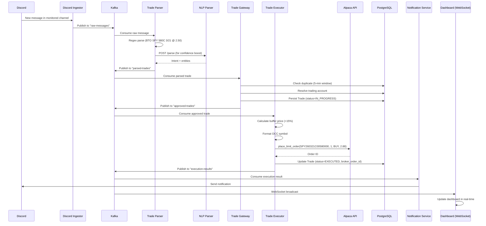

**Timing breakdown (typical):**
1. Discord message received: 0ms
2. Kafka publish + consume: ~50ms
3. Regex + NLP parsing: ~200ms
4. Gateway dedup + persist: ~100ms
5. Buffer pricing + broker call: ~500ms
6. **Total: ~850ms end-to-end**

---

## 5.2 Manual Approval Flow

When the gateway is in manual mode, trades require human approval before execution.

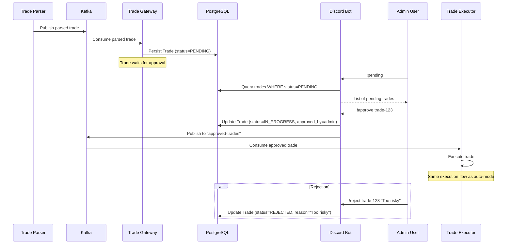

---

## 5.3 Position Lifecycle

From opening a position through monitoring and automatic exit.

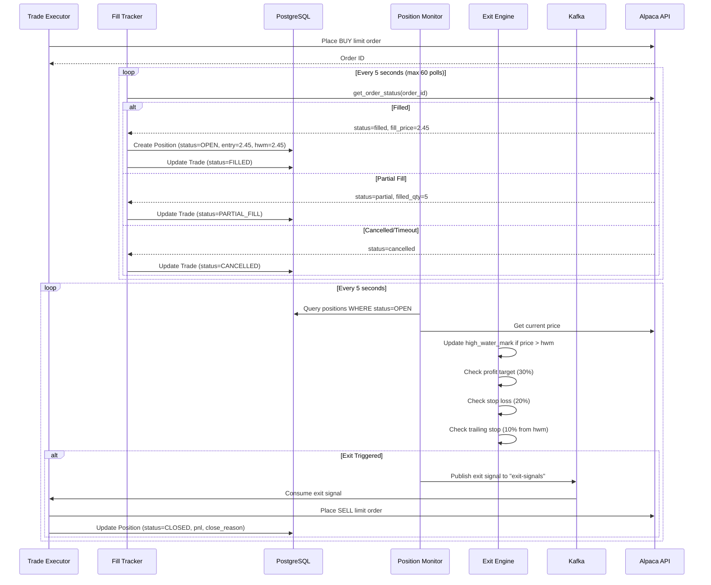

**Example Position Lifecycle:**
1. Entry: BUY 1x SPY 580C @ $2.45 (filled)
2. Price rises to $2.80 -> hwm updated to $2.80
3. Price rises to $3.20 -> hwm updated to $3.20 (profit target = $3.19, 30%)
4. Price hits $3.19 -> **PROFIT TARGET triggered**
5. Exit: SELL 1x SPY 580C @ $3.10 (97% of current)
6. Realized P&L: ($3.10 - $2.45) * 100 = $65.00

---

## 5.4 Strategy Creation & Backtest

End-to-end flow for creating a strategy using the AI agent and running a backtest.

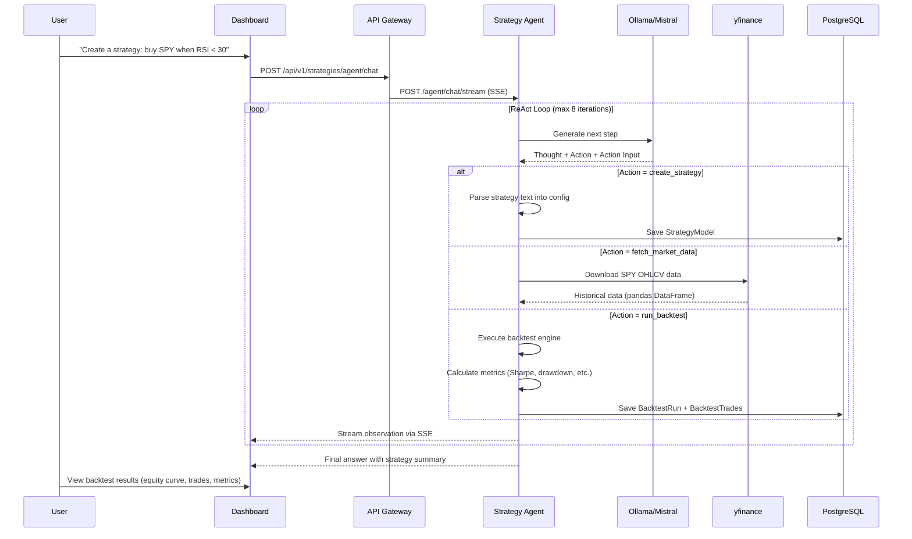

---

## 5.5 User Registration & Authentication

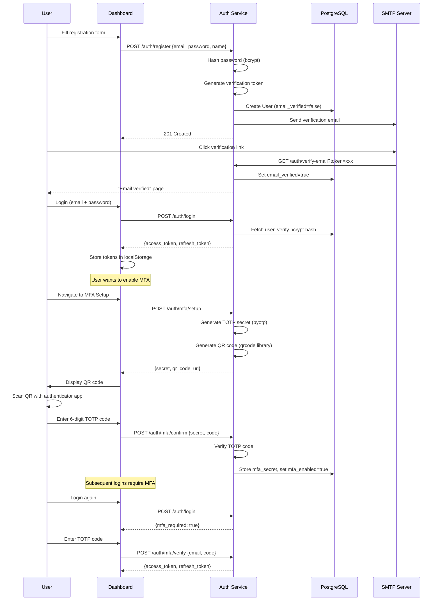

---

## 5.6 Pipeline Setup Flow

How a user connects Discord and creates an automated trading pipeline.

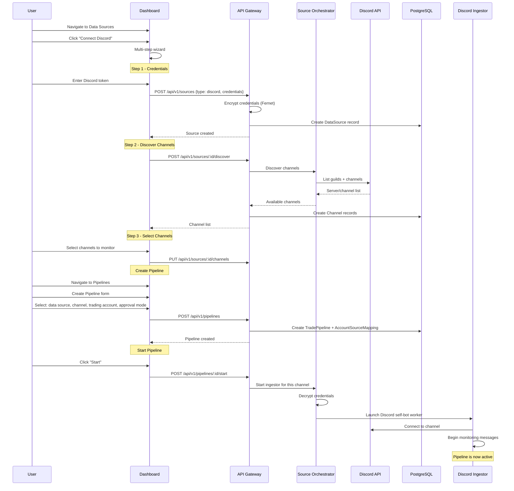

---

## 5.7 Market Command Center Usage

How a user creates and configures their multi-tab market dashboard.

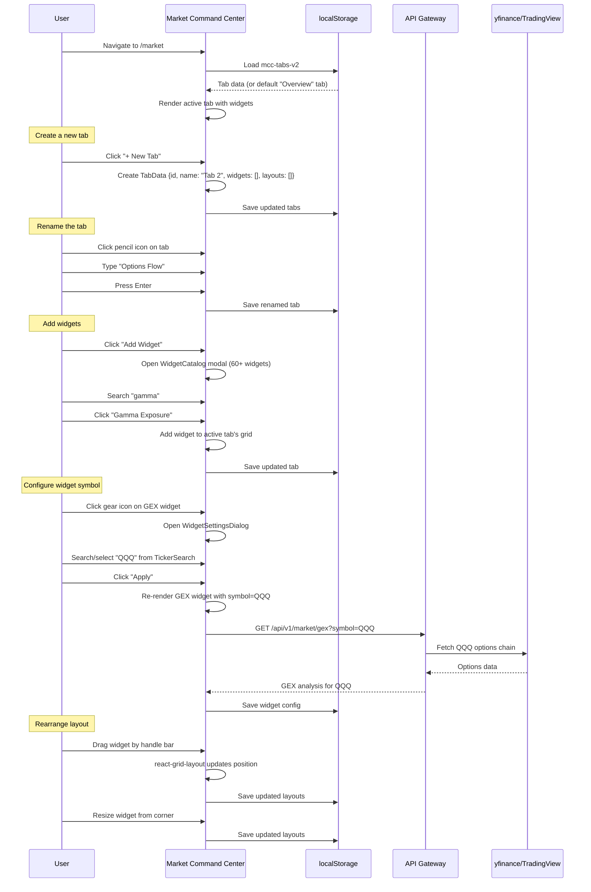

---

## 5.8 Sentiment Analysis Pipeline

How raw messages are analyzed for sentiment and aggregated into ticker sentiment scores.

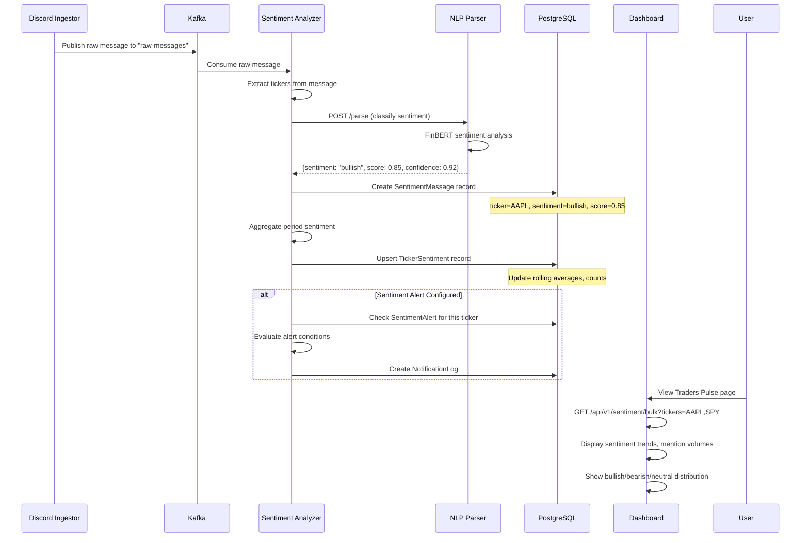

---

## 5.9 Daily Report Generation

Automated end-of-day performance reporting.

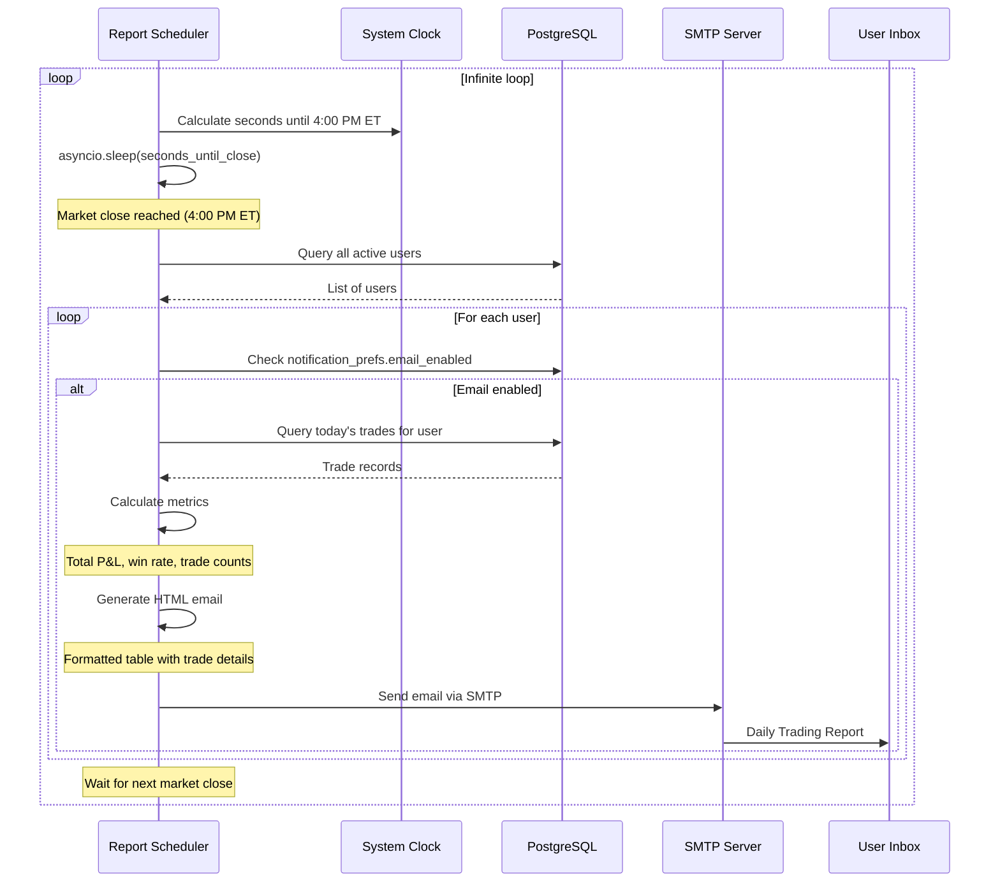

**Report Contents:**
- Header: "Daily Trading Report - {date}"
- Summary metrics: Total P&L, Win Rate, Executed/Rejected/Errored counts
- Trade table: Ticker, Action, Strike, Price, Fill Price, Status, P&L
- Color-coded P&L (green for gains, red for losses)

<div class="page-break"></div>

# Appendix A: Environment Variables Reference

| Variable | Default | Description |
|----------|---------|-------------|
| `KAFKA_BOOTSTRAP_SERVERS` | `localhost:9092` | Kafka broker address |
| `DATABASE_URL` | `postgresql+asyncpg://...` | PostgreSQL connection string |
| `REDIS_URL` | `redis://localhost:6379` | Redis connection string |
| `JWT_SECRET_KEY` | `dev-secret-key...` | JWT signing secret |
| `JWT_ALGORITHM` | `HS256` | JWT algorithm |
| `JWT_ACCESS_TOKEN_EXPIRE_MINUTES` | `30` | Access token TTL |
| `JWT_REFRESH_TOKEN_EXPIRE_DAYS` | `7` | Refresh token TTL |
| `CREDENTIAL_ENCRYPTION_KEY` | (empty) | Fernet encryption key |
| `ALPACA_API_KEY` | (empty) | Alpaca broker API key |
| `ALPACA_SECRET_KEY` | (empty) | Alpaca broker secret |
| `ALPACA_BASE_URL` | `https://paper-api...` | Alpaca API endpoint |
| `APPROVAL_MODE` | `auto` | Gateway mode (auto/manual) |
| `BUFFER_PERCENTAGE` | `0.15` | Order price buffer (15%) |
| `MAX_POSITION_SIZE` | `10` | Max contracts per position |
| `MAX_DAILY_LOSS` | `1000.0` | Daily loss limit ($) |
| `DEFAULT_PROFIT_TARGET` | `0.30` | Profit target (30%) |
| `DEFAULT_STOP_LOSS` | `0.20` | Stop loss (20%) |
| `TRAILING_STOP_ENABLED` | `false` | Enable trailing stops |
| `TRAILING_STOP_OFFSET` | `0.10` | Trailing stop offset (10%) |
| `DRY_RUN_MODE` | `false` | Simulate execution |
| `DISCORD_BOT_TOKEN` | (empty) | Discord bot token |
| `LOG_LEVEL` | `INFO` | Logging level |

# Appendix B: Kafka Topics

| Topic | Producers | Consumers | Message Content |
|-------|-----------|-----------|-----------------|
| `raw-messages` | Discord/Twitter/Reddit Ingestors | Trade Parser, Audit Writer | Raw message text + metadata |
| `parsed-trades` | Trade Parser | Trade Gateway, Signal Scorer | Structured trade (ticker, strike, etc.) |
| `approved-trades` | Trade Gateway, Discord Bot | Trade Executor | Approved trade for execution |
| `execution-results` | Trade Executor | API Gateway (WS), Notification Service | Execution outcome + order details |
| `exit-signals` | Position Monitor | Trade Executor | Position exit instructions |
| `trade-events-raw` | Trade Executor | Audit Writer | Audit trail events |
| `config-updates` | Source Orchestrator | Discord Ingestor | Pipeline config changes |
| `agent-scores` | Signal Scorer | (future consumers) | Scored trade signals |

# Appendix C: Service Ports

| Service | Port | Protocol |
|---------|------|----------|
| Auth Service | 8001 | HTTP |
| Source Orchestrator | 8002 | HTTP |
| Trade Parser | 8006 | HTTP |
| Trade Gateway | 8007 | HTTP |
| Trade Executor | 8008 | HTTP |
| Position Monitor | 8009 | HTTP |
| Notification Service | 8010 | HTTP |
| API Gateway | 8011 | HTTP + WebSocket |
| Audit Writer | 8012 | HTTP |
| Signal Scorer | 8013 | HTTP |
| NLP Parser | 8020 | HTTP |
| Strategy Agent | 8025 | HTTP + SSE |
| Dashboard UI | 3000 | HTTP |
| Kafka | 9092 | Kafka protocol |
| PostgreSQL | 5432 | PostgreSQL |
| Redis | 6379 | Redis protocol |

---

*Document generated February 2026. Phoenix Trade Bot v2.0.*
